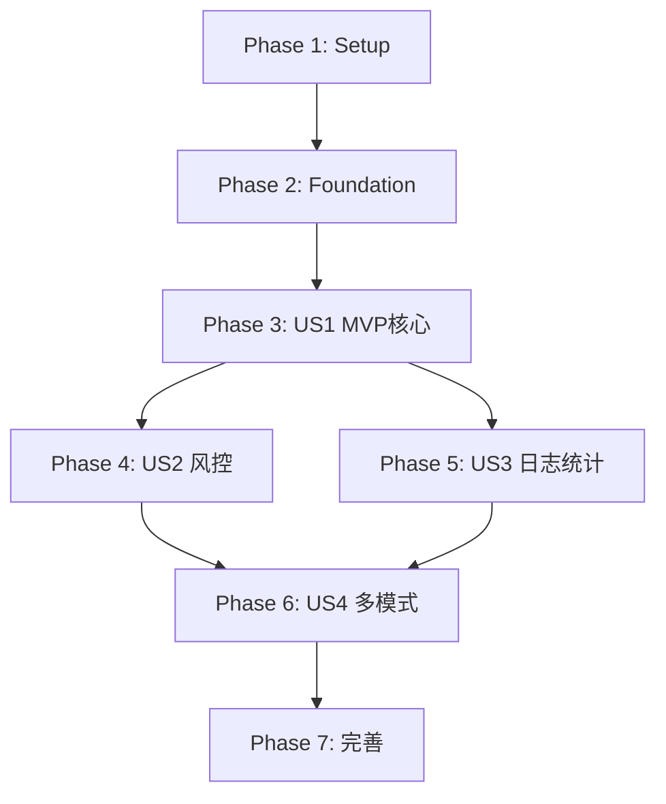

# Implementation Tasks: 自动化网格交易系统

**Feature**: 自动化网格交易系统
**Branch**: `002-auto-grid-trading`
**Spec**: [spec.md](./spec.md) | **Plan**: [plan.md](./plan.md)

---

## Overview

本文档将规格文档中的13个功能需求(FR)转化为可执行的开发任务,按用户故事(User Story)组织以支持独立实现和测试。

### 用户故事映射

| User Story | 优先级 | 功能需求 | 业务价值 |
|-----------|--------|---------|---------|
| **US1: MVP核心网格交易** | P1 (MVP) | FR-1,2,5,6,7,13 | 实现做空网格的完整生命周期 |
| **US2: 风控与错误处理** | P2 | FR-8,9,12 | 保护资金安全,提升系统稳定性 |
| **US3: 日志与统计分析** | P2 | FR-10,11 | 数据驱动决策,性能优化 |
| **US4: 中性与做多网格** | P3 | FR-3,4 | 扩展网格模式,支持更多策略 |

### MVP范围

**MVP阶段仅实现US1**,包含:
- ✅ 网格配置管理(CRUD)
- ✅ 做空网格策略核心逻辑
- ✅ Binance Futures交易所适配器
- ✅ 网格初始化与恢复机制
- ✅ 订单同步与幂等性保证
- ✅ 生命周期管理命令(start/stop/status)

---

## Phase 1: 项目设置 (Setup)

### 目标
创建Django app基础架构,配置开发环境,准备依赖库

### 验收标准
- [ ] Django app `grid_trading` 已创建并注册到INSTALLED_APPS
- [ ] 所有必要依赖已安装(python-binance, websockets, pandas, numpy)
- [ ] 数据库迁移已执行,基础表结构已创建
- [ ] pytest配置已完成,可运行测试套件
- [ ] 代码格式化工具(black, isort)已配置

### 任务列表

- [X] T001 创建Django app grid_trading并注册到listing_monitor_project/settings.py
- [X] T002 [P] 创建项目目录结构 grid_trading/{models,services,management/commands,tests}
- [X] T003 [P] 添加依赖到requirements.txt: python-binance==1.0.19, websockets==12.0, pandas>=2.0, numpy>=1.24
- [X] T004 安装所有依赖: pip install -r requirements.txt
- [X] T005 [P] 配置pytest: 创建grid_trading/tests/conftest.py和pytest.ini
- [X] T006 [P] 配置black和isort: 创建pyproject.toml
- [X] T007 创建grid_trading/apps.py: 定义GridTradingConfig类
- [X] T008 创建grid_trading/__init__.py: 设置default_app_config

---

## Phase 2: 基础数据模型 (Foundational)

### 目标
实现5个核心数据模型,支持所有用户故事

### 验收标准
- [ ] 所有5个模型已定义并通过makemigrations验证
- [ ] 数据库迁移已执行,表结构正确创建
- [ ] 模型的clean()方法包含完整验证逻辑
- [ ] Django Admin已配置,可通过Web界面管理GridConfig
- [ ] 模型单元测试覆盖率 >= 80%

### 任务列表

- [X] T009 [US1] 创建GridConfig模型 grid_trading/models/grid_config.py (15个字段,验证规则)
- [X] T010 [US1] 创建GridLevel模型 grid_trading/models/grid_level.py (状态机:4状态)
- [X] T011 [US1] 创建OrderIntent模型 grid_trading/models/order_intent.py (四元组唯一标识)
- [X] T012 [P] [US3] 创建TradeLog模型 grid_trading/models/trade_log.py (环形缓冲区)
- [X] T013 [P] [US3] 创建GridStatistics模型 grid_trading/models/grid_statistics.py (统计指标)
- [X] T014 创建grid_trading/models/__init__.py: 导出所有模型
- [X] T015 生成并执行数据库迁移: python manage.py makemigrations && python manage.py migrate
- [X] T016 [P] [US1] 配置GridConfig的Django Admin grid_trading/admin.py (list_display, filters, readonly_fields)
- [X] T017 [P] [US1] 编写GridConfig模型测试 grid_trading/tests/unit/test_models.py (验证规则测试)
- [X] T018 [P] [US1] 编写GridLevel状态机测试 grid_trading/tests/unit/test_grid_level.py

---

## Phase 3: US1 - MVP核心网格交易

### 故事目标
实现完整的做空网格交易生命周期:配置创建 → 启动策略 → WebSocket监听 → 自动挂单/撤单 → 订单成交 → 持仓管理 → 停止策略

### 独立测试标准
- [ ] 用户可通过命令行创建做空网格配置并验证参数
- [ ] 用户可启动策略,系统成功连接Binance WebSocket并初始化网格
- [ ] 价格变化时系统自动挂单/撤单,保持网格完整性
- [ ] 订单成交后系统正确更新网格层级状态和持仓
- [ ] 用户可查询策略状态,查看当前持仓和挂单
- [ ] 用户可停止策略,系统撤销所有挂单并清空状态

### 3.1 交易所适配器 (FR-5)

- [ ] T019 [P] [US1] 定义ExchangeAdapter抽象基类 grid_trading/services/exchange/base.py (7个抽象方法)
- [ ] T020 [US1] 实现BinanceFuturesAdapter grid_trading/services/exchange/binance_futures.py - 初始化和认证
- [ ] T021 [US1] 实现watchAccount方法: 订阅用户数据流(余额/持仓)
- [ ] T022 [US1] 实现watchOrders方法: 订阅订单更新流
- [ ] T023 [US1] 实现watchTicker方法: 订阅最新价格流
- [ ] T024 [US1] 实现createOrder方法: 创建限价单(处理精度,返回client_order_id)
- [ ] T025 [US1] 实现cancelOrder和cancelAllOrders方法
- [ ] T026 [US1] 实现WebSocket重连机制: 3次重试,指数退避(5/10/15秒)
- [ ] T027 [P] [US1] 编写BinanceFuturesAdapter单元测试 grid_trading/tests/unit/test_exchange_adapter.py (Mock API响应)

### 3.2 网格初始化与层级管理 (FR-6)

- [X] T028 [US1] 实现网格计算逻辑 grid_trading/services/grid/engine.py - calculateGridLevels方法
- [X] T029 [US1] 实现首次启动初始化: initializeGrid方法(计算中心价,生成层级数组)
- [X] T030 [US1] 实现策略恢复逻辑: recoverFromExistingPositions方法(同步订单,识别孤立订单)
- [X] T031 [P] [US1] 编写网格计算测试 grid_trading/tests/unit/test_grid_engine.py (验证间距,边界)

### 3.3 做空网格策略核心 (FR-2)

- [ ] T032 [US1] 实现ShortGridStrategy grid_trading/services/grid/short_grid.py - 构造函数和初始化
- [ ] T033 [US1] 实现calculateIdealOrders方法: 基于网格状态计算理想挂单(仅上方卖单+下方买单)
- [ ] T034 [US1] 实现持仓限制检查: checkPositionLimit方法(净空头持仓 <= maxPositionSize)
- [ ] T035 [US1] 实现订单过滤逻辑: 达到持仓上限时拒绝新卖单
- [ ] T036 [US1] 实现成交后状态更新: onOrderFilled回调(entry_working → position_open → exit_working → idle)
- [ ] T037 [P] [US1] 编写ShortGridStrategy单元测试 grid_trading/tests/unit/test_short_grid.py

### 3.4 订单同步与幂等性 (FR-7)

- [ ] T038 [US1] 实现OrderSyncManager grid_trading/services/grid/order_sync.py - 构造函数
- [ ] T039 [US1] 实现syncOrders方法: 对比理想订单vs实际订单(四元组标识)
- [ ] T040 [US1] 实现client_order_id生成: generateClientOrderId方法(config_intent_side_level_hash格式)
- [ ] T041 [US1] 实现订单撤销逻辑: cancelExcessOrders方法
- [ ] T042 [US1] 实现订单创建逻辑: createMissingOrders方法(幂等性保证)
- [ ] T043 [US1] 实现冷却期机制: 订单失败后GridLevel.blocked_until设置为now+5秒
- [ ] T044 [P] [US1] 编写订单同步测试 grid_trading/tests/unit/test_order_sync.py (幂等性验证)

### 3.5 网格引擎主循环 (FR-6, FR-7)

- [ ] T045 [US1] 实现GridEngine grid_trading/services/grid/engine.py - 构造函数(加载配置,初始化适配器)
- [ ] T046 [US1] 实现initialize方法: 连接WebSocket,初始化网格,挂初始订单
- [ ] T047 [US1] 实现主循环run方法: asyncio事件循环(轮询间隔1秒,调用syncOrders)
- [ ] T048 [US1] 实现WebSocket事件处理: onPriceUpdate, onOrderUpdate, onAccountUpdate回调
- [ ] T049 [US1] 实现状态持久化: persistGridLevels方法(每10秒批量更新数据库)
- [ ] T050 [P] [US1] 编写GridEngine集成测试 grid_trading/tests/integration/test_grid_lifecycle.py (模拟完整生命周期)

### 3.6 生命周期管理命令 (FR-13)

- [ ] T051 [P] [US1] 实现start_grid命令 grid_trading/management/commands/start_grid.py (检查配置,启动GridEngine)
- [ ] T052 [P] [US1] 实现stop_grid命令 grid_trading/management/commands/stop_grid.py (撤单,市价平仓,清空状态)
- [ ] T053 [P] [US1] 实现pause_grid命令 grid_trading/management/commands/pause_grid.py (停止轮询,保留挂单)
- [ ] T054 [P] [US1] 实现resume_grid命令 grid_trading/management/commands/resume_grid.py (从现有状态恢复)
- [ ] T055 [P] [US1] 实现grid_status命令 grid_trading/management/commands/grid_status.py (查询运行状态,持仓,挂单)
- [ ] T056 [P] [US1] 实现create_grid_config命令 grid_trading/management/commands/create_grid_config.py (命令行参数解析,验证,创建配置)
- [ ] T057 [P] [US1] 实现show_grid_config命令 grid_trading/management/commands/show_grid_config.py (格式化输出配置详情)

### US1 并行执行示例

```bash
# 第一轮: 并行开发4个独立模块
Terminal 1: 实现ExchangeAdapter (T019-T027)
Terminal 2: 实现网格计算逻辑 (T028-T031)
Terminal 3: 实现ShortGridStrategy (T032-T037)
Terminal 4: 编写模型测试 (T017-T018)

# 第二轮: 集成订单同步和引擎主循环
Terminal 1: 实现OrderSyncManager (T038-T044)
Terminal 2: 实现GridEngine主循环 (T045-T050)

# 第三轮: 并行实现所有管理命令
Terminal 1: start_grid + stop_grid (T051-T052)
Terminal 2: pause_grid + resume_grid (T053-T054)
Terminal 3: grid_status + create/show_grid_config (T055-T057)
```

---

## Phase 4: US2 - 风控与错误处理

### 故事目标
增强系统稳定性和资金安全:止损保护、持仓限制、完善错误处理机制

### 独立测试标准
- [ ] 价格突破止损线时系统自动撤单并市价平仓
- [ ] 持仓达到上限时系统拒绝新开仓单,只允许平仓
- [ ] WebSocket断线时系统自动重连,3次失败后进入安全模式
- [ ] API限流时系统进入冷却期,缓存订单后重试
- [ ] 数据库连接失败时日志缓存到内存,不影响交易

### 4.1 止损保护机制 (FR-8)

- [ ] T058 [P] [US2] 实现StopLossManager grid_trading/services/risk/stop_loss.py - 构造函数
- [ ] T059 [US2] 实现checkStopLoss方法: 判断价格是否触发止损(上界/下界 ± 缓冲区%)
- [ ] T060 [US2] 实现executeStopLoss方法: 标记状态,撤单,市价平仓(reduceOnly=True)
- [ ] T061 [US2] 实现generateStopLossReport方法: 记录触发价格,持仓,滑点
- [ ] T062 [US2] 集成到GridEngine主循环: 每次同步检查止损条件
- [ ] T063 [P] [US2] 编写止损测试 grid_trading/tests/unit/test_stop_loss.py (模拟价格突破)

### 4.2 持仓限制强化 (FR-9)

- [ ] T064 [P] [US2] 实现PositionLimitManager grid_trading/services/risk/position_limit.py
- [ ] T065 [US2] 实现checkPositionLimit方法: 分模式检查(做空/中性/做多)
- [ ] T066 [US2] 实现filterOrdersByLimit方法: 过滤超限订单
- [ ] T067 [US2] 实现记录跳过订单数: 增加GridStatistics.skipped_orders_count字段
- [ ] T068 [US2] 集成到OrderSyncManager: 调用过滤逻辑
- [ ] T069 [P] [US2] 编写持仓限制测试 grid_trading/tests/unit/test_position_limit.py

### 4.3 完善错误处理 (FR-12)

- [ ] T070 [US2] 实现ErrorHandler grid_trading/services/risk/error_handler.py - 分层错误处理
- [ ] T071 [US2] 实现handleWebSocketError: 重连逻辑(已在T026实现,此处增强日志)
- [ ] T072 [US2] 实现handleAPIError: 处理限流(429),余额不足(-2010),精度错误(-1111)
- [ ] T073 [US2] 实现handleDatabaseError: 日志缓存队列(最多1000条),定期重试
- [ ] T074 [US2] 实现SafeMode进入逻辑: 撤单,停止新订单,记录状态
- [ ] T075 [US2] 集成到GridEngine: try-catch保护核心循环,捕获未知异常
- [ ] T076 [P] [US2] 编写错误处理测试 grid_trading/tests/unit/test_error_handler.py

### US2 并行执行示例

```bash
# 并行开发3个风控模块
Terminal 1: 实现止损保护 (T058-T063)
Terminal 2: 实现持仓限制 (T064-T069)
Terminal 3: 实现错误处理 (T070-T076)
```

---

## Phase 5: US3 - 日志与统计分析

### 故事目标
提供完整的交易日志记录和统计分析功能,支持数据驱动决策

### 独立测试标准
- [ ] 所有交易事件(初始化,订单,成交,止损)正确记录到TradeLog
- [ ] 环形缓冲区保留最近200条日志,超出部分自动丢弃
- [ ] 用户可查询统计数据(总交易次数,盈亏,成交率,回撤)
- [ ] 统计数据每60秒自动更新,延迟 < 5秒
- [ ] 用户可导出CSV格式的交易明细

### 5.1 交易日志记录 (FR-10)

- [ ] T077 [P] [US3] 实现RingBuffer grid_trading/logging/ring_buffer.py (deque实现,容量200)
- [ ] T078 [US3] 实现TradeLogger grid_trading/logging/trade_logger.py - 构造函数
- [ ] T079 [US3] 实现log方法: 同时写入数据库和RingBuffer,数据库失败不影响运行
- [ ] T080 [US3] 实现日志查询API: queryLogs方法(按时间,类型,关键词筛选)
- [ ] T081 [US3] 集成到GridEngine: 记录6类关键事件(初始化,订单,成交,止损,错误,警告)
- [ ] T082 [P] [US3] 编写日志记录测试 grid_trading/tests/unit/test_trade_logger.py

### 5.2 统计分析 (FR-11)

- [ ] T083 [P] [US3] 实现StatisticsCalculator grid_trading/services/stats/calculator.py - 构造函数
- [ ] T084 [US3] 实现calculateBasicStats方法: 总交易次数,开仓/平仓/撤单次数
- [ ] T085 [US3] 实现calculatePnL方法: 已实现/未实现/总盈亏,网格收益率
- [ ] T086 [US3] 实现calculateRiskMetrics方法: 最大回撤,最大/平均持仓
- [ ] T087 [US3] 实现calculateEfficiency方法: 成交率,平均成交时间
- [ ] T088 [US3] 实现updateStatistics任务: 每60秒执行一次,更新GridStatistics表
- [ ] T089 [P] [US3] 实现grid_stats命令 grid_trading/management/commands/grid_stats.py (查询指定周期统计)
- [ ] T090 [P] [US3] 实现grid_report命令 grid_trading/management/commands/grid_report.py (生成详细报告,支持text/json/csv格式)
- [ ] T091 [P] [US3] 实现export_trades命令 grid_trading/management/commands/export_trades.py (导出交易明细CSV)
- [ ] T092 [P] [US3] 编写统计计算测试 grid_trading/tests/unit/test_stats_calculator.py

### US3 并行执行示例

```bash
# 并行开发日志和统计两个模块
Terminal 1: 实现交易日志 (T077-T082)
Terminal 2: 实现统计分析 (T083-T092)
```

---

## Phase 6: US4 - 中性与做多网格

### 故事目标
扩展网格模式,支持中性(双向)和做多策略

### 独立测试标准
- [ ] 用户可创建中性网格配置并启动,系统双向挂单(上方卖,下方买)
- [ ] 买单成交后在上方挂卖单平仓,卖单成交后在下方挂买单平仓
- [ ] 用户可创建做多网格配置并启动,系统仅在下方挂买单开仓
- [ ] 买单成交后在上方挂卖单平仓,卖单成交后重置层级
- [ ] 三种网格模式可并行运行,互不影响

### 6.1 中性网格策略 (FR-3)

- [ ] T093 [P] [US4] 实现NeutralGridStrategy grid_trading/services/grid/neutral_grid.py - 构造函数
- [ ] T094 [US4] 实现calculateIdealOrders方法: 上方卖单+下方买单(双向开仓)
- [ ] T095 [US4] 实现持仓限制检查: 分别限制多头和空头持仓
- [ ] T096 [US4] 实现成交后状态更新: 买单成交挂卖单,卖单成交挂买单
- [ ] T097 [P] [US4] 编写NeutralGridStrategy测试 grid_trading/tests/unit/test_neutral_grid.py

### 6.2 做多网格策略 (FR-4)

- [ ] T098 [P] [US4] 实现LongGridStrategy grid_trading/services/grid/long_grid.py - 构造函数
- [ ] T099 [US4] 实现calculateIdealOrders方法: 仅下方买单开仓+上方卖单平仓
- [ ] T100 [US4] 实现持仓限制检查: 净多头持仓 <= maxPositionSize
- [ ] T101 [US4] 实现成交后状态更新: entry_working → position_open → exit_working → idle
- [ ] T102 [P] [US4] 编写LongGridStrategy测试 grid_trading/tests/unit/test_long_grid.py

### 6.3 策略工厂模式

- [ ] T103 [US4] 实现GridStrategyFactory grid_trading/services/grid/factory.py
- [ ] T104 [US4] 实现createStrategy方法: 根据grid_mode返回对应策略实例
- [ ] T105 [US4] 更新GridEngine: 使用工厂模式创建策略,支持三种模式
- [ ] T106 [P] [US4] 编写策略工厂测试 grid_trading/tests/unit/test_strategy_factory.py

### US4 并行执行示例

```bash
# 并行开发两种新网格策略
Terminal 1: 实现中性网格 (T093-T097)
Terminal 2: 实现做多网格 (T098-T102)
Terminal 3: 实现策略工厂 (T103-T106)
```

---

## Phase 7: 完善与优化 (Polish)

### 目标
代码质量提升,性能优化,文档完善

### 任务列表

- [ ] T107 [P] 代码格式化: 运行black和isort,确保代码风格一致
- [ ] T108 [P] 类型注解: 为所有公共方法添加类型提示(mypy检查)
- [ ] T109 [P] 文档字符串: 为所有模块/类/方法添加中文docstring
- [ ] T110 [P] 性能优化: 批量数据库更新(bulk_update),减少查询次数
- [ ] T111 [P] 日志优化: 调整日志级别,减少INFO日志量
- [ ] T112 集成测试: 编写端到端测试 grid_trading/tests/integration/test_e2e.py
- [ ] T113 配置示例: 创建config_examples/目录,提供示例配置
- [ ] T114 README更新: 更新项目README,添加网格交易系统介绍
- [ ] T115 [P] 安全审计: 检查API密钥存储,确保不明文记录
- [ ] T116 运行完整测试套件: pytest --cov=grid_trading --cov-report=html

---

## 依赖关系图

### 用户故事依赖


### 关键任务依赖
- **T015 (数据库迁移)** 必须在所有模型创建后执行
- **T045-T050 (GridEngine)** 依赖 T019-T044 (适配器+策略+同步)
- **T051-T057 (管理命令)** 依赖 T045 (GridEngine已实现)
- **T062, T068, T075** (集成风控) 依赖各自模块完成
- **T081, T088** (集成日志统计) 依赖各自模块完成

---

## 并行执行策略

### 最大并行度
- **Phase 1**: 8个任务可全并行
- **Phase 2**: 5个模型可并行创建
- **Phase 3**: US1可分4轮并行(详见3.6节)
- **Phase 4-6**: 各自故事内部任务可并行

### 推荐团队分工
- **开发者A**: 交易所适配器 + 网格引擎
- **开发者B**: 做空/中性/做多策略
- **开发者C**: 订单同步 + 风控模块
- **开发者D**: 日志统计 + 管理命令
- **开发者E**: 测试编写 + 代码审查

---

## 测试覆盖要求

根据宪法要求,测试覆盖率 >= 80%

### 单元测试 (70个任务)
- 模型测试: T017-T018 (2个)
- 适配器测试: T027 (1个)
- 策略测试: T037, T097, T102 (3个)
- 订单同步测试: T044 (1个)
- 风控测试: T063, T069, T076 (3个)
- 日志统计测试: T082, T092 (2个)
- 工厂测试: T106 (1个)

### 集成测试 (3个任务)
- 网格生命周期: T050
- 端到端测试: T112
- Binance集成测试: 参考plan.md中的tests/integration/test_binance_integration.py

---

## 验证清单

### Phase 1完成标准
- [ ] `python manage.py check` 无错误
- [ ] `python manage.py shell -c "import grid_trading"` 成功
- [ ] `pytest grid_trading/tests/` 运行成功(即使0个测试)

### Phase 2完成标准
- [ ] `python manage.py showmigrations grid_trading` 显示所有迁移已应用
- [ ] `python manage.py shell -c "from grid_trading.models import *; print(GridConfig._meta.fields)"` 输出15个字段
- [ ] Django Admin可访问GridConfig管理页面

### US1完成标准
- [ ] 执行 `python manage.py create_grid_config --name test --exchange binance --symbol BTCUSDT --mode short --upper 65000 --lower 60000 --levels 20 --amount 0.01 --max-position 0.2` 成功
- [ ] 执行 `python manage.py start_grid --config test` 可启动策略(需配置API密钥)
- [ ] 执行 `python manage.py grid_status --config test` 显示运行状态
- [ ] 执行 `python manage.py stop_grid --config test` 可停止策略

### US2完成标准
- [ ] 模拟价格突破止损线,系统自动撤单平仓
- [ ] 持仓达到maxPositionSize时拒绝新开仓单

### US3完成标准
- [ ] 执行 `python manage.py grid_stats --config test` 显示统计数据
- [ ] 执行 `python manage.py export_trades --config test --output test.csv` 生成CSV文件

### US4完成标准
- [ ] 可创建并运行中性网格配置
- [ ] 可创建并运行做多网格配置

### 最终验收
- [ ] `pytest --cov=grid_trading --cov-report=term` 显示覆盖率 >= 80%
- [ ] `black --check grid_trading/` 无格式错误
- [ ] `isort --check grid_trading/` 无导入顺序错误
- [ ] 所有管理命令的 `--help` 输出清晰

---

## 任务统计

| 分类 | 任务数 | 可并行任务 |
|------|--------|-----------|
| Phase 1: Setup | 8 | 6 (75%) |
| Phase 2: Foundation | 10 | 6 (60%) |
| Phase 3: US1 | 39 | 18 (46%) |
| Phase 4: US2 | 19 | 11 (58%) |
| Phase 5: US3 | 16 | 10 (63%) |
| Phase 6: US4 | 14 | 8 (57%) |
| Phase 7: Polish | 10 | 8 (80%) |
| **总计** | **116** | **67 (58%)** |

---

## MVP实施建议

### 第一周: 基础搭建
- Day 1-2: Phase 1 + Phase 2 (18个任务)
- Day 3-5: Phase 3.1-3.3 (19个任务 - 适配器+网格计算+策略)

### 第二周: 核心功能
- Day 6-7: Phase 3.4-3.5 (12个任务 - 订单同步+引擎)
- Day 8-9: Phase 3.6 (7个任务 - 管理命令)
- Day 10: 集成测试和Bug修复

### 第三周: 风控与完善(可选)
- Day 11-13: Phase 4 (19个任务 - 风控)
- Day 14: Phase 7部分 (格式化,文档)

**MVP最小范围**: Phase 1 + Phase 2 + Phase 3 (57个任务,约10个工作日)

---

**下一步**: 从 `T001` 开始执行,祝开发顺利! 🚀
