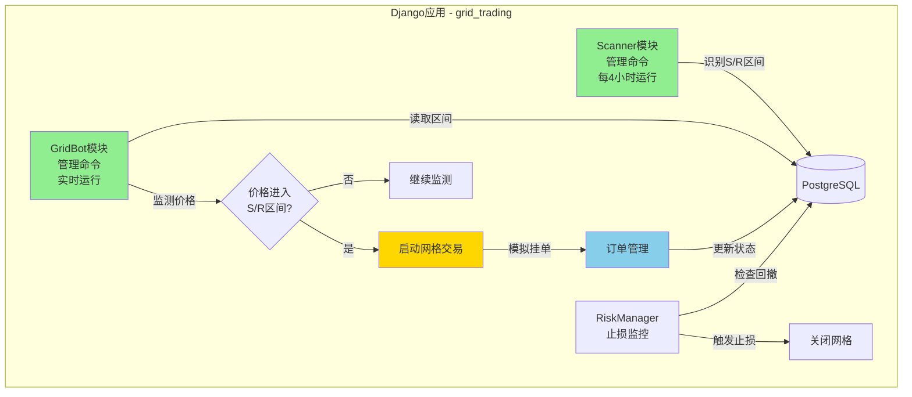

# 自动网格交易系统 - 简化方案 v2

**功能分支**: `004-auto-grid-trading`
**创建日期**: 2025-11-28
**版本**: v2（简化版）
**状态**: 待审批

---

## 📋 需求确认

根据用户反馈，本期开发目标：

| 需求项 | 确认结果 |
|--------|---------|
| **开发目标** | 完整实盘系统（Paper Trading模式） |
| **交易所接入** | ❌ 暂不接入真实交易所，模拟挂单即可 |
| **信号确认** | ❌ 不需要VSA信号确认，价格进入区间直接开网格 |
| **参数优化** | ✅ 手动配置，通过配置文件设置 |
| **风险管理** | ✅ 简单的止损配置（默认10%） |
| **回测框架** | ❌ 本期不集成，专注功能实现 |

---

## 一、简化后的系统架构

### 1.1 核心模块（2个）



### 1.2 数据流

```
步骤1: Scanner每4H运行
  ↓ 调用VP-Squeeze分析器
  ↓ 识别S1/S2/R1/R2
  ↓ 写入GridZone表

步骤2: GridBot实时运行（每分钟）
  ↓ 读取GridZone表
  ↓ 获取当前价格
  ↓ 判断：价格是否进入支撑区(S1-S2) 或 压力区(R1-R2)?

  如果进入支撑区 → 开启做多网格
    ↓ 在当前价下方布置Buy Limit订单
    ↓ 在当前价上方布置Sell Limit订单
    ↓ 等待"价格波动触发成交"

  如果进入压力区 → 开启做空网格（可选）

步骤3: RiskManager持续监控
  ↓ 计算当前浮动盈亏
  ↓ 是否触发止损（亏损>10%）?
  ↓ 是 → 市价全平 + 关闭网格
```

---

## 二、Django数据模型

### 2.1 核心表结构

```python
# grid_trading/models.py

class GridZone(models.Model):
    """支撑/压力区间"""
    symbol = models.CharField(max_length=20)  # BTCUSDT
    zone_type = models.CharField(max_length=10)  # support/resistance
    price_low = models.DecimalField(max_digits=20, decimal_places=8)
    price_high = models.DecimalField(max_digits=20, decimal_places=8)
    confidence = models.IntegerField()  # 置信度 0-100

    created_at = models.DateTimeField(auto_now_add=True)
    expires_at = models.DateTimeField()  # Scanner每次更新会刷新
    is_active = models.BooleanField(default=True)


class GridStrategy(models.Model):
    """网格策略实例"""
    symbol = models.CharField(max_length=20)
    strategy_type = models.CharField(max_length=10)  # long/short

    # 网格参数
    grid_step_pct = models.DecimalField(max_digits=5, decimal_places=4)  # 0.0080 = 0.8%
    grid_levels = models.IntegerField(default=10)  # 网格层数
    order_size = models.DecimalField(max_digits=20, decimal_places=8)  # 每格金额

    # 止损参数
    stop_loss_pct = models.DecimalField(max_digits=5, decimal_places=4, default=0.10)  # 10%

    # 状态
    status = models.CharField(max_length=20)  # idle/active/stopped
    entry_price = models.DecimalField(max_digits=20, decimal_places=8, null=True)
    pnl = models.DecimalField(max_digits=20, decimal_places=8, default=0)  # 累计盈亏

    created_at = models.DateTimeField(auto_now_add=True)
    updated_at = models.DateTimeField(auto_now=True)


class GridOrder(models.Model):
    """网格订单"""
    strategy = models.ForeignKey(GridStrategy, on_delete=models.CASCADE)
    order_type = models.CharField(max_length=10)  # buy/sell
    price = models.DecimalField(max_digits=20, decimal_places=8)
    quantity = models.DecimalField(max_digits=20, decimal_places=8)

    # 订单状态
    status = models.CharField(max_length=20)  # pending/filled/cancelled
    filled_at = models.DateTimeField(null=True)

    # 模拟撮合
    simulated_price = models.DecimalField(max_digits=20, decimal_places=8, null=True)
    simulated_fee = models.DecimalField(max_digits=20, decimal_places=8, default=0)

    created_at = models.DateTimeField(auto_now_add=True)


class StrategyConfig(models.Model):
    """策略参数配置（可追溯）"""
    symbol = models.CharField(max_length=20)
    config_name = models.CharField(max_length=50)  # "btc_default_v1"

    # 网格配置
    atr_multiplier = models.DecimalField(max_digits=5, decimal_places=2, default=0.80)
    grid_levels = models.IntegerField(default=10)
    order_size_usdt = models.DecimalField(max_digits=10, decimal_places=2, default=100)

    # 风险配置
    stop_loss_pct = models.DecimalField(max_digits=5, decimal_places=4, default=0.10)
    max_position_usdt = models.DecimalField(max_digits=10, decimal_places=2, default=1000)

    is_active = models.BooleanField(default=True)
    created_at = models.DateTimeField(auto_now_add=True)
```

---

## 三、系统工作流程

### 3.1 Scanner模块

```python
# grid_trading/management/commands/scanner.py

class Command(BaseCommand):
    def handle(self, *args, **options):
        symbol = options['symbol']  # 如 'btc'

        # 1. 调用现有VP-Squeeze分析器
        from vp_squeeze.services.multi_timeframe_analyzer import analyze_multiple_timeframes
        analyses = analyze_multiple_timeframes(symbol, ['4h'])

        from vp_squeeze.services.four_peaks_analyzer import analyze_four_peaks
        box = analyze_four_peaks(analyses, symbol.upper() + 'USDT')

        # 2. 提取S/R区间
        support_zones = [
            {'low': box.support2.price * 0.995, 'high': box.support2.price * 1.005},
            {'low': box.support1.price * 0.995, 'high': box.support1.price * 1.005},
        ]

        resistance_zones = [
            {'low': box.resistance1.price * 0.995, 'high': box.resistance1.price * 1.005},
            {'low': box.resistance2.price * 0.995, 'high': box.resistance2.price * 1.005},
        ]

        # 3. 写入数据库
        GridZone.objects.filter(symbol=symbol, is_active=True).update(is_active=False)

        for zone in support_zones:
            GridZone.objects.create(
                symbol=symbol,
                zone_type='support',
                price_low=zone['low'],
                price_high=zone['high'],
                confidence=80,
                expires_at=timezone.now() + timedelta(hours=4)
            )

        # resistance同理...
```

### 3.2 GridBot模块

```python
# grid_trading/management/commands/gridbot.py

class Command(BaseCommand):
    def handle(self, *args, **options):
        symbol = options['symbol']

        while True:  # 持续运行
            # 1. 获取当前价格
            current_price = self.fetch_current_price(symbol)

            # 2. 检查是否有活跃策略
            active_strategy = GridStrategy.objects.filter(
                symbol=symbol,
                status='active'
            ).first()

            if active_strategy:
                # 3a. 策略运行中 → 检查订单 + 止损
                self.check_orders(active_strategy, current_price)
                self.check_stop_loss(active_strategy, current_price)
            else:
                # 3b. 无活跃策略 → 检查是否触发入场
                zone = self.check_entry_zone(symbol, current_price)
                if zone:
                    self.start_grid_strategy(symbol, zone, current_price)

            time.sleep(60)  # 每分钟检查一次

    def check_entry_zone(self, symbol, current_price):
        """检查价格是否进入支撑/压力区"""
        zones = GridZone.objects.filter(
            symbol=symbol,
            is_active=True,
            price_low__lte=current_price,
            price_high__gte=current_price
        )
        return zones.first()

    def start_grid_strategy(self, symbol, zone, current_price):
        """启动网格策略"""
        # 1. 加载配置
        config = StrategyConfig.objects.filter(symbol=symbol, is_active=True).first()

        # 2. 计算网格步长（基于ATR）
        atr = self.calculate_atr(symbol, period=14)
        grid_step_pct = (atr / current_price) * config.atr_multiplier

        # 3. 创建策略实例
        strategy = GridStrategy.objects.create(
            symbol=symbol,
            strategy_type='long' if zone.zone_type == 'support' else 'short',
            grid_step_pct=grid_step_pct,
            grid_levels=config.grid_levels,
            order_size=config.order_size_usdt / current_price,
            stop_loss_pct=config.stop_loss_pct,
            status='active',
            entry_price=current_price
        )

        # 4. 布置网格订单
        self.place_grid_orders(strategy, current_price)

    def place_grid_orders(self, strategy, current_price):
        """布置网格订单"""
        step = float(strategy.grid_step_pct)

        # 下方挂买单
        for i in range(1, strategy.grid_levels + 1):
            buy_price = current_price * (1 - step * i)
            GridOrder.objects.create(
                strategy=strategy,
                order_type='buy',
                price=buy_price,
                quantity=strategy.order_size,
                status='pending'
            )

        # 上方挂卖单
        for i in range(1, strategy.grid_levels + 1):
            sell_price = current_price * (1 + step * i)
            GridOrder.objects.create(
                strategy=strategy,
                order_type='sell',
                price=sell_price,
                quantity=strategy.order_size,
                status='pending'
            )

    def check_orders(self, strategy, current_price):
        """检查订单是否成交（模拟撮合）"""
        pending_orders = GridOrder.objects.filter(
            strategy=strategy,
            status='pending'
        )

        for order in pending_orders:
            # 模拟撮合逻辑
            if order.order_type == 'buy' and current_price <= order.price:
                # 买单成交
                order.status = 'filled'
                order.filled_at = timezone.now()
                order.simulated_price = order.price
                order.simulated_fee = order.price * order.quantity * Decimal('0.001')  # 0.1% 手续费
                order.save()

                # 立即在上方挂卖单
                sell_price = order.price * (1 + float(strategy.grid_step_pct))
                GridOrder.objects.create(
                    strategy=strategy,
                    order_type='sell',
                    price=sell_price,
                    quantity=order.quantity,
                    status='pending'
                )

            elif order.order_type == 'sell' and current_price >= order.price:
                # 卖单成交（同理）
                # ...

    def check_stop_loss(self, strategy, current_price):
        """检查止损"""
        # 计算浮动盈亏
        filled_orders = GridOrder.objects.filter(strategy=strategy, status='filled')
        pnl = self.calculate_pnl(filled_orders, current_price)

        loss_pct = abs(pnl / (strategy.entry_price * strategy.order_size * strategy.grid_levels))

        if loss_pct >= float(strategy.stop_loss_pct):
            # 触发止损
            self.close_strategy(strategy, current_price, reason='stop_loss')
```

---

## 四、配置文件示例

```yaml
# config/grid_trading.yaml

btc_default:
  symbol: BTCUSDT

  # 网格参数
  atr_multiplier: 0.8  # ATR倍数
  grid_levels: 10      # 网格层数
  order_size_usdt: 100 # 每格100 USDT

  # 风险参数
  stop_loss_pct: 0.10  # 10%止损
  max_position_usdt: 1000  # 最大仓位1000 USDT

  # Scanner参数
  scanner_interval_hours: 4

  # GridBot参数
  check_interval_seconds: 60
```

---

## 五、定时任务配置

```bash
# crontab -e

# Scanner每4小时运行
0 */4 * * * cd /path && python manage.py scanner --symbol btc

# GridBot作为守护进程（使用systemd更稳定）
# 见下方systemd配置
```

**systemd服务** (推荐)

```ini
# /etc/systemd/system/gridbot@.service

[Unit]
Description=Grid Trading Bot for %i
After=network.target postgresql.service

[Service]
Type=simple
User=trader
WorkingDirectory=/home/trader/crypto_exchange_news_crawler
ExecStart=/home/trader/venv/bin/python manage.py gridbot --symbol %i
Restart=always
RestartSec=10

[Install]
WantedBy=multi-user.target
```

启动：
```bash
sudo systemctl enable gridbot@btc
sudo systemctl start gridbot@btc
sudo systemctl status gridbot@btc
```

---

## 六、开发阶段

### 阶段1: Scanner集成 (3天)
- ✅ 复用VP-Squeeze分析器
- ✅ 创建GridZone模型
- ✅ Scanner管理命令

### 阶段2: 网格核心逻辑 (5天)
- ✅ GridStrategy和GridOrder模型
- ✅ 网格订单布置算法
- ✅ 模拟订单撮合逻辑

### 阶段3: 风险管理 (2天)
- ✅ 止损监控
- ✅ 最大仓位限制
- ✅ 异常情况处理

### 阶段4: 配置和监控 (2天)
- ✅ YAML配置加载
- ✅ 日志和告警
- ✅ Admin后台界面

**总计：约12天（2周+2天缓冲）**

---

## 七、与原需求的差异说明

| 原需求 | 简化后 | 理由 |
|-------|--------|------|
| Trigger模块（VSA信号确认） | ❌ 移除 | 用户反馈：价格进区间直接开网格 |
| K-Means聚类 | ❌ 暂不实现 | VP-Squeeze已够用 |
| VPVR计算 | ❌ 暂不实现 | 成交量区间已在VP-Squeeze中 |
| 回测框架(VectorBT/Backtrader) | ❌ 移除 | 本期专注功能实现 |
| 期权对冲 | ❌ 移除 | 过于复杂 |
| 前向测试(Walk-Forward) | ❌ 移除 | 延后到下期 |

---

## 八、风险提示

### ⚠️ 简化带来的风险

| 风险 | 影响 | 缓解措施 |
|------|------|---------|
| **无信号确认** | 可能在下跌趋势中持续开多单 | 严格执行止损(10%) |
| **无回测验证** | 参数可能不是最优 | Paper Trading积累数据后手动调整 |
| **固定参数** | 无法适应市场变化 | 定期人工review并调整配置文件 |

### ✅ 建议

1. **初期小仓位运行**
   - 每格仅100 USDT
   - 最多10层网格 = 1000 USDT风险敞口

2. **每日监控**
   - 检查Admin后台的策略状态
   - 查看GridOrder成交记录
   - 分析盈亏分布

3. **定期复盘**
   - 每周统计胜率
   - 识别哪些S/R区间效果好
   - 调整ATR倍数等参数

---

**此简化方案已移除复杂的信号确认和回测框架，专注于核心网格交易逻辑的实现。请审批后我将创建详细的实施计划！** 🚀
