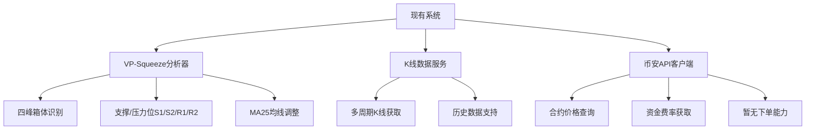
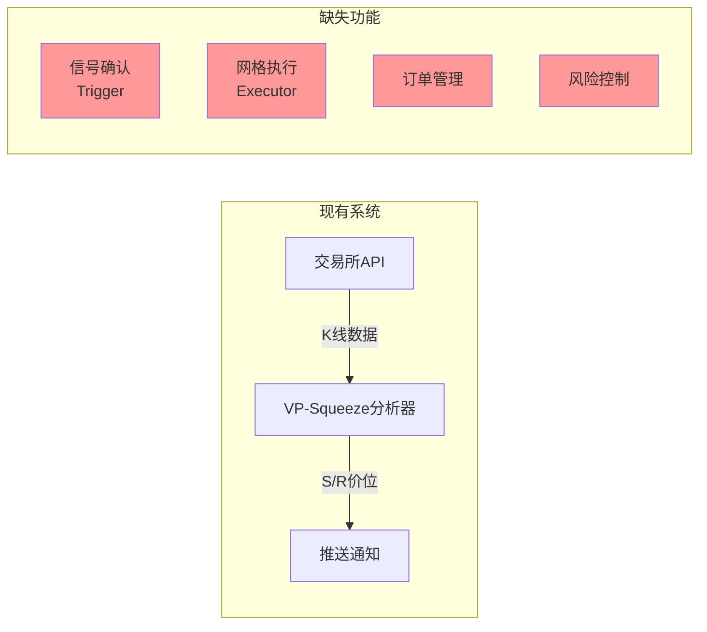
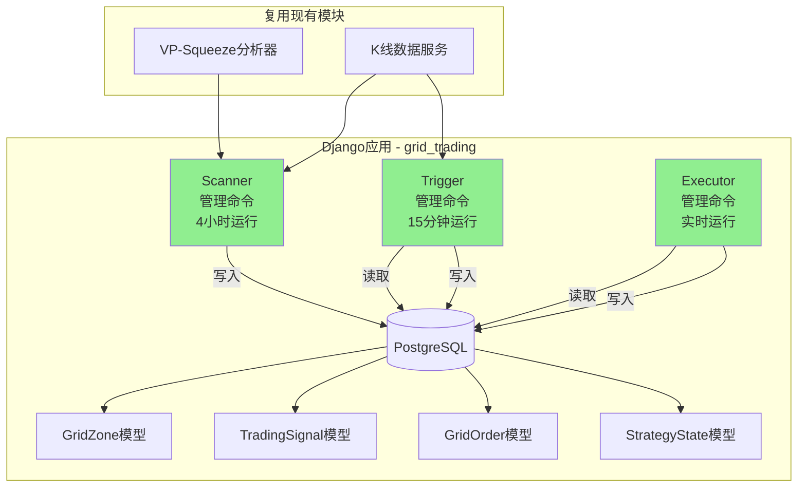
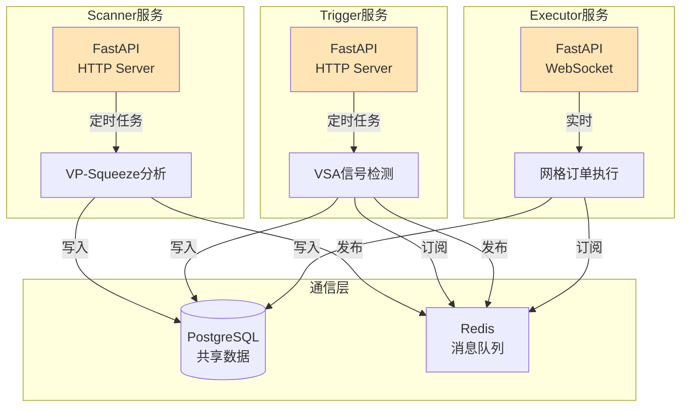

# 自动网格交易系统 - 方案文档

**功能分支**: `004-auto-grid-trading`
**创建日期**: 2025-11-28
**状态**: 待审批

---

## 一、现状分析 (Current State)

### 1.1 已有能力



### 1.2 可复用组件清单

| 组件 | 文件路径 | 可复用能力 | 缺失能力 |
|------|---------|-----------|---------|
| **VP-Squeeze分析器** | `vp_squeeze/services/four_peaks_analyzer.py` | ✅ S/R区间识别<br>✅ FourPeaksBox输出<br>✅ MA25调整 | ❌ K-Means聚类<br>❌ VPVR计算 |
| **K线数据服务** | `vp_squeeze/services/binance_kline_service.py` | ✅ 多周期数据<br>✅ 符号标准化 | ❌ 批量获取<br>❌ 缓存机制 |
| **币安API客户端** | `monitor/api_clients/binance.py` | ✅ 价格/资金费率<br>✅ 并行请求优化 | ❌ 下单/撤单<br>❌ 查询订单 |
| **Django模型** | `monitor/models.py` | ✅ 合约数据存储<br>✅ ORM查询 | ❌ 订单状态表<br>❌ 策略状态表 |

### 1.3 系统现状图



---

## 二、问题分析 (Analysis)

### 2.1 核心挑战

#### 挑战1: 模块间状态同步
- **问题**: Scanner(4H) → Trigger(15m) → Executor(实时) 三个模块运行频率不同
- **矛盾**: 如何高效传递GRID_ZONES状态?
- **风险**: 数据库读写过于频繁会成为性能瓶颈

#### 挑战2: 模拟订单的真实性
- **问题**: Paper Trading需要模拟真实的订单撮合逻辑
- **矛盾**: 太简单则无法验证策略,太复杂则开发成本高
- **风险**: 模拟环境表现好但实盘失败

#### 挑战3: 状态机复杂度
- **问题**: 网格系统有多个状态: Idle → Active → Closing
- **矛盾**: 每个状态下的订单管理逻辑不同
- **风险**: 状态转换错误导致资金损失

#### 挑战4: 参数可追溯性
- **问题**: 宪章要求所有参数必须可审计
- **矛盾**: 手动配置参数散落在代码或配置文件中
- **风险**: 无法回溯某次运行使用的参数版本

---

## 三、方案选项 (Solution Options)

### 方案A: 轻量级单体架构 🌟 **推荐**

#### 架构图



#### 方案描述

**核心理念**: 所有模块作为Django管理命令,通过数据库表同步状态

**新增组件** (标记为🆕):

1. **🆕 Django应用 `grid_trading`**
   - `grid_trading/models.py` - 4个新模型(见数据模型部分)
   - `grid_trading/management/commands/scanner.py` - Scanner管理命令
   - `grid_trading/management/commands/trigger.py` - Trigger管理命令
   - `grid_trading/management/commands/executor.py` - Executor管理命令

2. **🆕 模拟订单引擎**
   - `grid_trading/services/order_simulator.py` - 模拟挂单/成交逻辑
   - 使用实时价格判断订单是否成交
   - 记录滑点、手续费等真实因素

3. **🆕 风险管理器**
   - `grid_trading/services/risk_manager.py` - 止损/回撤监控
   - 配置化阈值(默认10%)

4. **🆕 参数配置表**
   - `grid_trading/models/GridStrategyConfig` - 存储所有策略参数
   - 每次运行创建快照,确保可追溯

**数据流**:
```
Scanner每4H运行 → 识别S/R → 写入GridZone表
↓
Trigger每15m运行 → 读取GridZone → 检测VSA信号 → 写入TradingSignal表
↓
Executor实时运行 → 读取TradingSignal → 模拟挂单 → 更新GridOrder表
```

**定时任务** (使用crontab):
```bash
0 */4 * * * cd /path && python manage.py scanner --symbol BTC
*/15 * * * * cd /path && python manage.py trigger --symbol BTC
* * * * * cd /path && python manage.py executor --symbol BTC
```

#### 优点 (Pros)

| 优点 | 说明 |
|------|------|
| ✅ **架构简单** | 单一Django项目,易于理解和调试 |
| ✅ **复用现有** | 直接使用现有VP-Squeeze和K线服务 |
| ✅ **快速开发** | 预计2周完成MVP |
| ✅ **易于测试** | 所有逻辑在一个项目中,单元测试方便 |
| ✅ **符合宪章** | 遵循"简单至上"和"小步提交"原则 |
| ✅ **渐进式扩展** | 未来可拆分为微服务 |

#### 缺点 (Cons)

| 缺点 | 影响 | 缓解措施 |
|------|------|---------|
| ❌ **数据库压力** | Executor每分钟读写,可能成为瓶颈 | 使用PostgreSQL连接池,添加Redis缓存 |
| ❌ **单点故障** | Django进程崩溃则全系统停止 | 使用systemd自动重启,添加告警 |
| ❌ **扩展性受限** | 多币种并发时性能下降 | 当前只监控1-2个币种,足够用 |

#### 复杂度评估

- **开发复杂度**: ⭐⭐☆☆☆ (中低)
- **运维复杂度**: ⭐⭐☆☆☆ (中低)
- **测试复杂度**: ⭐☆☆☆☆ (低)
- **预计开发时间**: 2周(MVP)

---

### 方案B: 微服务架构

#### 架构图



#### 方案描述

**核心理念**: 三个模块独立部署,通过Redis Pub/Sub通信

**新增组件**:

1. **3个FastAPI服务**
   - `scanner_service/` - 独立服务,暴露HTTP API
   - `trigger_service/` - 独立服务
   - `executor_service/` - 独立服务,支持WebSocket

2. **Redis消息队列**
   - 频道: `grid:zones`, `grid:signals`, `grid:orders`
   - 实现松耦合通信

3. **Docker Compose编排**
   - 一键启动所有服务
   - 容器化部署

#### 优点 (Pros)

| 优点 | 说明 |
|------|------|
| ✅ **高扩展性** | 各服务可独立水平扩展 |
| ✅ **技术解耦** | 可为不同模块选择最佳技术栈 |
| ✅ **故障隔离** | 单个服务崩溃不影响其他模块 |
| ✅ **生产级架构** | 符合微服务最佳实践 |

#### 缺点 (Cons)

| 缺点 | 影响 | 缓解措施 |
|------|------|---------|
| ❌ **开发成本高** | 需要配置服务发现、API网关等 | 使用成熟框架(FastAPI + Redis) |
| ❌ **调试困难** | 分布式追踪需要额外工具 | 添加ELK或Jaeger |
| ❌ **过度设计** | Paper Trading不需要如此复杂架构 | - |
| ❌ **维护成本** | 需要管理多个服务和容器 | 使用K8s或Docker Compose |

#### 复杂度评估

- **开发复杂度**: ⭐⭐⭐⭐☆ (高)
- **运维复杂度**: ⭐⭐⭐⭐⭐ (很高)
- **测试复杂度**: ⭐⭐⭐⭐☆ (高)
- **预计开发时间**: 6周

---

## 四、推荐方案 (Recommendation)

### 🌟 推荐: 方案A - 轻量级单体架构

#### 推荐理由

1. **符合当前需求**
   - 您明确表示"先不接入交易所,模拟挂单即可"
   - Paper Trading不需要微服务的高并发能力
   - 单体架构足够支撑1-5个币种的并发监控

2. **符合宪法原则**

   | 宪法原则 | 方案A的一致性 |
   |---------|-------------|
   | **简单至上** | ✅ 单一Django项目,无分布式复杂度 |
   | **务实主义** | ✅ 选择最适合当前阶段的方案 |
   | **小步提交** | ✅ 可按模块逐步实现(Scanner→Trigger→Executor) |
   | **渐进式部署** | ✅ 未来可重构为微服务 |

3. **快速验证价值**
   - 2周内完成MVP,快速进入回测阶段
   - 验证策略有效性后再考虑架构升级

4. **成本效益最优**
   - 开发时间: 2周 vs 6周(节省4周)
   - 维护成本: 低(单一进程) vs 高(多服务)
   - 测试成本: 低(单体测试) vs 高(集成测试)

#### 迁移路径

方案A未来可平滑升级到方案B:

```
阶段1 (当前): 单体架构 → Paper Trading验证
                 ↓
阶段2 (3个月后): 如果策略有效 → 回测验证参数
                 ↓
阶段3 (6个月后): 小资金实盘 → 考虑拆分Executor为独立服务
                 ↓
阶段4 (1年后): 多币种/多策略 → 全面微服务化
```

#### 与宪法的一致性检查

| 宪法要求 | 方案A如何满足 |
|---------|-------------|
| **回测优先** | ✅ 先完成Scanner+Trigger,再用VectorBT回测 |
| **风险控制第一** | ✅ 独立的RiskManager模块 |
| **模块化与状态隔离** | ✅ 三个管理命令独立,通过DB通信 |
| **参数可追溯** | ✅ GridStrategyConfig表记录所有参数版本 |
| **渐进式部署** | ✅ Paper Trading → 回测 → Micro实盘 |

---

## 五、下一步行动

### 如果批准方案A

1. 创建 `IMPLEMENTATION_PLAN.md` (3-5个阶段)
2. 定义数据模型 (4个Django模型)
3. 定义API契约 (Scanner/Trigger/Executor接口)
4. 开始阶段1: Scanner模块实现

### 如果选择方案B

1. 讨论服务拆分边界
2. 选择消息队列方案(Redis/RabbitMQ/Kafka)
3. 定义服务间API契约
4. 设计Docker Compose配置

---

## 六、风险提示

### ⚠️ 无论选择哪个方案,必须注意:

1. **回测强制性**
   - 在Paper Trading阶段就必须进行历史数据回测
   - 不能跳过回测直接"上线"模拟系统

2. **参数记录**
   - 每次运行都必须记录使用的参数版本
   - 建议使用Git标签标记参数版本

3. **止损测试**
   - 必须测试止损逻辑在极端行情下的表现
   - 模拟2020年3月暴跌场景

4. **滑点模拟**
   - 模拟订单引擎必须包含滑点计算
   - 建议使用0.05%-0.1%的滑点

---

**请您审阅并选择方案,我将立即开始下一步工作。** 🚀
