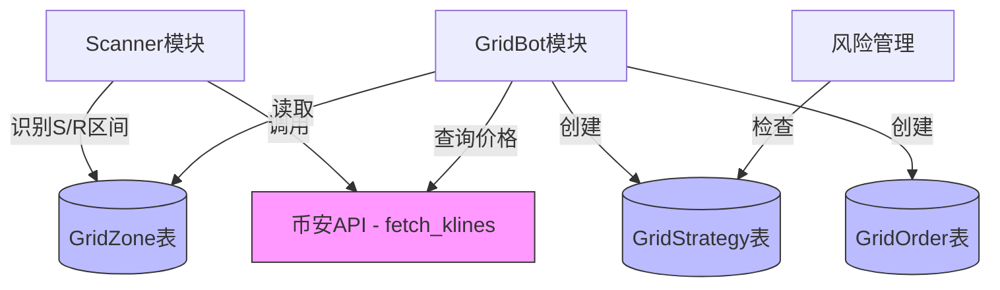
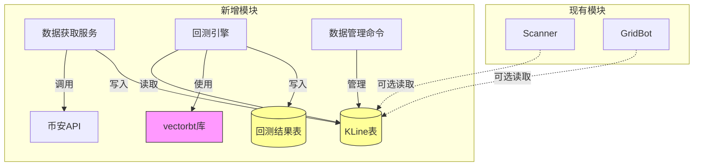

# 回测框架与数据持久化方案

**Branch**: `005-backtest-framework`
**Date**: 2025-11-28
**Status**: Proposal (待审批)
**前置需求**: 004-auto-grid-trading (已完成)

---

## 目录

1. [需求背景](#需求背景)
2. [现状分析](#现状分析)
3. [核心需求](#核心需求)
4. [方案选项](#方案选项)
5. [推荐方案](#推荐方案)
6. [技术决策](#技术决策)
7. [风险评估](#风险评估)

---

## 需求背景

### 业务目标

当前网格交易系统已实现Paper Trading模式，但缺少以下能力：
1. **历史数据支持**: 没有历史K线数据用于分析和回测
2. **策略验证**: 无法对网格策略进行历史数据回测
3. **参数优化**: 无法基于历史数据优化网格参数（ATR倍数、网格层数等）

### 用户需求

1. **数据需求**: 接入币安4小时ETH数据（6个月历史），持久化到数据库
2. **回测需求**: 使用vectorbt框架，基于持久化数据进行网格策略回测

### 业务价值

- ✅ 验证网格策略的历史表现
- ✅ 优化策略参数（网格步长、止损线等）
- ✅ 降低实盘风险（先回测再上线）
- ✅ 积累数据资产（支持未来更多分析）

---

## 现状分析

### 当前系统架构



### 现有能力

✅ **已有**:
- `vp_squeeze/services/binance_kline_service.py`: 币安K线数据获取服务
- `vp_squeeze/dto.py`: KLineData数据传输对象
- `grid_trading` Django应用：完整的网格交易逻辑
- PostgreSQL/SQLite数据库支持

❌ **缺失**:
- K线历史数据持久化（当前只在内存中临时使用）
- 回测框架集成
- 回测结果存储和分析

### 技术栈

- **Python**: 3.8+
- **Django**: 4.2.8
- **数据库**: PostgreSQL (生产) / SQLite (开发)
- **币安API**: 现货API v3
- **数据分析**: 需要引入 (pandas, numpy)
- **回测框架**: 需要引入 (vectorbt)

---

## 核心需求

### 功能需求

#### FR1: 历史数据持久化

- **FR1.1**: 支持币安4小时ETH数据获取（6个月）
- **FR1.2**: K线数据存储到数据库（去重、增量更新）
- **FR1.3**: 数据质量验证（缺失检测、异常值检测）
- **FR1.4**: 支持数据查询和导出

#### FR2: 回测框架集成

- **FR2.1**: 集成vectorbt库
- **FR2.2**: 实现网格策略回测逻辑
- **FR2.3**: 支持多参数组合回测
- **FR2.4**: 回测结果可视化和报告

#### FR2.3: 数据管理

- **FR3.1**: 支持数据更新（每日/每周）
- **FR3.2**: 支持多币种、多时间周期扩展
- **FR3.3**: 数据清理和归档

### 非功能需求

- **性能**: 6个月数据（~1100条）查询 < 100ms
- **存储**: 单币种单周期数据 < 50MB
- **可靠性**: 数据获取失败自动重试
- **可扩展**: 支持添加更多币种和时间周期

---

## 方案选项

### 方案A: 独立数据表 + vectorbt集成 (推荐)

#### 架构设计



#### 数据库设计

**新增表1: KLine (K线历史数据)**

```python
class KLine(models.Model):
    """K线历史数据"""
    symbol = models.CharField(max_length=20, db_index=True)      # ETHUSDT
    interval = models.CharField(max_length=10, db_index=True)    # 4h

    # OHLCV数据
    open_time = models.DateTimeField(db_index=True)
    open_price = models.DecimalField(max_digits=20, decimal_places=8)
    high_price = models.DecimalField(max_digits=20, decimal_places=8)
    low_price = models.DecimalField(max_digits=20, decimal_places=8)
    close_price = models.DecimalField(max_digits=20, decimal_places=8)
    volume = models.DecimalField(max_digits=30, decimal_places=8)

    close_time = models.DateTimeField()
    quote_volume = models.DecimalField(max_digits=30, decimal_places=8)
    trade_count = models.IntegerField()
    taker_buy_volume = models.DecimalField(max_digits=30, decimal_places=8)
    taker_buy_quote_volume = models.DecimalField(max_digits=30, decimal_places=8)

    created_at = models.DateTimeField(auto_now_add=True)

    class Meta:
        unique_together = [['symbol', 'interval', 'open_time']]  # 防止重复
        indexes = [
            models.Index(fields=['symbol', 'interval', 'open_time']),
            models.Index(fields=['open_time']),
        ]
```

**新增表2: BacktestResult (回测结果)**

```python
class BacktestResult(models.Model):
    """回测结果记录"""
    name = models.CharField(max_length=100)                      # 回测名称
    symbol = models.CharField(max_length=20)
    interval = models.CharField(max_length=10)

    # 回测参数
    strategy_params = models.JSONField()                         # 网格参数
    start_date = models.DateTimeField()
    end_date = models.DateTimeField()

    # 回测结果
    total_return = models.DecimalField(max_digits=10, decimal_places=4)
    sharpe_ratio = models.DecimalField(max_digits=10, decimal_places=4, null=True)
    max_drawdown = models.DecimalField(max_digits=10, decimal_places=4)
    win_rate = models.DecimalField(max_digits=5, decimal_places=2)
    total_trades = models.IntegerField()

    # 详细数据
    equity_curve = models.JSONField(null=True)                   # 权益曲线
    trades_detail = models.JSONField(null=True)                  # 交易明细

    created_at = models.DateTimeField(auto_now_add=True)

    class Meta:
        indexes = [
            models.Index(fields=['symbol', 'interval', 'created_at']),
        ]
```

#### 目录结构

```text
backtest/                           # 新增Django应用
├── __init__.py
├── models.py                       # KLine, BacktestResult
├── management/commands/
│   ├── fetch_klines.py            # 数据获取命令
│   ├── update_klines.py           # 数据更新命令
│   └── run_backtest.py            # 回测执行命令
├── services/
│   ├── data_fetcher.py            # 数据获取服务
│   ├── data_validator.py          # 数据验证服务
│   ├── backtest_engine.py         # 回测引擎（vectorbt）
│   └── grid_strategy_vbt.py       # 网格策略（vectorbt格式）
├── admin.py                        # Django Admin
└── tests/
    ├── test_data_fetcher.py
    ├── test_backtest_engine.py
    └── test_grid_strategy.py
```

#### 优点

- ✅ **职责清晰**: 新模块独立，不影响现有grid_trading
- ✅ **可扩展**: 易于添加更多币种和时间周期
- ✅ **数据复用**: 其他模块可共享历史数据
- ✅ **标准化**: 遵循Django最佳实践
- ✅ **测试友好**: 独立模块易于测试

#### 缺点

- ⚠️ **数据冗余**: 可能与现有VP-Squeeze数据重叠（可接受）
- ⚠️ **初始开发**: 需要创建新的Django应用（工作量适中）

#### 实现步骤

1. **Phase 0**: 创建backtest Django应用，定义models
2. **Phase 1**: 实现数据获取服务（fetch_klines命令）
3. **Phase 2**: 集成vectorbt，实现回测引擎
4. **Phase 3**: 实现网格策略回测逻辑
5. **Phase 4**: 回测结果可视化和分析

---

### 方案B: 扩展现有模型 + pandas回测

#### 架构设计

不创建新应用，直接在`grid_trading`中添加KLine模型。
不使用vectorbt，自己实现基于pandas的简单回测。

#### 优点

- ✅ 代码集中，减少模块数量
- ✅ 不依赖vectorbt（减少依赖）

#### 缺点

- ❌ **功能受限**: 自己实现回测，功能不如vectorbt丰富
- ❌ **代码复杂**: grid_trading职责过重
- ❌ **维护困难**: 混合实盘和回测逻辑
- ❌ **重复造轮子**: vectorbt已是成熟的回测框架

---

### 方案C: 使用外部时序数据库 (InfluxDB/TimescaleDB)

#### 架构设计

使用专门的时序数据库存储K线数据，Django只存储回测结果。

#### 优点

- ✅ 时序数据库针对金融数据优化
- ✅ 查询性能更好
- ✅ 内置聚合和降采样

#### 缺点

- ❌ **复杂度高**: 需要额外部署和维护时序数据库
- ❌ **学习成本**: 需要学习新的查询语言
- ❌ **过度设计**: 对于6个月数据来说杀鸡用牛刀
- ❌ **依赖增加**: 增加系统依赖

---

## 推荐方案

**推荐：方案A - 独立数据表 + vectorbt集成**

### 理由

1. **职责分离**: backtest模块专注于历史数据和回测，grid_trading专注于实盘交易
2. **成熟工具**: vectorbt是专业的回测框架，功能强大，社区活跃
3. **渐进式**: 可以先实现数据持久化，后续再优化回测逻辑
4. **可扩展**: 未来可以扩展到更多币种、策略类型
5. **数据复用**: 历史数据可用于其他分析（机器学习、策略研究等）

### 关键决策

| 决策点 | 选择 | 原因 |
|--------|------|------|
| **模块划分** | 新建backtest应用 | 职责清晰，易于维护 |
| **回测框架** | vectorbt | 成熟、功能强大、性能好 |
| **数据存储** | PostgreSQL | 复用现有基础设施 |
| **数据范围** | 6个月，4小时周期 | 适中的数据量，便于测试 |
| **币种** | ETH（先期），可扩展 | 从一个币种开始验证 |

---

## 技术决策

### 1. 数据获取策略

**方案**: 批量获取 + 增量更新

```python
# 初次获取：6个月数据
fetch_klines --symbol ETHUSDT --interval 4h --days 180

# 增量更新：每天更新最新数据
update_klines --symbol ETHUSDT --interval 4h
```

**考虑因素**:
- 币安API限制：1200请求/分钟，2400请求/5分钟
- 每次请求最多1000条K线
- 6个月4小时数据约1100条，1次请求即可

### 2. 数据质量保证

```python
class DataValidator:
    """数据验证器"""

    def validate_kline(self, kline):
        """验证单条K线数据"""
        # 1. 价格合理性：high >= low, high >= open/close
        # 2. 时间连续性：open_time和close_time间隔正确
        # 3. 成交量非负
        pass

    def check_gaps(self, klines):
        """检查数据缺口"""
        # 检查时间序列是否连续
        pass
```

### 3. vectorbt集成策略

**依赖安装**:
```bash
pip install vectorbt pandas numpy matplotlib
```

**网格策略实现**:
```python
import vectorbt as vbt
import pandas as pd

class GridStrategyVBT:
    """网格策略（vectorbt格式）"""

    def __init__(self, klines_df, grid_step_pct=0.01, grid_levels=10):
        self.data = klines_df
        self.grid_step_pct = grid_step_pct
        self.grid_levels = grid_levels

    def generate_signals(self):
        """生成交易信号"""
        # 基于价格波动生成网格买卖信号
        pass

    def run_backtest(self):
        """运行回测"""
        # 使用vectorbt的Portfolio类
        portfolio = vbt.Portfolio.from_signals(
            close=self.data['close_price'],
            entries=buy_signals,
            exits=sell_signals,
            init_cash=10000,
            fees=0.001  # 0.1% 手续费
        )
        return portfolio
```

### 4. 性能优化

| 场景 | 优化策略 |
|------|----------|
| **数据插入** | 使用bulk_create批量插入 |
| **数据查询** | 合理使用索引，查询时添加symbol+interval过滤 |
| **数据导出** | 使用values_list避免ORM开销 |
| **回测计算** | vectorbt底层使用NumPy，性能已优化 |

---

## 风险评估

### 技术风险

| 风险 | 可能性 | 影响 | 缓解措施 |
|------|--------|------|----------|
| **币安API限流** | 中 | 中 | 添加请求间隔，实现指数退避重试 |
| **数据存储空间** | 低 | 低 | 6个月数据约5MB，PostgreSQL足够 |
| **vectorbt学习曲线** | 中 | 低 | 先实现简单策略，逐步学习 |
| **数据缺失/错误** | 中 | 中 | 实现数据验证和修复机制 |

### 业务风险

| 风险 | 可能性 | 影响 | 缓解措施 |
|------|--------|------|----------|
| **回测过拟合** | 高 | 高 | 使用训练集/测试集分割，多参数组合验证 |
| **回测与实盘差异** | 高 | 高 | 回测考虑滑点和手续费，保守估计 |
| **历史表现不代表未来** | 高 | 高 | 明确标注回测结果，不作为投资建议 |

---

## 方案对比总结

| 维度 | 方案A: 独立模块+vectorbt | 方案B: 扩展模型+pandas | 方案C: 时序数据库 |
|------|-------------------------|----------------------|-----------------|
| **实现复杂度** | ⭐⭐⭐ (中) | ⭐⭐ (低) | ⭐⭐⭐⭐⭐ (高) |
| **功能完整性** | ⭐⭐⭐⭐⭐ (高) | ⭐⭐⭐ (中) | ⭐⭐⭐⭐⭐ (高) |
| **可维护性** | ⭐⭐⭐⭐⭐ (优) | ⭐⭐⭐ (一般) | ⭐⭐ (差) |
| **性能** | ⭐⭐⭐⭐ (好) | ⭐⭐⭐ (一般) | ⭐⭐⭐⭐⭐ (优) |
| **扩展性** | ⭐⭐⭐⭐⭐ (优) | ⭐⭐⭐ (一般) | ⭐⭐⭐⭐ (好) |
| **学习成本** | ⭐⭐⭐ (中) | ⭐⭐ (低) | ⭐⭐⭐⭐ (高) |
| **推荐度** | ✅ **强烈推荐** | ⚠️ 不推荐 | ❌ 不推荐 |

---

## 下一步

### 方案确认后的行动

1. **创建IMPLEMENTATION_PLAN.md**: 详细的4阶段实现计划
2. **Phase 0**: 项目初始化，创建backtest应用
3. **Phase 1**: 实现数据获取和持久化
4. **Phase 2**: 集成vectorbt回测框架
5. **Phase 3**: 实现网格策略回测
6. **Phase 4**: 结果分析和可视化

### 需要确认的问题

1. ✅ 是否同意使用vectorbt作为回测框架？
2. ✅ 是否同意创建独立的backtest Django应用？
3. ✅ 数据范围：6个月，4小时周期，ETH是否合适？
4. ⚠️ 是否需要支持多币种（BTC/ETH/SOL）？
5. ⚠️ 是否需要支持多时间周期（1h/4h/1d）？

---

**文档版本**: v1.0
**创建时间**: 2025-11-28
**审批状态**: 待审批
**审批人**: (用户)
