# 经典网格交易策略 - 完整设计文档

## 目录

- [1. 策略概述](#1-策略概述)
- [2. 核心概念](#2-核心概念)
- [3. 网格初始化](#3-网格初始化)
- [4. 交易流程](#4-交易流程)
- [5. 状态管理](#5-状态管理)
- [6. 完整示例](#6-完整示例)
- [7. 实现细节](#7-实现细节)
- [8. 待确认问题](#8-待确认问题)

---

## 1. 策略概述

### 1.1 什么是网格交易？

网格交易是一种在**价格区间内**通过**频繁的低买高卖**来获利的量化策略。


### 1.2 策略优势

| 优势 | 说明 |
|------|------|
| 🎯 **适合震荡市** | 在横盘或震荡行情中表现优秀 |
| 🔄 **自动化** | 无需预测方向，价格触发自动交易 |
| 💰 **频繁套利** | 通过多次小幅盈利积累收益 |
| 📊 **风险分散** | 分层建仓，降低单笔风险 |

### 1.3 策略风险

| 风险 | 说明 | 缓解措施 |
|------|------|---------|
| ⚠️ **单边行情** | 持续上涨或下跌时表现差 | 设置止损 |
| 💸 **资金占用** | 需要足够资金支撑多层网格 | 合理设置网格层数 |
| 📉 **套牢风险** | 下跌时可能全仓买入 | 控制单格投入比例 |

---

## 2. 核心概念

### 2.1 参数定义

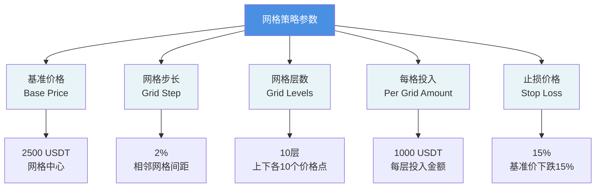

### 2.2 网格结构

```mermaid
graph TB
    subgraph "卖出区域 (上方)"
        S10[Sell-10: 3000 USDT]
        S9[Sell-9: 2950 USDT]
        S8[Sell-8: 2900 USDT]
        S7[Sell-7: 2850 USDT]
        S6[Sell-6: 2800 USDT]
        S5[Sell-5: 2750 USDT]
        S4[Sell-4: 2700 USDT]
        S3[Sell-3: 2650 USDT]
        S2[Sell-2: 2600 USDT]
        S1[Sell-1: 2550 USDT]
    end

    BASE[⭐ 基准价格: 2500 USDT]

    subgraph "买入区域 (下方)"
        B1[Buy-1: 2450 USDT]
        B2[Buy-2: 2400 USDT]
        B3[Buy-3: 2350 USDT]
        B4[Buy-4: 2300 USDT]
        B5[Buy-5: 2250 USDT]
        B6[Buy-6: 2200 USDT]
        B7[Buy-7: 2150 USDT]
        B8[Buy-8: 2100 USDT]
        B9[Buy-9: 2050 USDT]
        B10[Buy-10: 2000 USDT]
    end

    S1 -.配对.-> B1
    S2 -.配对.-> B2
    S3 -.配对.-> B3

    style BASE fill:#ffd700,color:#000
    style S1 fill:#90EE90
    style S2 fill:#90EE90
    style S3 fill:#90EE90
    style B1 fill:#FFB6C1
    style B2 fill:#FFB6C1
    style B3 fill:#FFB6C1
```

### 2.3 网格配对关系

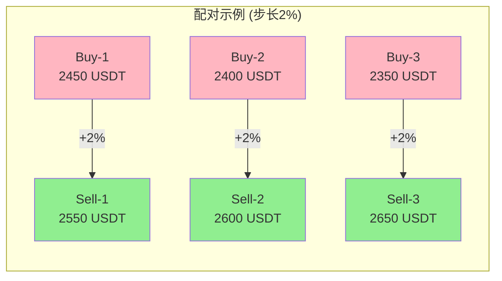

**配对公式**：
```
卖出价格 = 买入价格 × (1 + 步长)

例如：
Sell-1 = Buy-1 × 1.02 = 2450 × 1.02 = 2499 ≈ 2550
```

---

## 3. 网格初始化

### 3.1 初始化流程

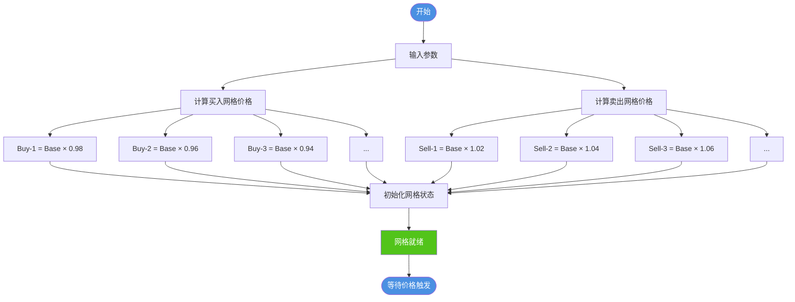

### 3.2 网格价格计算表

**示例配置**：
- 基准价格：2500 USDT
- 网格步长：2%
- 网格层数：10

| 买入网格 | 计算公式 | 价格 | 卖出网格 | 计算公式 | 价格 | 价差 |
|---------|---------|------|---------|---------|------|------|
| Buy-1 | 2500×0.98 | 2450 | Sell-1 | 2500×1.02 | 2550 | +100 |
| Buy-2 | 2500×0.96 | 2400 | Sell-2 | 2500×1.04 | 2600 | +200 |
| Buy-3 | 2500×0.94 | 2350 | Sell-3 | 2500×1.06 | 2650 | +300 |
| Buy-4 | 2500×0.92 | 2300 | Sell-4 | 2500×1.08 | 2700 | +400 |
| Buy-5 | 2500×0.90 | 2250 | Sell-5 | 2500×1.10 | 2750 | +500 |
| Buy-6 | 2500×0.88 | 2200 | Sell-6 | 2500×1.12 | 2800 | +600 |
| Buy-7 | 2500×0.86 | 2150 | Sell-7 | 2500×1.14 | 2850 | +700 |
| Buy-8 | 2500×0.84 | 2100 | Sell-8 | 2500×1.16 | 2900 | +800 |
| Buy-9 | 2500×0.82 | 2050 | Sell-9 | 2500×1.18 | 2950 | +900 |
| Buy-10 | 2500×0.80 | 2000 | Sell-10 | 2500×1.20 | 3000 | +1000 |

### 3.3 初始状态

```
┌─────────────────────────────────────┐
│         初始账户状态                 │
├─────────────────────────────────────┤
│ 💰 现金余额：10,000 USDT            │
│ 📊 持仓数量：0 ETH                  │
│ 💵 总价值：  10,000 USDT            │
├─────────────────────────────────────┤
│ 🔲 买入网格：10个（全部激活）       │
│ 🔳 卖出网格：10个（全部未激活）     │
└─────────────────────────────────────┘
```

---

## 4. 交易流程

### 4.1 完整交易生命周期

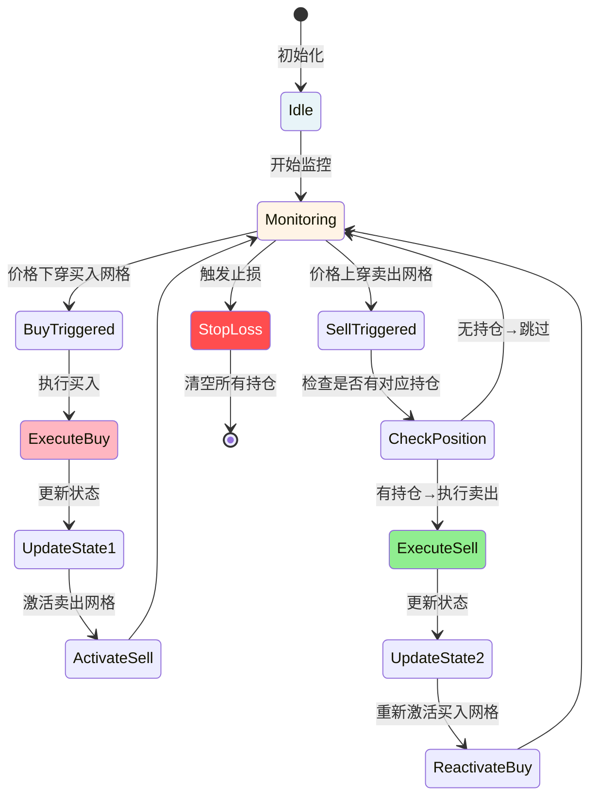

### 4.2 买入流程详解

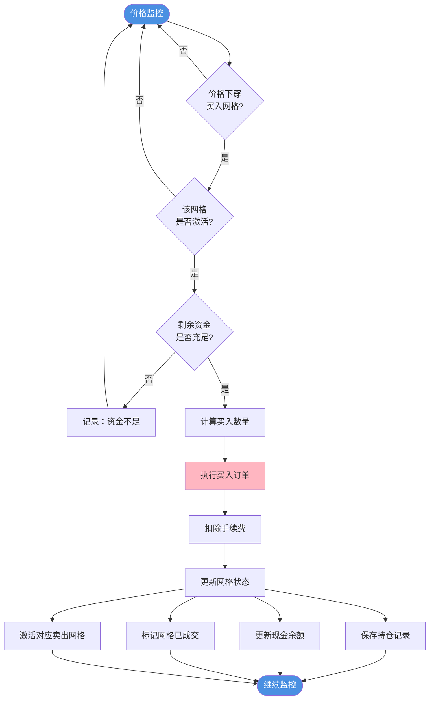

**买入计算示例**：

```
输入：
  - 买入价格：2450 USDT
  - 投入金额：1000 USDT
  - 手续费率：0.1%

计算：
  1. 手续费 = 1000 × 0.1% = 1 USDT
  2. 实际投入 = 1000 + 1 = 1001 USDT
  3. 买入数量 = 1000 / 2450 = 0.4082 ETH

输出：
  - 买入数量：0.4082 ETH
  - 成本：1001 USDT
  - 持仓记录：{ level: 1, amount: 0.4082, cost: 1001 }
```

### 4.3 卖出流程详解

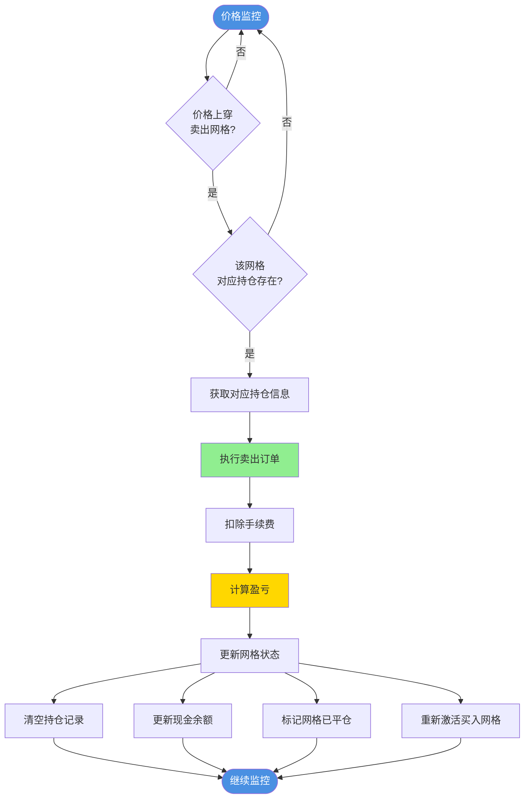

**卖出计算示例**：

```
输入：
  - 卖出价格：2550 USDT
  - 卖出数量：0.4082 ETH (来自Buy-1)
  - 买入成本：1001 USDT
  - 手续费率：0.1%

计算：
  1. 卖出所得 = 0.4082 × 2550 = 1041 USDT
  2. 手续费 = 1041 × 0.1% = 1.04 USDT
  3. 实际收入 = 1041 - 1.04 = 1039.96 USDT
  4. 净利润 = 1039.96 - 1001 = 38.96 USDT
  5. 收益率 = 38.96 / 1001 = 3.89%

输出：
  - 实际收入：1039.96 USDT
  - 净利润：38.96 USDT
  - 收益率：3.89%
```

### 4.4 价格穿越检测

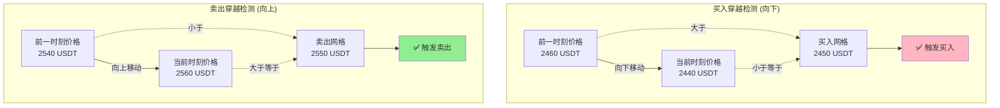

**伪代码**：

```python
# 买入穿越检测
def check_buy_cross(prev_price, curr_price, buy_level_price):
    """检查是否向下穿过买入网格"""
    return prev_price > buy_level_price >= curr_price

# 卖出穿越检测
def check_sell_cross(prev_price, curr_price, sell_level_price):
    """检查是否向上穿过卖出网格"""
    return prev_price < sell_level_price <= curr_price
```

---

## 5. 状态管理

### 5.1 网格状态机

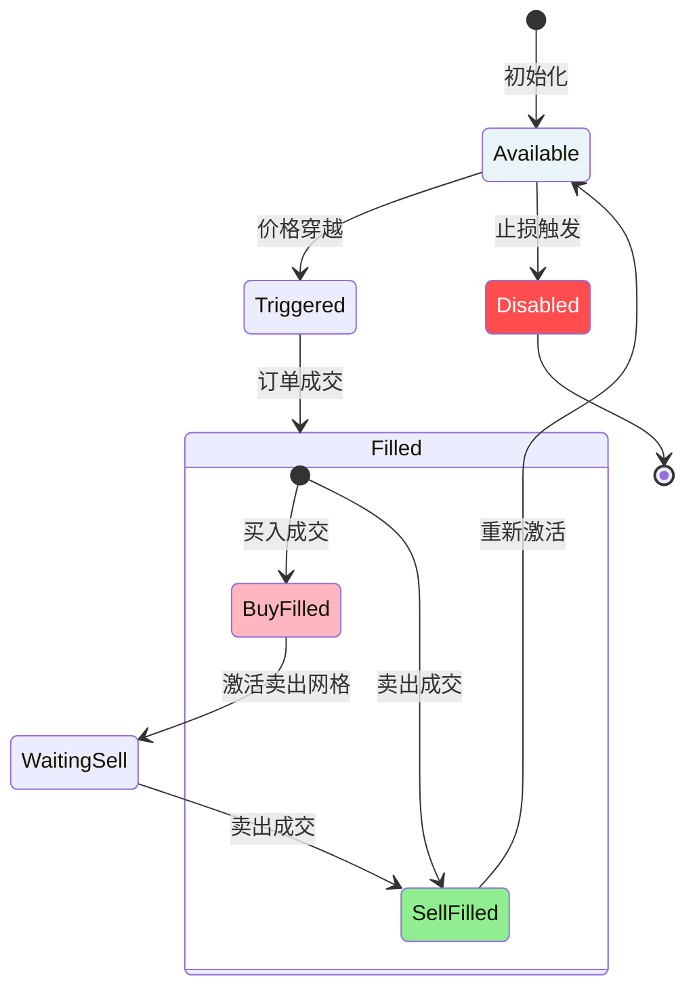

### 5.2 网格数据结构

```python
# 单个网格的状态
Grid = {
    "level": 1,                    # 网格层级
    "type": "buy",                 # 类型：buy/sell
    "price": 2450.0,               # 触发价格
    "status": "available",         # 状态：available/filled/waiting
    "paired_level": 1,             # 配对的网格层级
    "position": {                  # 持仓信息
        "amount": 0.4082,          # 持仓数量（ETH）
        "cost": 1001.0,            # 总成本（USDT）
        "buy_price": 2450.0,       # 买入价格
        "buy_time": "2025-01-15T10:00:00"  # 买入时间
    } or None                      # 无持仓时为None
}
```

### 5.3 账户状态

```python
Account = {
    "cash": 8999.0,                # 现金余额（USDT）
    "positions": [                 # 所有持仓列表
        {
            "grid_level": 1,
            "amount": 0.4082,
            "cost": 1001.0,
            "buy_price": 2450.0
        }
    ],
    "total_buy_orders": 1,         # 总买入次数
    "total_sell_orders": 0,        # 总卖出次数
    "realized_pnl": 0.0,           # 已实现盈亏
    "unrealized_pnl": -1.0,        # 未实现盈亏（含手续费）
    "total_fees": 2.0              # 总手续费
}
```

---

## 6. 完整示例

### 6.1 时序图

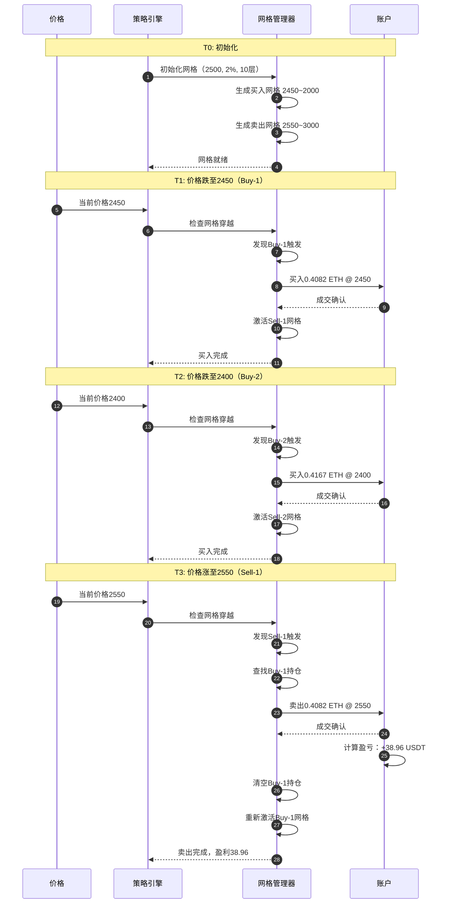

### 6.2 价格走势与交易点

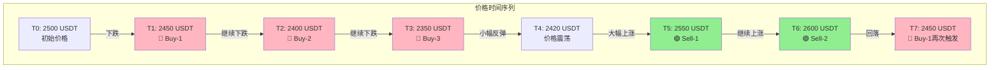

### 6.3 账户余额变化表

| 时刻 | 事件 | 价格 | 现金 | 持仓(ETH) | 持仓市值 | 总价值 | 盈亏 |
|------|------|------|------|----------|---------|--------|------|
| T0 | 初始化 | 2500 | 10,000 | 0 | 0 | 10,000 | 0 |
| T1 | Buy-1买入 | 2450 | 8,999 | 0.4082 | 1,000 | 9,999 | -1 |
| T2 | Buy-2买入 | 2400 | 7,998 | 0.8249 | 1,980 | 9,978 | -22 |
| T3 | Buy-3买入 | 2350 | 6,997 | 1.2504 | 2,938 | 9,935 | -65 |
| T4 | 价格震荡 | 2420 | 6,997 | 1.2504 | 3,026 | 10,023 | +23 |
| T5 | Sell-1卖出 | 2550 | 8,037 | 0.8422 | 2,148 | 10,185 | +185 |
| T6 | Sell-2卖出 | 2600 | 9,119 | 0.4255 | 1,106 | 10,225 | +225 |
| T7 | Buy-1再买 | 2450 | 8,118 | 0.8337 | 2,043 | 10,161 | +161 |

**关键观察**：
- 手续费导致初始亏损（-1 USDT）
- 下跌时浮亏扩大（-65 USDT）
- 反弹卖出后转为盈利（+185 USDT）
- 网格可重复触发（T7再次买入）

---

## 7. 实现细节

### 7.1 核心算法流程

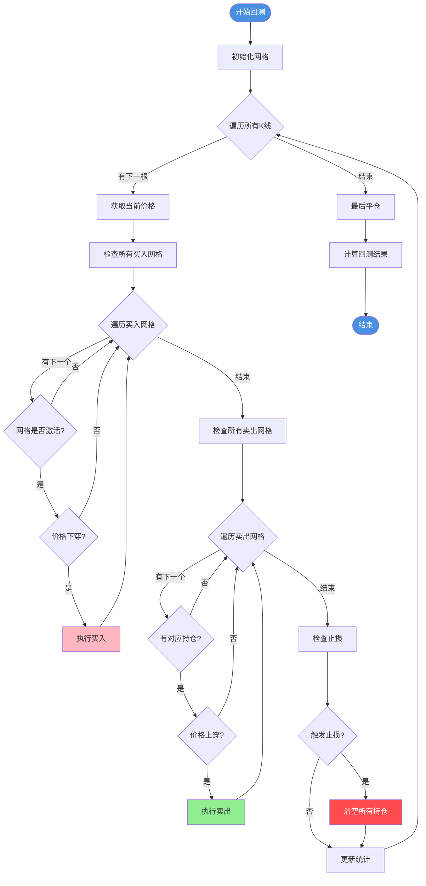

### 7.2 数据结构设计

```python
class GridStrategy:
    """网格策略核心类"""

    def __init__(self, config):
        # 配置参数
        self.base_price = config.base_price        # 基准价格
        self.grid_step = config.grid_step          # 网格步长
        self.grid_levels = config.grid_levels      # 网格层数
        self.per_grid_amount = config.amount       # 每格投入
        self.stop_loss_pct = config.stop_loss      # 止损百分比

        # 网格列表
        self.buy_grids = []      # 买入网格列表
        self.sell_grids = []     # 卖出网格列表

        # 账户状态
        self.cash = config.initial_cash            # 现金
        self.positions = {}                        # 持仓字典 {level: Position}

        # 统计信息
        self.total_buy_orders = 0
        self.total_sell_orders = 0
        self.realized_pnl = 0.0
        self.total_fees = 0.0

    def initialize_grids(self):
        """初始化网格"""
        for i in range(1, self.grid_levels + 1):
            # 买入网格
            buy_price = self.base_price * (1 - self.grid_step * i)
            sell_price = self.base_price * (1 + self.grid_step * i)

            self.buy_grids.append({
                'level': i,
                'price': buy_price,
                'status': 'available',
                'paired_sell_level': i
            })

            # 卖出网格
            self.sell_grids.append({
                'level': i,
                'price': sell_price,
                'status': 'inactive',  # 初始未激活
                'paired_buy_level': i
            })

    def on_price_update(self, prev_price, curr_price):
        """价格更新时调用"""
        # 1. 检查买入网格
        for grid in self.buy_grids:
            if self.check_buy_cross(prev_price, curr_price, grid):
                self.execute_buy(grid)

        # 2. 检查卖出网格
        for grid in self.sell_grids:
            if self.check_sell_cross(prev_price, curr_price, grid):
                self.execute_sell(grid)

        # 3. 检查止损
        if self.check_stop_loss(curr_price):
            self.close_all_positions(curr_price)
```

### 7.3 关键函数伪代码

#### 买入执行

```python
def execute_buy(self, grid, price):
    """
    执行买入操作

    Args:
        grid: 买入网格对象
        price: 当前价格
    """
    # 1. 检查资金
    if self.cash < self.per_grid_amount:
        log("资金不足，跳过买入")
        return

    # 2. 计算买入数量
    amount_in_usdt = self.per_grid_amount
    fee = amount_in_usdt * FEE_RATE
    total_cost = amount_in_usdt + fee
    amount_in_eth = amount_in_usdt / price

    # 3. 更新账户
    self.cash -= total_cost
    self.positions[grid.level] = {
        'amount': amount_in_eth,
        'cost': total_cost,
        'buy_price': price,
        'buy_time': current_time
    }

    # 4. 更新网格状态
    grid.status = 'filled'
    paired_sell_grid = self.sell_grids[grid.paired_sell_level - 1]
    paired_sell_grid.status = 'active'  # 激活卖出网格

    # 5. 统计
    self.total_buy_orders += 1
    self.total_fees += fee

    log(f"买入成交: Level {grid.level}, "
        f"价格 {price}, 数量 {amount_in_eth:.4f}")
```

#### 卖出执行

```python
def execute_sell(self, grid, price):
    """
    执行卖出操作

    Args:
        grid: 卖出网格对象
        price: 当前价格
    """
    # 1. 检查持仓
    buy_level = grid.paired_buy_level
    if buy_level not in self.positions:
        log("无对应持仓，跳过卖出")
        return

    position = self.positions[buy_level]

    # 2. 计算卖出收益
    amount_in_eth = position['amount']
    revenue = amount_in_eth * price
    fee = revenue * FEE_RATE
    net_revenue = revenue - fee

    # 3. 计算盈亏
    pnl = net_revenue - position['cost']
    pnl_pct = pnl / position['cost'] * 100

    # 4. 更新账户
    self.cash += net_revenue
    del self.positions[buy_level]

    # 5. 更新网格状态
    grid.status = 'inactive'  # 卖出网格重置
    paired_buy_grid = self.buy_grids[buy_level - 1]
    paired_buy_grid.status = 'available'  # 重新激活买入网格

    # 6. 统计
    self.total_sell_orders += 1
    self.realized_pnl += pnl
    self.total_fees += fee

    log(f"卖出成交: Level {grid.level}, "
        f"价格 {price}, 数量 {amount_in_eth:.4f}, "
        f"盈亏 {pnl:.2f} ({pnl_pct:.2f}%)")
```

---

## 8. 待确认问题

在实现之前，请明确以下设计选择：

### 问题1: 网格配对策略

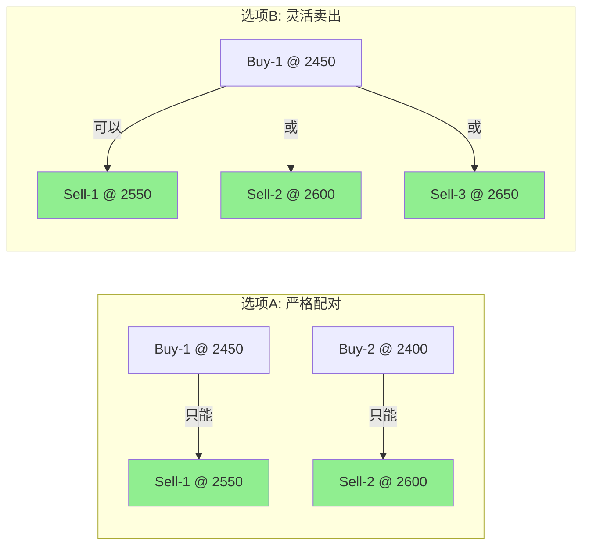

**你的选择**：`选项A` 或 `选项B`？

---

### 问题2: 卖出顺序

如果同时持有多个买入持仓（Buy-1, Buy-2, Buy-3），当Sell-2触发时：

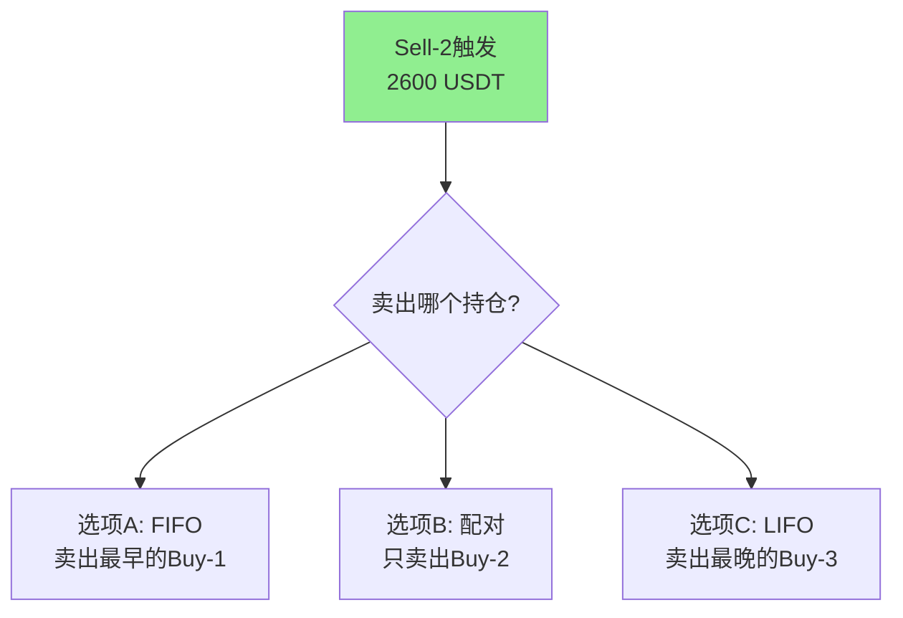

**你的选择**：`选项A`, `选项B`, 或 `选项C`？

---

### 问题3: 资金分配策略

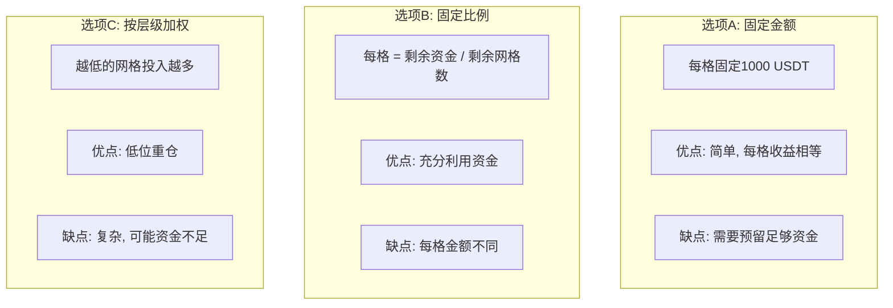

**你的选择**：`选项A`, `选项B`, 或 `选项C`？

---

### 问题4: 基准价格确定

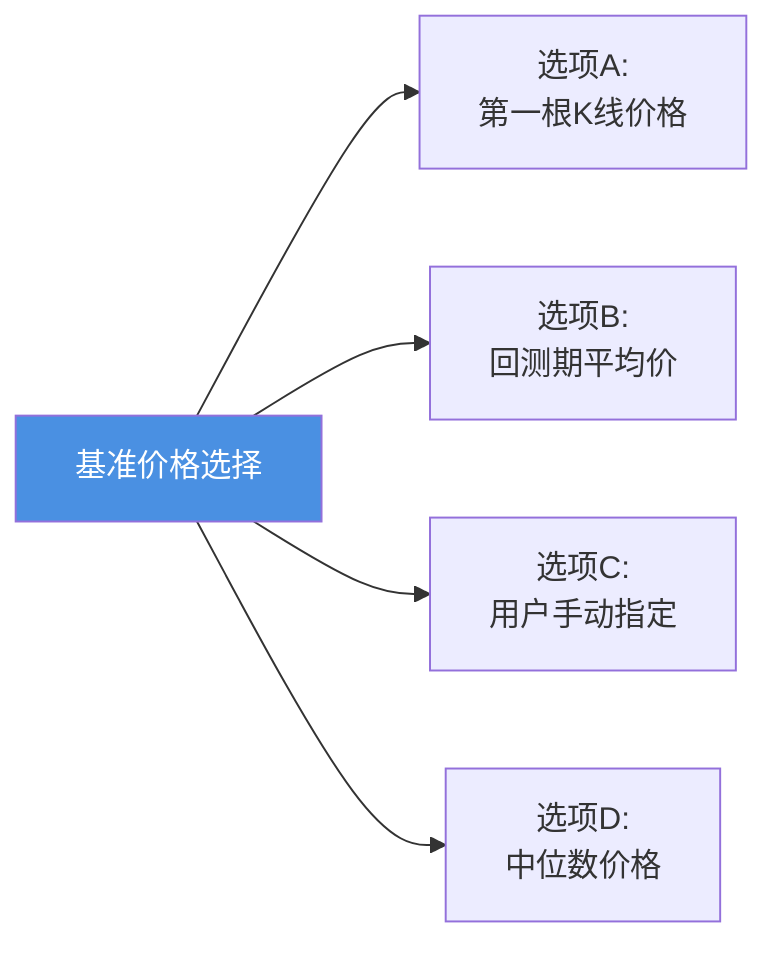

**你的选择**：`选项A`, `选项B`, `选项C`, 或 `选项D`？

---

### 问题5: 止损机制

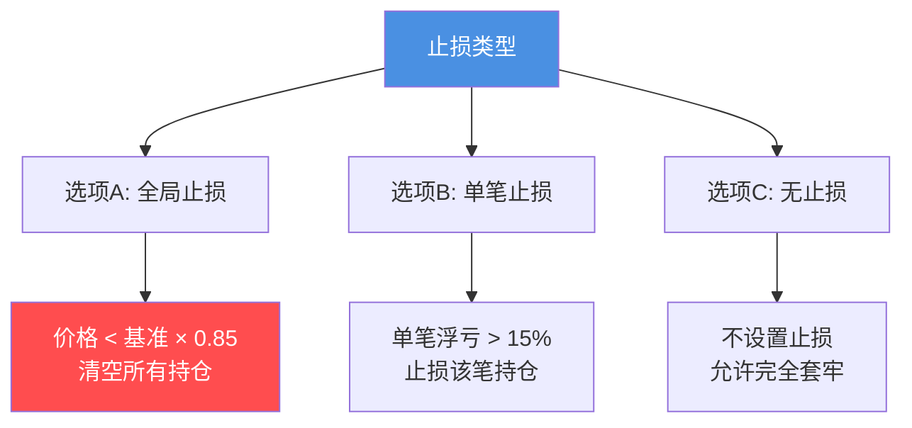

**你的选择**：`选项A`, `选项B`, 或 `选项C`？

---

## 9. 预期结果

### 9.1 合理的交易频率

在**震荡市场**（ETH 2000-3000区间，180天）：

| 市场特征 | 预期买入次数 | 预期卖出次数 | 总交易 |
|---------|------------|------------|--------|
| 窄幅震荡 (±5%) | 10-20 | 10-20 | 20-40 |
| 中幅震荡 (±10%) | 20-40 | 20-40 | 40-80 |
| 宽幅震荡 (±20%) | 30-60 | 30-60 | 60-120 |

**如果只有4笔交易，说明策略实现有误！**

### 9.2 收益分布

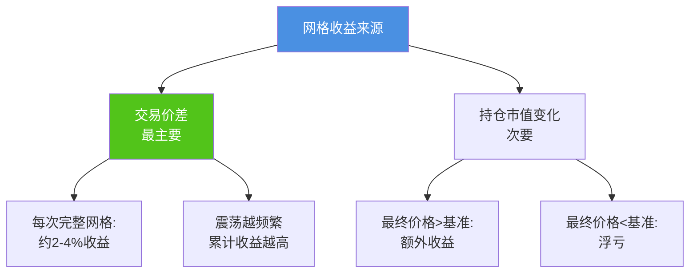

---

## 10. 总结

### ✅ 确认清单

请确认你理解并同意以下内容：

- [ ] 理解经典网格策略的核心原理
- [ ] 理解网格配对和重置机制
- [ ] 理解买入/卖出穿越检测逻辑
- [ ] 理解资金管理和持仓跟踪
- [ ] 明确8个待确认问题的答案

### 📋 实现前的准备

1. **明确设计选择**：回答8个待确认问题
2. **确定配置参数**：基准价格、步长、层数等
3. **商定测试标准**：期望的交易频率、收益率
4. **准备测试数据**：ETH 4h, 180天数据

### 🚀 下一步

**请回复你对8个待确认问题的答案，我将据此实现完整的网格策略！**

---

**文档版本**: v1.0
**创建时间**: 2025-11-28
**最后更新**: 2025-11-28
