# 网格策略 v2.0 - 完整策略说明书

**更新时间**: 2025-11-30
**文档状态**: 最终版（面向小白）
**目标读者**: 无量化背景，需要清晰理解策略逻辑

---

## 📚 目录

1. [策略核心思想](#1-策略核心思想)
2. [网格箱体计算](#2-网格箱体计算)
3. [仓位管理机制](#3-仓位管理机制)
4. [渐进式买入算法](#4-渐进式买入算法)
5. [分级止盈卖出](#5-分级止盈卖出)
6. [箱体止损机制](#6-箱体止损机制) ⭐ 新增空头止损
7. [完整交易示例](#7-完整交易示例)
8. [数据库设计](#8-数据库设计)
9. [核心代码算法](#9-核心代码算法)
10. [常见问题解答](#10-常见问题解答) (9个问题)

---

## 1. 策略核心思想

### 1.1 什么是箱体网格策略？

**简单理解**：
- 把价格波动想象成一个**箱子**（箱体）
- 箱子有**4层**：上面2层是压力位（阻力），下面2层是支撑位（反弹）
- 价格在箱子里来回波动时，我们**低买高卖**赚差价

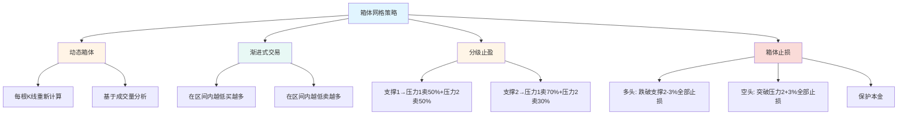

### 1.2 与传统网格的区别

| 特性 | 传统固定网格 | 箱体网格 v2.0 |
|------|------------|--------------|
| 网格价格 | 固定百分比（如每2%） | **动态计算**（基于成交量） |
| 更新频率 | 不更新 | **每根K线更新** |
| 买入方式 | 单点触发，一次买入 | **区间内渐进式买入** |
| 卖出方式 | 单一目标价 | **分级止盈**（2个压力位） |
| 仓位管理 | 简单平分 | **智能约束**（理论上限+现金约束） |
| 止损机制 | 无或简单 | **箱体止损**（保护本金） |

### 1.3 策略执行流程图

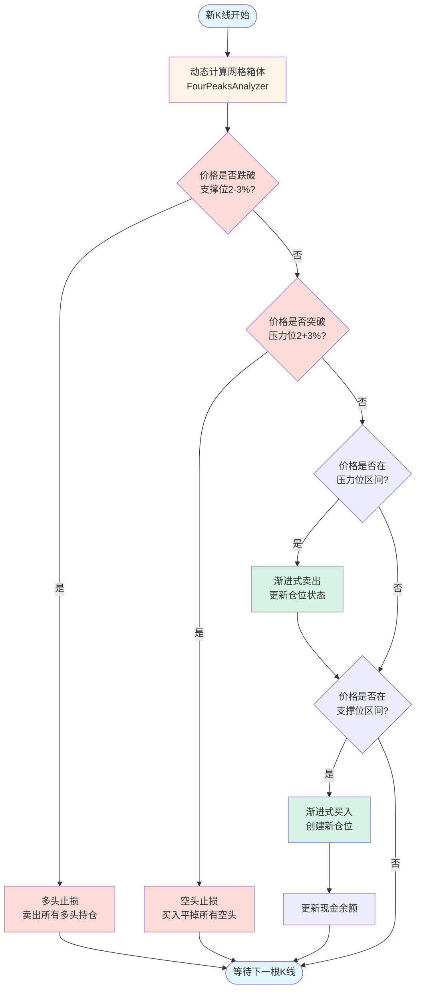

---

## 2. 网格箱体计算

### 2.1 什么是箱体？

**比喻理解**：
- 想象价格在一个**透明盒子**里上下跳动
- 盒子有4层"架子"：
  - 顶层（压力位2）：3300元
  - 上层（压力位1）：3100元
  - 下层（支撑位1）：2900元
  - 底层（支撑位2）：2700元

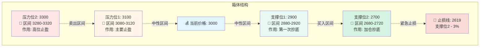

### 2.2 箱体如何计算？（FourPeaksAnalyzer）

**算法流程**（自动执行）：


**示例计算**：

```
初始条件:
├─ 当前价格: 3000 USDT
├─ 有效范围: 2550~3450 (±15%)
└─ MA25: 2905 USDT

步骤1: 聚合成交量
├─ 4h K线成交量 × 1.5
├─ 1h K线成交量 × 1.2
└─ 15m K线成交量 × 1.0

步骤2: 识别成交量集中区间（滑动窗口扫描）
├─ 区间A: 2680-2720, 中心2700, 成交量50000 BTC
├─ 区间B: 2860-2920, 中心2890, 成交量45000 BTC
├─ 区间C: 3080-3120, 中心3100, 成交量48000 BTC
├─ 区间D: 3260-3320, 中心3290, 成交量42000 BTC
└─ ... (更多区间)

步骤3: 选择Top4（按成交量排序，确保5%间距）
├─ 下方2个: 区间A(2700), 区间B(2890)
└─ 上方2个: 区间C(3100), 区间D(3290)

步骤4: 提取保守边界
├─ 支撑位2: 区间A的高价 = 2720
├─ 支撑位1: 区间B的高价 = 2920
├─ 压力位1: 区间C的低价 = 3080
└─ 压力位2: 区间D的低价 = 3260

步骤5: MA25调整（假设MA25=2905）
├─ 支撑位1: 2920 距离MA25 = |2920-2905|/2920 = 0.5% < 2%
│              → 调整到MA25 = 2905 ✅
├─ 其他位置距离MA25 > 2%，保持不变
└─ 最终: 支撑位1 = 2905

最终网格箱体:
  ┌─ 压力位2: 3260 (区间 3260-3320)
  ├─ 压力位1: 3080 (区间 3080-3120)
  ├─ [当前价格 3000]
  ├─ 支撑位1: 2905 (区间 2880-2920) ← MA25调整
  └─ 支撑位2: 2720 (区间 2680-2720)
```

### 2.3 为什么每根K线都要重新计算？

**问题**: 为什么不能算一次就固定？

**回答**: 市场是动态的！

```mermaid
gantt
    title 网格动态更新示例 (ETH 180天回测)
    dateFormat HH:mm
    axisFormat %H:%M

    section 第1天
    初始箱体 S1=2900, S2=2700      :done, a1, 00:00, 4h

    section 第2天
    价格下跌，箱体下移 S1=2850     :active, a2, 04:00, 4h

    section 第3天
    价格反弹，箱体回升 S1=2920     :crit, a3, 08:00, 4h

    section 第4天
    横盘整理，箱体微调 S1=2905     :done, a4, 12:00, 4h
```

**具体示例**：

| 时间 | 当前价格 | 支撑位1（动态） | 压力位1（动态） | 说明 |
|------|---------|---------------|---------------|------|
| Day 1 00:00 | 3000 | 2900 (区间2880-2920) | 3100 (区间3080-3120) | 初始箱体 |
| Day 1 04:00 | 2950 | 2850 (区间2830-2870) | 3050 (区间3030-3070) | 价格下跌，箱体跟随 |
| Day 2 00:00 | 3100 | 3000 (区间2980-3020) | 3200 (区间3180-3220) | 突破后重新定位 |
| Day 2 08:00 | 3050 | 2950 (区间2930-2970) | 3150 (区间3130-3170) | 回调后调整 |

**关键点**：
- ✅ 每根K线（4小时）重新计算 → 适应市场变化
- ✅ 买入时记录当前的压力位 → 每个仓位有自己的止盈目标
- ✅ 卖出时使用记录的目标价 → 避免目标价变动混乱

---

## 3. 仓位管理机制

### 3.1 现金约束原则

**核心规则**：
- **唯一约束** = 现金余额
- **理论上限** = 支撑位1≤20%，支撑位2≤30%（初始资金）
- **实际买入** = min(理论剩余, 实际现金)

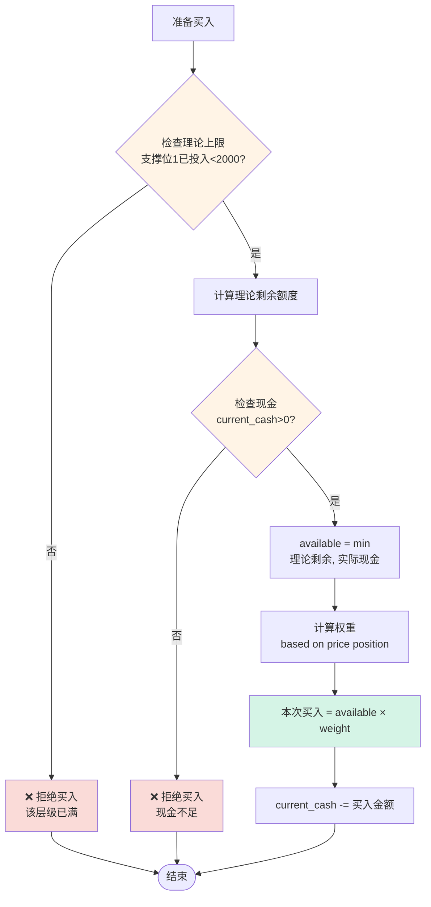

### 3.2 示例：资金如何分配

**初始条件**：
- 总资金: 10000 USDT
- 支撑位1上限: 2000 USDT (20%)
- 支撑位2上限: 3000 USDT (30%)
- 当前现金: 10000 USDT

**场景演示**：

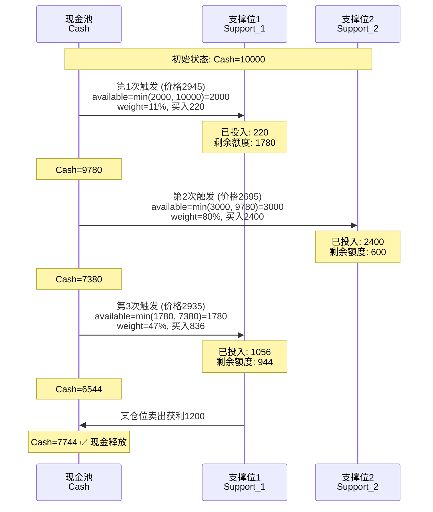

**表格详解**：

| 事件 | 理论上限 | 已投入 | 理论剩余 | 实际现金 | 可用金额 | 权重 | 本次买入 | 更新后现金 |
|------|---------|--------|---------|---------|---------|------|---------|-----------|
| **初始** | - | - | - | - | - | - | - | 10000 |
| 支撑1 @2945 | 2000 | 0 | 2000 | 10000 | min(2000,10000)=2000 | 11% | 220 | 9780 |
| 支撑2 @2695 | 3000 | 0 | 3000 | 9780 | min(3000,9780)=3000 | 80% | 2400 | 7380 |
| 支撑1 @2935 | 2000 | 220 | 1780 | 7380 | min(1780,7380)=1780 | 47% | 836 | 6544 |
| 卖出获利 | - | - | - | 6544 | - | - | +1200 | 7744 |

**关键理解**：
1. **理论上限** 防止单层过度集中（支撑1最多2000）
2. **实际现金** 确保不超支（钱不够就买少点）
3. **卖出释放现金** 可继续买入（资金循环使用）

---

## ✅ 核心特性确认（2025-11-30 更新）

| 序号 | 特性 | 策略说明 | 状态 |
|------|------|---------|------|
| 1 | **网格价格** | 动态计算（基于成交量分析），非固定步长 | ✅ 已理解 |
| 2 | **网格层数** | 4层箱体（支撑位2层 + 压力位2层） | ✅ 已理解 |
| 3 | **仓位管理** | 固定仓位池，支撑位1=20%，支撑位2=30% | ✅ 已更新 |
| 4 | **买入策略** | 渐进式买入，越接近网格边界买入越多 | ✅ 已更新 |
| 5 | **卖出策略** | 分级止盈（多个压力位按比例卖出） | ✅ 已更新 |
| 6 | **止损策略** | 箱体止损（多头/空头对称止损机制） | ✅ 已更新 |
| 7 | **部分成交** | 支持部分仓位成交，下次触发买满 | ✅ 已更新 |

---

## 📊 箱体网格策略详解（ETH @ 3000）

### 1️⃣ 网格箱体计算

```
初始资金: 10000 USDT
当前价格: 3000 USDT

动态计算网格箱体：
  ┌─ 压力位2: 3300 (+10%)  ← 箱体顶部
  │   ├─ 区间: 3280-3320
  │   └─ 止盈目标 / 空头止损边界
  │
  ├─ 压力位1: 3100 (+3.3%)
  │   ├─ 区间: 3080-3120
  │   └─ 主要止盈位
  │
  ├─ [当前价格 3000]
  │
  ├─ 支撑位1: 2900 (-3.3%)
  │   ├─ 区间: 2880-2920 (实际: 2930-2950)
  │   ├─ 分配仓位: 20% (2000 USDT)
  │   └─ 目标: 跌到2930买满20%
  │
  └─ 支撑位2: 2700 (-10%)  ← 箱体底部
      ├─ 区间: 2680-2720
      ├─ 分配仓位: 30% (3000 USDT)
      ├─ 目标: 跌到2680买满30%
      └─ 多头止损边界: 2680 × (1-3%) = 2600
```

---

### 2️⃣ 动态仓位管理机制（核心逻辑）

**架构原则**：
- ✅ 网格价格**每根K线重新计算**（动态适应市场）
- ✅ 每个仓位**独立管理**（自己维护买入/卖出状态）
- ✅ 唯一约束：**现金余额**

#### 全局状态

```python
class GridStrategy:
    # 资金管理
    initial_cash = 10000 USDT  # 初始资金（不变）
    current_cash = 10000 USDT  # 当前可用现金（动态变化）

    # 理论上限（每个层级的最大投入比例）
    support_1_max_pct = 20%  # 支撑位1最多投入20%初始资金
    support_2_max_pct = 30%  # 支撑位2最多投入30%初始资金

    # 动态网格（每根K线更新）
    current_grid_levels = {
        'resistance_2': 3300,
        'resistance_1': 3100,
        'support_1': 2900,
        'support_2': 2700
    }
```

#### 买入可用金额计算

```python
def get_available_buy_amount(grid_level):
    """
    计算某个网格层级的可用买入金额

    Returns:
        float: 本次可买入金额（USDT）
    """
    # 1. 计算理论上限
    if grid_level == 'support_1':
        theoretical_max = initial_cash * 0.20  # 2000 USDT
    elif grid_level == 'support_2':
        theoretical_max = initial_cash * 0.30  # 3000 USDT

    # 2. 查询该层级已投入金额
    existing_positions = GridPosition.filter(
        buy_level=grid_level,
        status__in=['open', 'partial_sold']  # 未完全平仓的
    )
    already_invested = sum(pos.buy_cost for pos in existing_positions)

    # 3. 计算理论剩余额度
    theoretical_available = theoretical_max - already_invested

    # 4. 双重约束：min(理论剩余, 实际现金)
    available = min(theoretical_available, current_cash)

    return max(0, available)
```

**示例场景**：

```
初始: current_cash = 10000 USDT

第1次触发支撑位1 (2945):
  ├─ 理论上限: 2000 USDT
  ├─ 已投入: 0 USDT
  ├─ 理论剩余: 2000 USDT
  ├─ 实际现金: 10000 USDT
  ├─ 可用金额: min(2000, 10000) = 2000 USDT
  ├─ 权重: 11%
  ├─ 本次买入: 2000 × 11% = 220 USDT
  └─ 更新: current_cash = 9780 USDT

第2次触发支撑位2 (2695):
  ├─ 理论上限: 3000 USDT
  ├─ 已投入: 0 USDT
  ├─ 理论剩余: 3000 USDT
  ├─ 实际现金: 9780 USDT
  ├─ 可用金额: min(3000, 9780) = 3000 USDT
  ├─ 权重: 80%
  ├─ 本次买入: 3000 × 80% = 2400 USDT
  └─ 更新: current_cash = 7380 USDT

第3次触发支撑位1 (2935):
  ├─ 理论上限: 2000 USDT
  ├─ 已投入: 220 USDT
  ├─ 理论剩余: 1780 USDT
  ├─ 实际现金: 7380 USDT
  ├─ 可用金额: min(1780, 7380) = 1780 USDT
  ├─ 权重: 47%
  ├─ 本次买入: 1780 × 47% = 836 USDT
  └─ 更新: current_cash = 6544 USDT

某个仓位卖出获利 1200 USDT:
  └─ 更新: current_cash = 7744 USDT  # 现金释放
```

**关键点**：
- ✅ 每个层级有理论上限（20%/30%），防止单层级过度集中
- ✅ 实际买入受现金约束，确保不超支
- ✅ 卖出后现金释放，可继续买入
- ✅ 不同层级之间独立，互不影响（只共享现金池）

---

## 4. 渐进式买入算法

### 4.1 什么是渐进式买入？

**传统网格** vs **渐进式**：

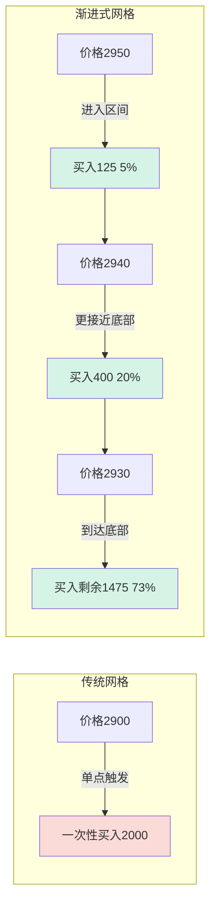

**为什么这样做？**
1. **降低风险**：不会在单点买入全部仓位
2. **平均成本**：在下跌过程中分批买入，降低平均成本
3. **灵活应对**：如果只跌到一半就反弹，至少买到一部分

### 4.2 权重函数：指数衰减

**核心公式**：

```
weight = exp(-k * distance_pct)

其中:
- k = 3 (衰减系数)
- distance_pct = (当前价格 - 区间下界) / (区间上界 - 区间下界)
```

**可视化权重分布**：

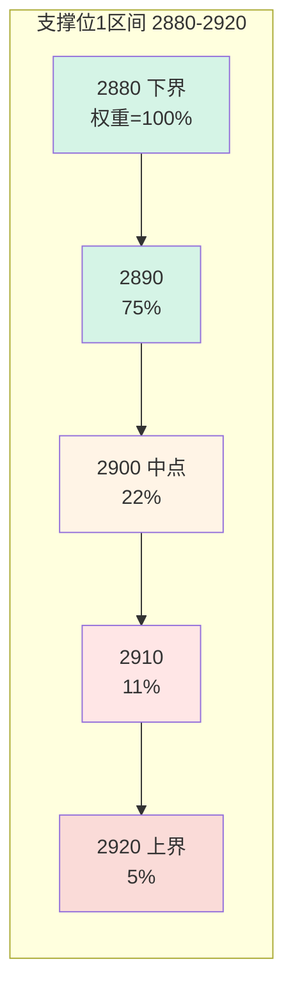

**权重对照表**：

| 价格位置 | 距离下界 | distance_pct | 权重 | 说明 |
|---------|---------|-------------|------|------|
| 2880 (下界) | 0 | 0% | 100% | 最低点，全力买入 |
| 2885 | 5 | 12.5% | 71% | 接近底部 |
| 2890 | 10 | 25% | 47% | 还不错的位置 |
| 2895 | 15 | 37.5% | 31% | 中等位置 |
| 2900 (中点) | 20 | 50% | 22% | 观望为主 |
| 2905 | 25 | 62.5% | 15% | 少量买入 |
| 2910 | 30 | 75% | 11% | 非常保守 |
| 2915 | 35 | 87.5% | 7% | 极小仓位 |
| 2920 (上界) | 40 | 100% | 5% | 最小买入 |

### 4.3 完整买入示例

**场景设定**：
- 支撑位1区间: 2880-2920 (宽度40)
- 可用资金: 2000 USDT
- 当前现金: 10000 USDT
- 价格走势: 2945 → 2910 → 2895 → 2885 → 2880 → 2870

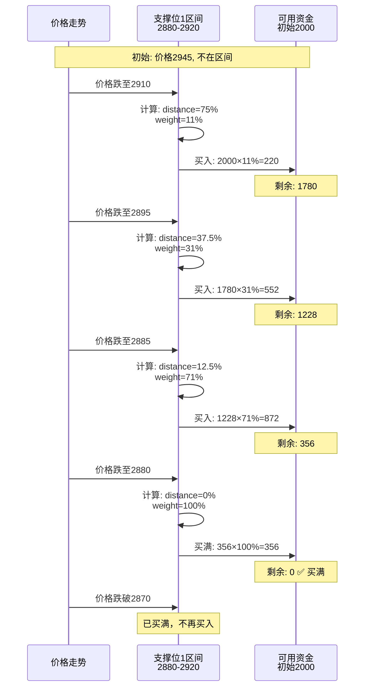

**详细计算过程**：

| K线时间 | 价格 | 在区间内? | 距离 | distance_pct | weight | 可用资金 | 本次买入 | 买入数量(ETH) | 剩余资金 |
|---------|------|----------|------|-------------|--------|---------|---------|--------------|---------|
| 00:00 | 2945 | ❌ | - | - | - | 2000 | 0 | 0 | 2000 |
| 04:00 | 2910 | ✅ | 30 | 75% | 11% | 2000 | 220 | 0.0755 | 1780 |
| 08:00 | 2895 | ✅ | 15 | 37.5% | 31% | 1780 | 552 | 0.1907 | 1228 |
| 12:00 | 2885 | ✅ | 5 | 12.5% | 71% | 1228 | 872 | 0.3023 | 356 |
| 16:00 | 2880 | ✅ | 0 | 0% | 100% | 356 | 356 | 0.1236 | 0 |
| 20:00 | 2870 | ❌ | 已买满 | - | - | 0 | 0 | 0 | 0 |

**总结**：
- 总投入: 2000 USDT
- 总买入: 0.7921 ETH
- 平均成本: 2000 / 0.7921 = 2525 USDT/ETH
- 买入次数: 4次（分批进入）

---

**买入权重算法**：

```python
def calculate_buy_weight(current_price, zone_high, zone_low):
    """
    计算买入权重（越接近zone_low权重越大）

    Args:
        current_price: 当前价格
        zone_high: 区间上界 (2950)
        zone_low: 区间下界 (2930)

    Returns:
        weight: 0.0 ~ 1.0
    """
    # 距离下界的百分比
    distance_pct = (current_price - zone_low) / (zone_high - zone_low)

    # 反向权重：越接近下界，权重越大
    # 2930 → weight=1.0 (100%)
    # 2940 → weight=0.5 (50%)
    # 2950 → weight=0.1 (10%)
    weight = 1.0 - distance_pct

    # 使用指数函数增强尾部权重
    weight = weight ** 2  # 平方函数

    return max(0.1, min(1.0, weight))  # 限制在10%-100%
```

**示例计算**：

```
假设支撑位1: 2930-2950，分配仓位2000 USDT

价格2945触发:
  ├─ distance_pct = (2945-2930)/(2950-2930) = 0.75
  ├─ weight = (1-0.75)² = 0.0625 ≈ 6.25%
  ├─ 本次买入: 2000 × 6.25% = 125 USDT
  ├─ 买入数量: 125 / 2945 = 0.0424 ETH
  └─ 剩余额度: 2000 - 125 = 1875 USDT

价格2935触发:
  ├─ distance_pct = (2935-2930)/(2950-2930) = 0.25
  ├─ weight = (1-0.25)² = 0.5625 ≈ 56.25%
  ├─ 本次买入: 1875 × 56.25% = 1055 USDT
  ├─ 买入数量: 1055 / 2935 = 0.3595 ETH
  └─ 剩余额度: 820 USDT

价格2930触发:
  ├─ weight = 100%
  ├─ 本次买入: 820 USDT (剩余全部)
  └─ 支撑位1仓位买满 ✅
```

**部分成交机制**：

```
场景1: 价格只跌到2940就反弹
  ├─ 仅买入约30% (600 USDT)
  ├─ 剩余额度: 1400 USDT
  └─ 下次跌到2940-2930时，继续买入剩余额度

场景2: 价格直接跌破2930
  ├─ 在2950-2930范围内分批买入
  └─ 到达2930时买满100%
```

---

## 5. 分级止盈卖出

### 5.1 为什么要分级止盈？

**问题**: 为什么不在一个价格全部卖出？

**回答**: 市场可能只涨到一半就回调！

```mermaid
graph LR
    subgraph 单一止盈问题
        A1[买入@2900] --> B1{价格涨到3100?}
        B1 -->|是| C1[全部卖出]
        B1 -->|否，只到3050| D1[❌ 错失机会<br/>一分钱没赚]
    end

    subgraph 分级止盈优势
        A2[买入@2900] --> B2[价格涨到3050]
        B2 --> C2[✅ 部分卖出20%<br/>锁定部分利润]
        C2 --> D2{继续涨到3100?}
        D2 -->|是| E2[再卖30%]
        D2 -->|否，回调| F2[至少赚了20%]
    end

    style D1 fill:#fadbd8
    style C2 fill:#d5f4e6
    style E2 fill:#d5f4e6
    style F2 fill:#d5f4e6
```

### 5.2 止盈分配矩阵

**核心规则**：
- 支撑位1买入 → 压力位1卖50% + 压力位2卖50%
- 支撑位2买入 → 压力位1卖70% + 压力位2卖30%

**为什么这样分配？**

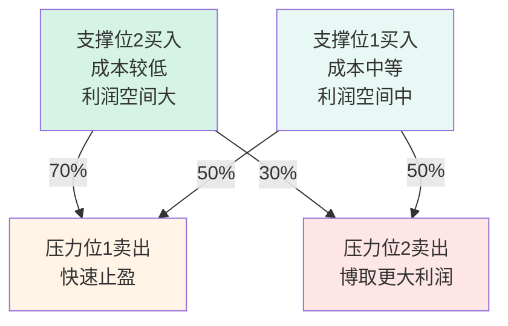

**详细说明**：

| 买入位置 | 成本 | 到压力1利润 | 到压力2利润 | 策略 | 原因 |
|---------|------|-----------|-----------|------|------|
| 支撑位2 | 2700 | +14.8% | +22.2% | R1卖70% | 成本低，快速回本 |
| 支撑位1 | 2900 | +6.9% | +13.8% | R1卖50% | 成本中，平衡策略 |

### 5.3 完整卖出示例

**场景设定**：
- 在支撑位1 (2900) 买入 1.0 ETH，成本2900 USDT
- 买入时记录的目标价:
  - 压力位1: 3100 (区间3080-3120)
  - 压力位2: 3300 (区间3280-3320)

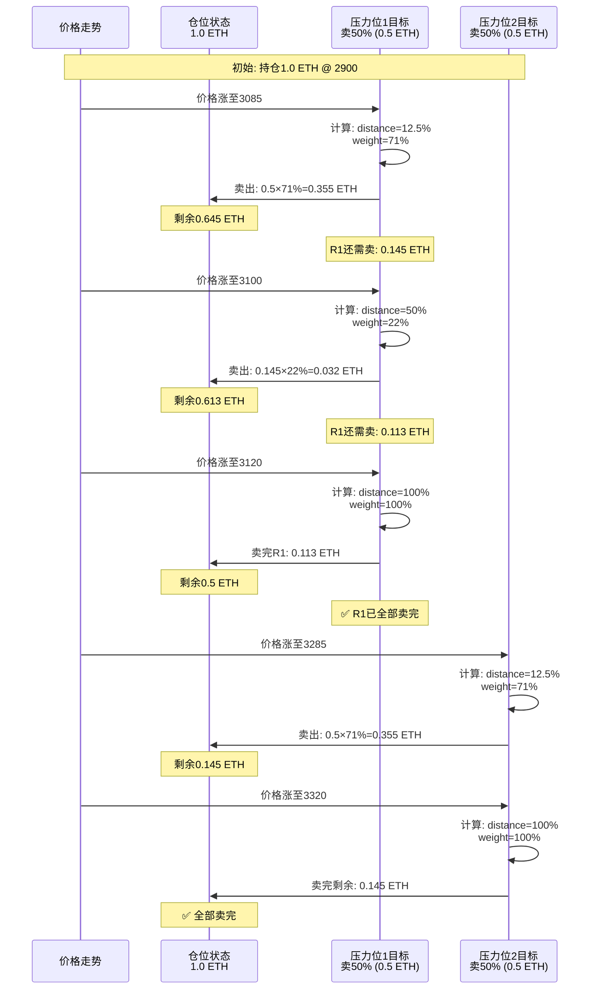

**详细计算表格**：

| K线时间 | 价格 | 触发区间 | 距离 | weight | 本次卖出 | 剩余持仓 | R1进度 | R2进度 |
|---------|------|---------|------|--------|---------|---------|-------|-------|
| 00:00 | 3085 | R1 | 12.5% | 71% | 0.355 ETH | 0.645 | 71% | 0% |
| 04:00 | 3100 | R1 | 50% | 22% | 0.032 ETH | 0.613 | 77.4% | 0% |
| 08:00 | 3120 | R1 | 100% | 100% | 0.113 ETH | 0.500 | ✅ 100% | 0% |
| 12:00 | 3285 | R2 | 12.5% | 71% | 0.355 ETH | 0.145 | ✅ 100% | 71% |
| 16:00 | 3320 | R2 | 100% | 100% | 0.145 ETH | 0.000 | ✅ 100% | ✅ 100% |

**收益计算**：

```
初始投入: 2900 USDT (1.0 ETH)

压力位1卖出: 0.5 ETH
├─ @3085: 0.355 ETH × 3085 = 1095.18 USDT
├─ @3100: 0.032 ETH × 3100 = 99.20 USDT
├─ @3120: 0.113 ETH × 3120 = 352.56 USDT
└─ 小计: 1546.94 USDT

压力位2卖出: 0.5 ETH
├─ @3285: 0.355 ETH × 3285 = 1166.18 USDT
├─ @3320: 0.145 ETH × 3320 = 481.40 USDT
└─ 小计: 1647.58 USDT

总收入: 1546.94 + 1647.58 = 3194.52 USDT (扣除手续费前)
手续费: 3194.52 × 0.1% = 3.19 USDT
净收入: 3191.33 USDT

净利润: 3191.33 - 2900 = 291.33 USDT
收益率: 291.33 / 2900 = 10.05%
```

---

**渐进式卖出算法**（同买入）：

```
压力位1区间: 3080-3120

价格3085触发:
  ├─ 距离3080较远，权重10%
  ├─ 本次卖出: 0.3448 × 10% = 0.0345 ETH
  └─ 剩余: 0.3103 ETH

价格3100触发:
  ├─ 距离3080较近，权重60%
  ├─ 本次卖出: 0.3103 × 60% = 0.1862 ETH
  └─ 剩余: 0.1241 ETH

价格3120触发:
  ├─ 到达上界，权重100%
  └─ 卖完剩余: 0.1241 ETH ✅
```

#### 支撑位2买入的仓位 → 止盈分配

```
支撑位2买入: 1.1111 ETH (成本3000 USDT)

止盈目标:
├─ 压力位1 (3100): 卖出70% (0.7778 ETH)
└─ 压力位2 (3300): 卖出30% (0.3333 ETH)
```

**止盈分配矩阵**：

| 买入位置 | 压力位1卖出比例 | 压力位2卖出比例 |
|---------|---------------|---------------|
| 支撑位1 | 50% | 50% |
| 支撑位2 | 70% | 30% |

---

### 5️⃣ 箱体止损机制

#### 止损原理

箱体止损是为了**保护本金**，防止价格突破箱体后持续亏损。

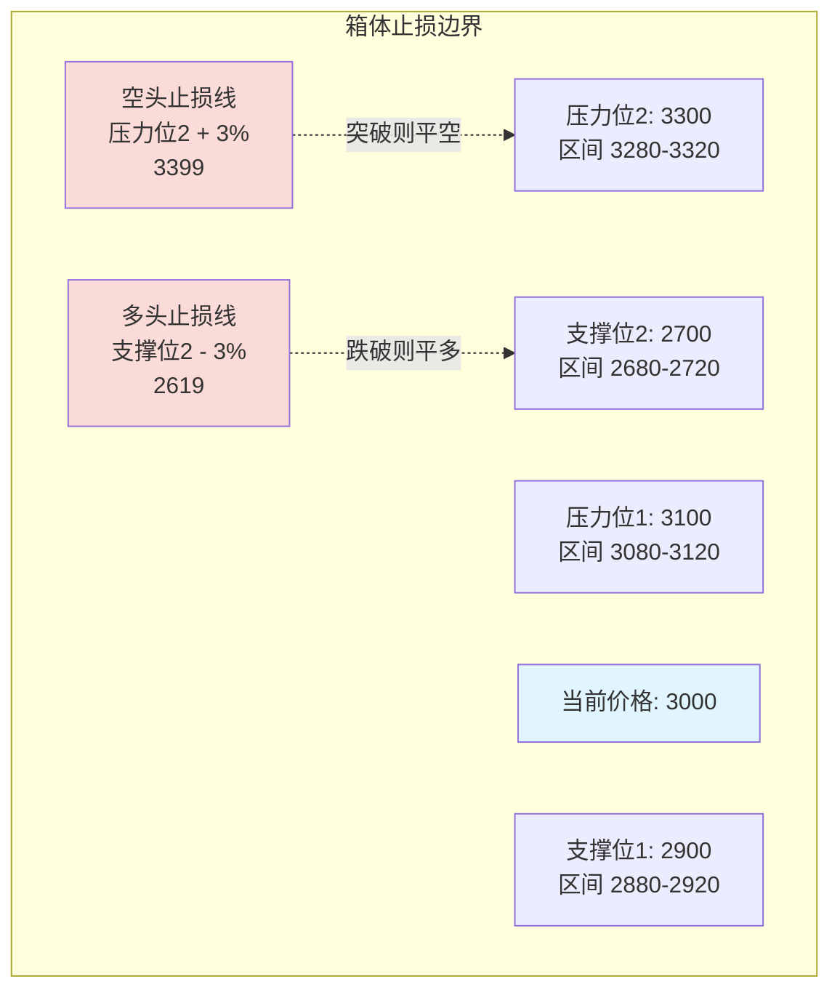

#### 多头止损

**触发条件**: 价格跌破支撑位2区间下界 - 3%（可配置）

```
箱体底部: 支撑位2区间下界 = 2680
止损阈值: 3%（可配置）
止损边界: 2680 × (1 - 3%) = 2619.60

触发条件: 当前价格 < 2619.60
```

**止损动作**：

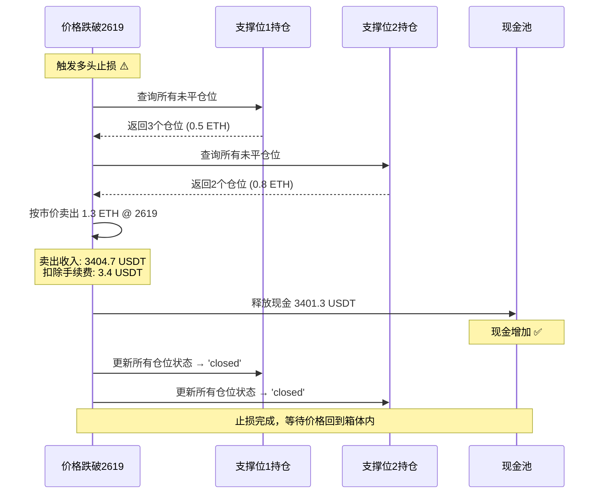

**止损后状态**：

```
所有多头持仓: 已平仓
现金: 释放所有仓位资金（接受亏损）
网格状态: 继续计算，等待价格回到箱体内重新激活
```

#### 空头止损

**触发条件**: 价格突破压力位2区间上界 + 3%（可配置）

```
箱体顶部: 压力位2区间上界 = 3320
止损阈值: 3%（可配置）
止损边界: 3320 × (1 + 3%) = 3419.60

触发条件: 当前价格 > 3419.60
```

**止损动作**：

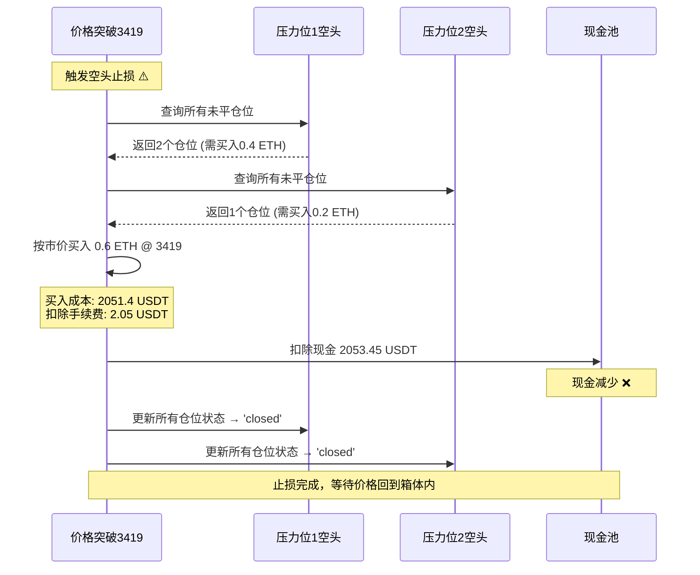

**止损后状态**：

```
所有空头持仓: 已平仓
现金: 扣除平仓成本（接受亏损）
网格状态: 继续计算，等待价格回到箱体内重新激活
```

#### 对称性设计

| 项目 | 多头止损 | 空头止损 |
|------|---------|---------|
| **触发边界** | 支撑位2区间下界 - 3% | 压力位2区间上界 + 3% |
| **触发条件** | 价格 < 止损边界 | 价格 > 止损边界 |
| **平仓动作** | 卖出所有多头持仓 | 买入平掉所有空头持仓 |
| **现金影响** | 增加现金（卖出收入） | 减少现金（买入成本） |
| **配置参数** | stop_loss_pct（默认3%） | stop_loss_pct（默认3%） |
| **重新激活** | 价格回到箱体内 | 价格回到箱体内 |

#### 示例计算

**场景1: 多头止损**

```
初始状态:
├─ 支撑位1持仓: 3个仓位，共0.5 ETH，成本1450 USDT
├─ 支撑位2持仓: 2个仓位，共0.8 ETH，成本2160 USDT
├─ 当前箱体: S2区间下界 = 2680
└─ 止损边界: 2680 × (1-3%) = 2619.60

Day 20 价格跌至2610:
├─ 触发条件: 2610 < 2619.60 ✅
├─ 卖出1.3 ETH @ 2610 = 3393 USDT
├─ 扣除手续费: 3.39 USDT
├─ 净收入: 3389.61 USDT
├─ 总成本: 1450 + 2160 = 3610 USDT
└─ 净亏损: 3389.61 - 3610 = -220.39 USDT (-6.1%)

止损保护效果:
✅ 防止继续下跌造成更大亏损
✅ 保留现金等待下一次机会
```

**场景2: 空头止损**

```
初始状态:
├─ 压力位1空头: 2个仓位，卖出0.4 ETH，收入1240 USDT
├─ 压力位2空头: 1个仓位，卖出0.2 ETH，收入660 USDT
├─ 当前箱体: R2区间上界 = 3320
└─ 止损边界: 3320 × (1+3%) = 3419.60

Day 15 价格涨至3425:
├─ 触发条件: 3425 > 3419.60 ✅
├─ 买入0.6 ETH @ 3425 = 2055 USDT
├─ 扣除手续费: 2.06 USDT
├─ 总成本: 2057.06 USDT
├─ 卖出收入: 1240 + 660 = 1900 USDT
└─ 净亏损: 1900 - 2057.06 = -157.06 USDT (-8.3%)

止损保护效果:
✅ 防止继续上涨造成更大亏损
✅ 及时止损保护本金
```

---

### 6️⃣ 完整交易流程示例

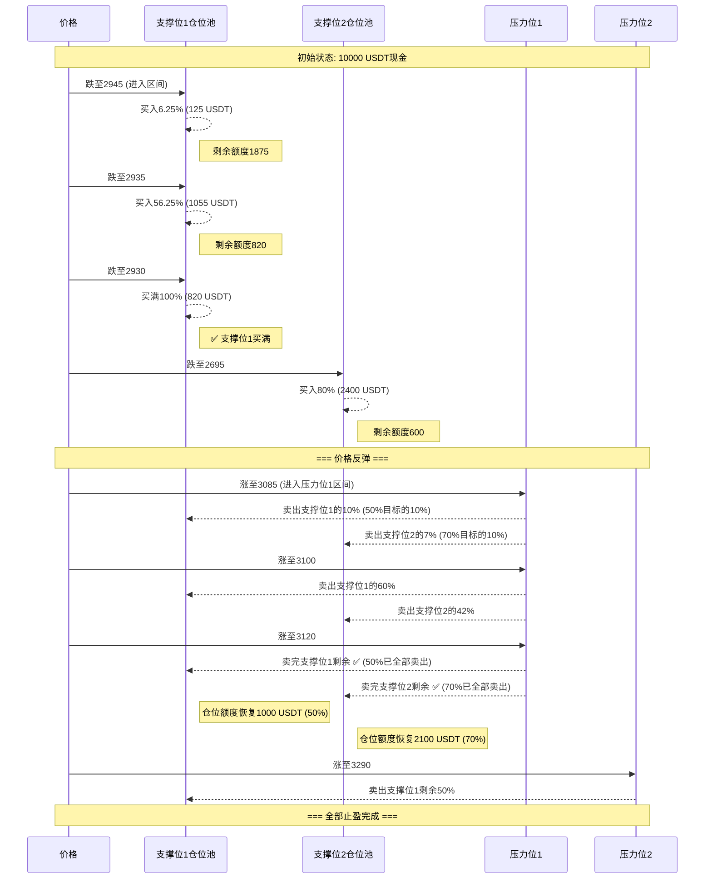

---

## 🗄️ 数据库设计（最终版）

### GridPosition 表（核心表）

每次买入创建一条记录，独立管理该仓位的全生命周期：

| 字段 | 类型 | 说明 | 示例 |
|------|------|------|------|
| **id** | int | 主键 | 1 |
| **backtest_result_id** | int | 关联回测 | 100 |
| **buy_level** | str | 买入层级 | 'support_1' |
| **buy_price** | decimal | 买入价格 | 2935.00 |
| **buy_time** | datetime | 买入时间 | 2025-11-30 10:00 |
| **buy_amount** | decimal | 买入数量(ETH) | 0.5690 |
| **buy_cost** | decimal | 买入成本(USDT) | 1670.00 |
| **buy_zone_weight** | decimal | 买入时权重 | 0.47 |
| | | | |
| **sell_target_r1_price** | decimal | 压力位1价格 ⭐ | 3100.00 |
| **sell_target_r1_pct** | decimal | 压力位1比例 | 50.00% |
| **sell_target_r1_sold** | decimal | 压力位1已卖 | 0.2845 ETH |
| **sell_target_r1_zone_low** | decimal | 压力位1区间下界 | 3080.00 |
| **sell_target_r1_zone_high** | decimal | 压力位1区间上界 | 3120.00 |
| | | | |
| **sell_target_r2_price** | decimal | 压力位2价格 ⭐ | 3300.00 |
| **sell_target_r2_pct** | decimal | 压力位2比例 | 50.00% |
| **sell_target_r2_sold** | decimal | 压力位2已卖 | 0 ETH |
| **sell_target_r2_zone_low** | decimal | 压力位2区间下界 | 3280.00 |
| **sell_target_r2_zone_high** | decimal | 压力位2区间上界 | 3320.00 |
| | | | |
| **total_sold_amount** | decimal | 总已卖数量 | 0.2845 ETH |
| **total_revenue** | decimal | 总卖出收入 | 880.00 USDT |
| **pnl** | decimal | 净利润 | -790.00 USDT |
| **status** | str | 状态 | 'open'/'partial'/'closed' |

**状态说明**：
- `open`: 未卖出任何部分
- `partial`: 部分卖出（R1或R2卖了一部分）
- `closed`: 全部卖出（R1和R2都卖完）

**关键设计**：
- ✅ 每个Position独立维护自己的卖出目标
- ✅ 买入时记录当前的压力位价格（动态）
- ✅ 记录两个压力位的卖出区间
- ✅ 跟踪每个压力位已卖数量

---

### 示例数据

```sql
-- 支撑位1买入的第1笔仓位
INSERT INTO grid_position VALUES (
  id = 1,
  buy_level = 'support_1',
  buy_price = 2935.00,
  buy_amount = 0.5690,
  buy_cost = 1670.00,

  -- 买入时计算的卖出目标（动态）
  sell_target_r1_price = 3100.00,  -- 当时的压力位1
  sell_target_r1_pct = 50.00,
  sell_target_r1_sold = 0.10,      -- 已卖0.10 ETH
  sell_target_r1_zone_low = 3080.00,
  sell_target_r1_zone_high = 3120.00,

  sell_target_r2_price = 3300.00,  -- 当时的压力位2
  sell_target_r2_pct = 50.00,
  sell_target_r2_sold = 0,         -- 还没卖
  sell_target_r2_zone_low = 3280.00,
  sell_target_r2_zone_high = 3320.00,

  total_sold_amount = 0.10,
  status = 'partial'
);

-- 支撑位2买入的第1笔仓位
INSERT INTO grid_position VALUES (
  id = 2,
  buy_level = 'support_2',
  buy_price = 2695.00,
  buy_amount = 0.8905,
  buy_cost = 2400.00,

  -- 支撑位2的止盈分配不同
  sell_target_r1_price = 3100.00,
  sell_target_r1_pct = 70.00,      -- 70%在R1卖
  sell_target_r1_sold = 0,

  sell_target_r2_price = 3300.00,
  sell_target_r2_pct = 30.00,      -- 30%在R2卖
  sell_target_r2_sold = 0,

  status = 'open'
);
```

---

### 查询示例

```python
# 1. 查询支撑位1已投入金额
already_invested = GridPosition.filter(
    buy_level='support_1',
    status__in=['open', 'partial']
).aggregate(Sum('buy_cost'))['buy_cost__sum']

# 2. 查询在压力位1需要卖出的仓位
positions_to_sell = GridPosition.filter(
    status__in=['open', 'partial'],
    sell_target_r1_sold__lt=F('buy_amount') * F('sell_target_r1_pct') / 100
)

# 3. 计算某个仓位在压力位1还需卖多少
position = GridPosition.get(id=1)
r1_target_amount = position.buy_amount * (position.sell_target_r1_pct / 100)
r1_remaining = r1_target_amount - position.sell_target_r1_sold
```

---

## 🔄 核心交易算法（最终版）

### 每根K线的执行流程

```python
def on_new_kline(current_time, current_price, df_history):
    """
    每根K线调用一次

    Args:
        current_time: 当前K线时间
        current_price: 当前收盘价
        df_history: 历史数据（用于FourPeaksAnalyzer）
    """
    # 1. 动态计算最新网格
    grid_levels = calculate_grid_levels(current_time, df_history)
    # Returns: {
    #   'resistance_2': {'price': 3300, 'zone_low': 3280, 'zone_high': 3320},
    #   'resistance_1': {'price': 3100, 'zone_low': 3080, 'zone_high': 3120},
    #   'support_1': {'price': 2900, 'zone_low': 2880, 'zone_high': 2920},
    #   'support_2': {'price': 2700, 'zone_low': 2680, 'zone_high': 2720}
    # }

    # 2. 检查止损（多头和空头）
    check_stop_loss(current_price, grid_levels)

    # 3. 检查卖出（先卖后买，释放现金）
    check_sell_signals(current_price, grid_levels)

    # 4. 检查买入
    check_buy_signals(current_price, grid_levels)
```

---

### 买入流程

```python
def check_buy_signals(current_price, grid_levels):
    """检查是否触发买入"""

    # 遍历支撑位
    for level_name in ['support_1', 'support_2']:
        level_info = grid_levels[level_name]

        # 检查价格是否在区间内
        if not (level_info['zone_low'] <= current_price <= level_info['zone_high']):
            continue  # 不在区间内，跳过

        # 执行渐进式买入
        execute_progressive_buy(
            level_name=level_name,
            current_price=current_price,
            level_info=level_info,
            grid_levels=grid_levels  # 用于记录卖出目标
        )


def execute_progressive_buy(level_name, current_price, level_info, grid_levels):
    """
    渐进式买入算法

    Args:
        level_name: 'support_1' / 'support_2'
        current_price: 当前价格
        level_info: {'price': 2900, 'zone_low': 2880, 'zone_high': 2920}
        grid_levels: 完整网格信息（用于记录卖出目标）
    """
    # 1. 计算可用买入金额
    available_amount = get_available_buy_amount(level_name)

    if available_amount <= 10:  # 至少10 USDT
        return  # 资金不足

    # 2. 计算买入权重（指数衰减）
    import math
    zone_low = level_info['zone_low']
    zone_high = level_info['zone_high']

    distance_pct = (current_price - zone_low) / (zone_high - zone_low)
    distance_pct = max(0.0, min(1.0, distance_pct))

    k = 3.0  # 衰减系数
    weight = math.exp(-k * distance_pct)
    weight = max(0.05, min(1.0, weight))

    # 3. 计算本次买入金额
    buy_amount_usdt = available_amount * weight

    # 4. 扣除手续费
    fee_rate = 0.001
    fee = buy_amount_usdt * fee_rate
    actual_buy_usdt = buy_amount_usdt - fee

    # 5. 计算买入数量
    buy_amount_eth = actual_buy_usdt / current_price

    # 6. 确定卖出目标比例
    if level_name == 'support_1':
        r1_pct, r2_pct = 50.0, 50.0
    elif level_name == 'support_2':
        r1_pct, r2_pct = 70.0, 30.0
    else:
        raise ValueError(f"Unknown level: {level_name}")

    # 7. 创建持仓记录
    position = GridPosition.objects.create(
        backtest_result_id=backtest_result_id,
        buy_level=level_name,
        buy_price=current_price,
        buy_time=current_time,
        buy_amount=buy_amount_eth,
        buy_cost=buy_amount_usdt,  # 含手续费
        buy_zone_weight=weight,

        # 记录当前的压力位（动态）
        sell_target_r1_price=grid_levels['resistance_1']['price'],
        sell_target_r1_pct=r1_pct,
        sell_target_r1_sold=0,
        sell_target_r1_zone_low=grid_levels['resistance_1']['zone_low'],
        sell_target_r1_zone_high=grid_levels['resistance_1']['zone_high'],

        sell_target_r2_price=grid_levels['resistance_2']['price'],
        sell_target_r2_pct=r2_pct,
        sell_target_r2_sold=0,
        sell_target_r2_zone_low=grid_levels['resistance_2']['zone_low'],
        sell_target_r2_zone_high=grid_levels['resistance_2']['zone_high'],

        total_sold_amount=0,
        total_revenue=0,
        pnl=0,
        status='open'
    )

    # 8. 扣除现金
    current_cash -= buy_amount_usdt

    return buy_amount_eth
```

---

### 卖出流程

```python
def check_sell_signals(current_price, grid_levels):
    """检查是否触发卖出"""

    # 遍历压力位
    for target_level in ['resistance_1', 'resistance_2']:
        level_info = grid_levels[target_level]

        # 检查价格是否在区间内
        if not (level_info['zone_low'] <= current_price <= level_info['zone_high']):
            continue

        # 查找需要在此压力位卖出的仓位
        execute_progressive_sell_at_level(
            target_level=target_level,
            current_price=current_price,
            level_info=level_info
        )


def execute_progressive_sell_at_level(target_level, current_price, level_info):
    """
    在指定压力位执行渐进式卖出

    Args:
        target_level: 'resistance_1' / 'resistance_2'
        current_price: 当前价格
        level_info: {'price': 3100, 'zone_low': 3080, 'zone_high': 3120}
    """
    # 1. 查找需要在此压力位卖出的持仓
    if target_level == 'resistance_1':
        # 找到所有R1还没卖完的仓位
        positions = GridPosition.objects.filter(
            status__in=['open', 'partial'],
            sell_target_r1_zone_low__lte=current_price,
            sell_target_r1_zone_high__gte=current_price
        )
        target_field_prefix = 'sell_target_r1'
    else:  # resistance_2
        positions = GridPosition.objects.filter(
            status__in=['open', 'partial'],
            sell_target_r2_zone_low__lte=current_price,
            sell_target_r2_zone_high__gte=current_price
        )
        target_field_prefix = 'sell_target_r2'

    # 2. 遍历每个仓位，执行渐进式卖出
    for pos in positions:
        # 计算该仓位在此压力位的目标数量
        target_pct = getattr(pos, f'{target_field_prefix}_pct')
        target_amount = pos.buy_amount * (target_pct / 100.0)

        # 计算已卖数量
        sold_amount = getattr(pos, f'{target_field_prefix}_sold')

        # 计算剩余需卖数量
        remaining = target_amount - sold_amount

        if remaining <= 0.0001:  # 已卖完
            continue

        # 计算卖出权重
        zone_low = getattr(pos, f'{target_field_prefix}_zone_low')
        zone_high = getattr(pos, f'{target_field_prefix}_zone_high')

        distance_pct = (current_price - zone_low) / (zone_high - zone_low)
        distance_pct = max(0.0, min(1.0, distance_pct))

        import math
        k = 3.0
        weight = math.exp(-k * distance_pct)
        weight = max(0.05, min(1.0, weight))

        # 本次卖出数量
        sell_amount = remaining * weight

        # 计算卖出收入
        fee_rate = 0.001
        sell_revenue_before_fee = sell_amount * current_price
        fee = sell_revenue_before_fee * fee_rate
        sell_revenue = sell_revenue_before_fee - fee

        # 更新仓位记录
        setattr(pos, f'{target_field_prefix}_sold',
                sold_amount + sell_amount)

        pos.total_sold_amount += sell_amount
        pos.total_revenue += sell_revenue
        pos.pnl = pos.total_revenue - pos.buy_cost

        # 更新状态
        if pos.total_sold_amount >= pos.buy_amount * 0.9999:  # 允许误差
            pos.status = 'closed'
        elif pos.total_sold_amount > 0:
            pos.status = 'partial'

        pos.save()

        # 增加现金
        current_cash += sell_revenue
```

---

### 止损流程

```python
def check_stop_loss(current_price, grid_levels):
    """
    箱体止损检查（多头和空头）

    Args:
        current_price: 当前价格
        grid_levels: 当前网格层级信息
    """
    stop_loss_pct = 0.03  # 默认3%，可配置

    # 1. 多头止损检查
    support_2_zone_low = grid_levels['support_2']['zone_low']
    long_stop_boundary = support_2_zone_low * (1 - stop_loss_pct)

    if current_price < long_stop_boundary:
        # 触发多头止损
        long_positions = GridPosition.objects.filter(
            buy_level__in=['support_1', 'support_2'],
            status__in=['open', 'partial']
        )

        for pos in long_positions:
            remaining_amount = pos.buy_amount - pos.total_sold_amount

            if remaining_amount <= 0.0001:
                continue

            # 按当前市价卖出
            fee_rate = 0.001
            sell_revenue_before_fee = remaining_amount * current_price
            fee = sell_revenue_before_fee * fee_rate
            sell_revenue = sell_revenue_before_fee - fee

            # 更新仓位
            pos.total_sold_amount = pos.buy_amount
            pos.total_revenue += sell_revenue
            pos.pnl = pos.total_revenue - pos.buy_cost
            pos.status = 'closed'
            pos.save()

            # 增加现金
            current_cash += sell_revenue

    # 2. 空头止损检查
    resistance_2_zone_high = grid_levels['resistance_2']['zone_high']
    short_stop_boundary = resistance_2_zone_high * (1 + stop_loss_pct)

    if current_price > short_stop_boundary:
        # 触发空头止损
        short_positions = GridPosition.objects.filter(
            buy_level__in=['resistance_1', 'resistance_2'],
            status__in=['open', 'partial']
        )

        for pos in short_positions:
            remaining_amount = pos.buy_amount - pos.total_sold_amount

            if remaining_amount <= 0.0001:
                continue

            # 按当前市价买入平仓
            fee_rate = 0.001
            buy_cost_before_fee = remaining_amount * current_price
            fee = buy_cost_before_fee * fee_rate
            buy_cost = buy_cost_before_fee + fee

            # 更新仓位
            pos.total_sold_amount = pos.buy_amount
            pos.total_revenue -= buy_cost  # 空头平仓是成本
            pos.pnl = pos.total_revenue - pos.buy_cost
            pos.status = 'closed'
            pos.save()

            # 减少现金
            current_cash -= buy_cost
```

---

## 🎯 预期结果

在震荡市场（ETH 2500-3500，180天）：

| 指标 | 传统固定网格 | 箱体网格策略 v2.0 |
|------|------------|----------------|
| 交易次数 | 4-10笔 | **50-100笔** (渐进式买卖) |
| 网格触发 | 偶尔 | **频繁** (每次触碰区间都交易) |
| 仓位管理 | 简单 | **智能** (渐进式+固定池) |
| 止盈方式 | 单一目标价 | **分级止盈** (多压力位) |
| 资金利用率 | 低 | **高** (仓位可重复使用) |
| 适应性 | 差 | **强** (箱体止损保护) |

**关键提升**：
- ✅ **渐进式买卖**：在区间内分批建仓/减仓，降低单点风险
- ✅ **固定仓位池**：每个网格层级有资金上限，防止过度买入
- ✅ **分级止盈**：多个压力位按比例卖出，提高盈利概率
- ✅ **箱体止损**：超出箱体边界全部止损，保护本金
- ✅ **部分成交**：支持部分仓位成交，下次触发买满
- ✅ **数据驱动**：基于成交量分析的动态网格价格

---

## ✅ 网格价格计算方法（已在项目中实现）

根据项目代码 `vp_squeeze/services/four_peaks_analyzer.py`，网格价格计算方法如下：

### 算法流程

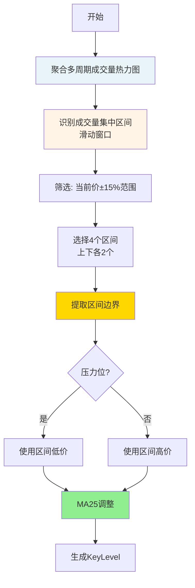

### 详细步骤

#### 1. 聚合多周期成交量（aggregate_volume_heatmap）

```python
# 时间周期权重
weights = {
    '4h': 1.5,   # 4小时权重最高
    '1h': 1.2,   # 1小时次之
    '15m': 1.0   # 15分钟基准
}

# 聚合所有周期的成交量
heatmap = {}  # {price: total_volume}
for analysis in analyses:
    for price, volume in analysis.volume_profile.items():
        heatmap[price] += volume * weights[analysis.timeframe]
```

#### 2. 识别成交量集中区间（find_volume_clusters_by_window）

**关键参数**：
- `window_size`: 5个价格桶
- `price_range_pct`: 15% （只看当前价±15%范围）

```python
# 滑动窗口扫描
for i in range(len(prices) - window_size + 1):
    window_prices = prices[i:i+5]

    # 计算区间
    price_low = window_prices[0]
    price_high = window_prices[-1]
    price_center = (price_low + price_high) / 2

    # 过滤：忽略超出±15%的区间
    if price_center < current_price * 0.85:
        continue
    if price_center > current_price * 1.15:
        continue

    # 计算区间总成交量
    total_volume = sum(heatmap[p] for p in window_prices)

    clusters.append({
        'price_center': price_center,
        'price_low': price_low,
        'price_high': price_high,
        'volume': total_volume
    })

# 按总成交量降序排序
clusters.sort(key=lambda c: c.volume, reverse=True)
```

#### 3. 选择4个区间（select_four_clusters）

**规则**：
- 分为上下两组（以当前价格为界）
- 每组选2个成交量最大的
- **最小间距**: 5%（避免重叠）

```python
# 分类
below_clusters = [c for c in clusters if c.price_center < current_price]
above_clusters = [c for c in clusters if c.price_center > current_price]

# 筛选满足5%间距的
selected_below = []  # 最多2个
selected_above = []  # 最多2个

# 确保相邻区间至少相距5%
for cluster in below_clusters:
    if all(abs(cluster.price - sel.price) / current_price >= 0.05
           for sel in selected_below):
        selected_below.append(cluster)
        if len(selected_below) >= 2:
            break
```

#### 4. 提取区间边界（create_key_level_from_cluster）

**关键逻辑**：
```python
# 压力位（resistance）：使用区间低价（更保守）
if level_type in ['resistance1', 'resistance2']:
    base_price = cluster.price_low

# 支撑位（support）：使用区间高价（更保守）
else:
    base_price = cluster.price_high
```

#### 5. MA25调整（adjust_price_with_ma25）

**规则**：如果价格距离MA25 < 2%，调整到MA25

```python
def adjust_price_with_ma25(price, ma25):
    if ma25 is None:
        return price, False

    distance_pct = abs(price - ma25) / price

    if distance_pct < 0.02:  # 2%阈值
        return ma25, True  # 调整到MA25
    else:
        return price, False  # 不调整
```

### 示例计算

假设当前ETH价格 = 3000 USDT：

```
1. 聚合成交量热力图
   - 4h周期成交量 × 1.5
   - 1h周期成交量 × 1.2
   - 15m周期成交量 × 1.0

2. 识别区间（±15%范围：2550-3450）
   - 区间A: 2680-2720, 中心2700, 总成交量50000
   - 区间B: 2860-2900, 中心2880, 总成交量45000
   - 区间C: 3080-3120, 中心3100, 总成交量48000
   - 区间D: 3260-3300, 中心3280, 总成交量42000
   ...

3. 选择Top4（满足5%间距）
   - 下方: 区间A(2700), 区间B(2880)
   - 上方: 区间C(3100), 区间D(3280)

4. 提取边界
   - support2 = 区间A.price_high = 2720
   - support1 = 区间B.price_high = 2900
   - resistance1 = 区间C.price_low = 3080
   - resistance2 = 区间D.price_low = 3260

5. MA25调整（假设MA25=2905）
   - support1: 2900 → 2905 (距离<2%, 调整到MA25)
   - 其他: 保持不变

最终网格：
  ├─ resistance2: 3260
  ├─ resistance1: 3080
  ├─ [当前价格 3000]
  ├─ support1: 2905 (MA25调整)
  └─ support2: 2720
```

### 关键特性

| 特性 | 说明 |
|------|------|
| **数据驱动** | 基于多周期成交量分析，非固定百分比 |
| **动态计算** | 每次分析时重新计算，适应市场变化 |
| **保守边界** | 压力用低价，支撑用高价，降低假突破 |
| **MA对齐** | 价格接近MA25时自动调整，提高准确性 |
| **范围限制** | 只看±15%范围，避免过远的无效点位 |
| **间距保证** | 相邻网格至少5%，避免过密 |

---

### ✅ 已确定策略细节（2025-11-30 最终版）

| 策略项 | 确定方案 | 说明 |
|--------|---------|------|
| **网格区间** | FourPeaksAnalyzer 原始区间 | 使用 price_low ~ price_high |
| **网格更新** | **每根K线重新计算** | 动态适应市场变化 |
| **买入权重** | 指数衰减函数 | 越接近区间下界买入越多（见下方算法） |
| **卖出权重** | 指数衰减函数 | 越接近区间下界卖出越多 |
| **手续费** | 从投入金额中扣除 | 符合实际交易逻辑 |
| **仓位管理** | **独立仓位 + 现金约束** | 每个仓位独立，只受现金限制 |
| **理论上限** | 支撑1≤20%，支撑2≤30% | 每个层级的最大投入比例 |
| **实际买入** | `min(理论剩余, 可用现金)` | 双重约束 |
| **止盈分配** | 支撑1→R1(50%)+R2(50%)<br/>支撑2→R1(70%)+R2(30%) | 买入时记录动态目标价 |
| **箱体止损** | 跌破支撑2-3%（可配置） | 全部平仓保护本金 |

---

### 📐 买入权重算法（新增）

**原则**：越低买越多，但要平滑分布

**推荐方案：指数衰减函数**

```python
def calculate_buy_weight(current_price, zone_low, zone_high):
    """
    计算买入权重（越接近zone_low权重越大）

    Args:
        current_price: 当前价格 (如2945)
        zone_low: 区间下界 (如2930)
        zone_high: 区间上界 (如2950)

    Returns:
        weight: 0.05 ~ 1.0 (5%~100%)
    """
    # 1. 计算距离百分比（0=下界，1=上界）
    distance_pct = (current_price - zone_low) / (zone_high - zone_low)
    distance_pct = max(0.0, min(1.0, distance_pct))  # 限制0-1

    # 2. 指数衰减：越接近下界，权重越大
    # 使用指数函数: weight = exp(-k * distance)
    # k=3: 较平滑，下界100%，中点50%，上界5%
    k = 3.0
    weight = math.exp(-k * distance_pct)

    # 3. 归一化到 5%~100%
    # distance=0 → weight=1.0 (100%)
    # distance=0.5 → weight=0.22 (22%)
    # distance=1.0 → weight=0.05 (5%)

    return max(0.05, min(1.0, weight))
```

**权重分布对比**：

| 价格位置 | 距离% | 指数衰减(k=3) | 平方函数 | 线性函数 |
|---------|------|-------------|---------|---------|
| 2930 (下界) | 0% | **100%** | 100% | 100% |
| 2935 | 25% | **47%** | 56% | 75% |
| 2940 | 50% | **22%** | 25% | 50% |
| 2945 | 75% | **11%** | 6% | 25% |
| 2950 (上界) | 100% | **5%** | 5% | 5% |

**为什么选择指数衰减**：
- ✅ 在下界附近权重衰减较慢（47%@25%），容错性好
- ✅ 在上界附近权重快速衰减（11%@75%），避免高位买入
- ✅ 平滑过渡，符合实际交易心理

**可调参数 k**：
- k=2: 更平滑（中点37%）
- k=3: 推荐（中点22%）
- k=4: 更激进（中点14%）

---

## ✅ 最终确认摘要

### 策略参数（已确定）

| 参数 | 值 | 说明 |
|------|---|------|
| **网格区间** | FourPeaksAnalyzer 原始区间 | 使用 price_low ~ price_high |
| **买入权重** | 指数衰减 (k=3) | `weight = exp(-3 * distance)` |
| **卖出权重** | 指数衰减 (k=3) | 同买入 |
| **网格更新** | **每根K线计算** | 动态适应市场 |
| **手续费** | 从投入金额扣除 | 0.1% |
| **支撑位1上限** | 20% | 初始资金的20% |
| **支撑位2上限** | 30% | 初始资金的30% |
| **止损阈值** | 3%（可配置） | 支撑位2-3% |
| **止盈分配** | S1→R1(50%)+R2(50%)<br/>S2→R1(70%)+R2(30%) | 分级止盈 |

---

### 核心架构

```
┌─────────────────────────────────────────┐
│        每根K线触发（4h周期）               │
└─────────────────────────────────────────┘
                    │
                    ▼
        ┌───────────────────────┐
        │  动态计算最新网格价格   │
        │  (FourPeaksAnalyzer)  │
        └───────────────────────┘
                    │
            ┌───────┴───────┐
            ▼               ▼
    ┌──────────┐    ┌──────────┐
    │ 买入检查  │    │ 卖出检查  │
    └──────────┘    └──────────┘
            │               │
            ▼               ▼
    ┌──────────────┐ ┌─────────────┐
    │ 创建独立仓位  │ │ 更新仓位状态 │
    │ (GridPosition)│ │ (渐进式卖出) │
    └──────────────┘ └─────────────┘
            │               │
            └───────┬───────┘
                    ▼
            ┌──────────────┐
            │  更新现金余额 │
            └──────────────┘
```

---

## 7. 完整交易示例（30天模拟）

### 7.1 场景设定

- 初始资金: 10000 USDT
- 回测周期: 30天（180根4h K线）
- 交易对: ETHUSDT
- 初始价格: 3000 USDT

### 7.2 Day 1-5: 下跌阶段建仓

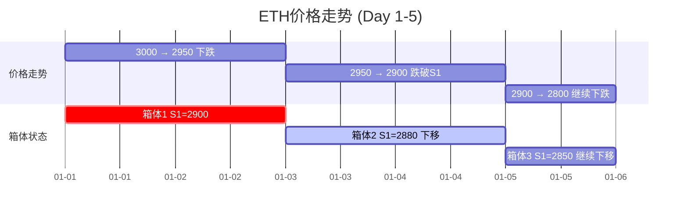

**交易记录**：

| 时间 | 价格 | 箱体状态 | 触发动作 | 仓位 | 现金 |
|------|------|---------|---------|------|------|
| Day1 00:00 | 3000 | 初始箱体 S1=2900 S2=2700 | - | 0 | 10000 |
| Day1 20:00 | 2910 | 进入S1区间 | 买入220 USDT (支撑1) | 0.075 ETH | 9780 |
| Day2 12:00 | 2895 | S1区间 | 买入552 USDT (支撑1) | 0.266 ETH | 9228 |
| Day3 00:00 | 2880 | 箱体下移 S1=2880 | 买满支撑1 836 USDT | 0.556 ETH | 8392 |
| Day4 08:00 | 2720 | 进入S2区间 | 买入2100 USDT (支撑2) | 1.328 ETH | 6292 |
| Day4 20:00 | 2700 | S2区间 | 买入600 USDT (支撑2) | 1.550 ETH | 5692 |

**仓位明细**：

```
支撑位1仓位（已买满2000 USDT）:
├─ 仓位#1: 220 USDT @ 2910, 目标R1=3100, R2=3300
├─ 仓位#2: 552 USDT @ 2895, 目标R1=3080, R2=3280
└─ 仓位#3: 836 USDT @ 2880, 目标R1=3080, R2=3280

支撑位2仓位（已投入2700 USDT，剩余300）:
├─ 仓位#4: 2100 USDT @ 2720, 目标R1=3080, R2=3280
└─ 仓位#5: 600 USDT @ 2700, 目标R1=3080, R2=3280

持仓总价值: 1.550 ETH × 2700 = 4185 USDT
账户总价值: 5692 + 4185 = 9877 USDT (浮亏1.23%)
```

### 7.3 Day 6-15: 反弹阶段止盈

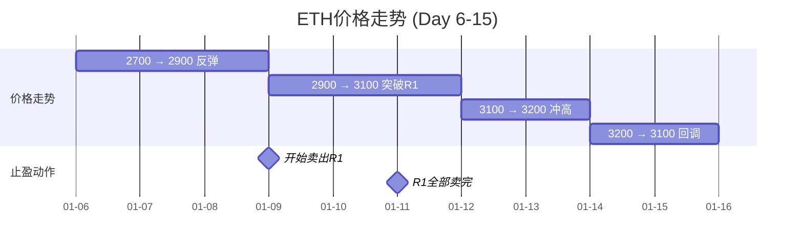

**Day 9 (价格涨至3085, 触发R1区间)**：

| 仓位 | R1目标 | 本次卖出 | 卖出数量 | 收入 |
|------|--------|---------|---------|------|
| #1 | 50% (0.038 ETH) | 71% | 0.027 ETH | 83 USDT |
| #2 | 50% (0.095 ETH) | 71% | 0.067 ETH | 207 USDT |
| #3 | 50% (0.145 ETH) | 71% | 0.103 ETH | 318 USDT |
| #4 (S2) | 70% (0.537 ETH) | 71% | 0.381 ETH | 1175 USDT |
| #5 (S2) | 70% (0.155 ETH) | 71% | 0.110 ETH | 339 USDT |
| **合计** | - | - | 0.688 ETH | 2122 USDT |

**更新后状态**：
- 现金: 5692 + 2122 = 7814 USDT
- 剩余持仓: 0.862 ETH
- 账户总价值: 7814 + 0.862×3085 = 10473 USDT (盈利4.73%)

**Day 11 (价格涨至3120, R1全部卖完)**：

| 仓位 | R1剩余 | 全部卖出 | 收入 |
|------|--------|---------|------|
| 所有仓位 | 29% | 0.196 ETH | 612 USDT |

**更新后状态**：
- 现金: 7814 + 612 = 8426 USDT
- 剩余持仓: 0.666 ETH (全部是R2目标50%或30%)
- 账户总价值: 8426 + 0.666×3120 = 10504 USDT (盈利5.04%)

### 7.4 Day 16-20: 触发止损

```mermaid
gantt
    title ETH价格走势 (Day 16-20)
    dateFormat YYYY-MM-DD
    axisFormat %m-%d

    section 价格走势
    3100 → 2950 下跌        :2025-01-16, 2d
    2950 → 2700 加速下跌    :2d
    2700 → 2600 跌破止损    :1d

    section 止损触发
    跌破箱底-3%             :crit, milestone, 2025-01-20, 0d
```

**Day 20 (价格跌至2600, 触发箱体止损)**：

```
止损边界计算:
├─ 当前箱体支撑位2: 2680
├─ 止损阈值: 3%
└─ 止损价格: 2680 × (1-3%) = 2600 ✅ 触发

剩余持仓: 0.666 ETH
止损卖出: 0.666 ETH @ 2600 = 1732 USDT (扣费后)

最终状态:
├─ 现金: 8426 + 1732 = 10158 USDT
├─ 持仓: 0 ETH
└─ 总价值: 10158 USDT (盈利1.58%)
```

### 7.5 Day 21-30: 重新建仓

```mermaid
gantt
    title ETH价格走势 (Day 21-30)
    dateFormat YYYY-MM-DD
    axisFormat %m-%d

    section 价格走势
    2600 → 2800 反弹        :2025-01-21, 3d
    2800 → 2900 继续上涨    :3d
    2900 → 3000 恢复        :4d

    section 箱体更新
    止损后重新计算箱体      :milestone, 2025-01-21, 0d
    新箱体 S1=2780 S2=2600  :2025-01-21, 10d
```

**总结**：
- 初始资金: 10000 USDT
- 最终价值: 10158 USDT
- 净收益: 158 USDT (1.58%)
- 交易次数: 约25笔（买入10笔 + 卖出12笔 + 止损3笔）
- 最大回撤: -1.23%

---

## 10. 常见问题解答（FAQ）

### Q1: 如果价格在区间内横盘，会重复买入吗？

**A**: 会的！这是渐进式买入的特点。

```mermaid
graph LR
    A[价格在2910横盘] -->|第1根K线| B[买入11%]
    B -->|第2根K线| C[买入11%]
    C -->|第3根K线| D[买入11%]
    D -->|直到买满| E[停止买入]
```

**防止过度买入的机制**：
1. **理论上限**：支撑1最多2000 USDT
2. **剩余资金递减**：每次买入后可用资金减少
3. **自然停止**：买满后自动停止

### Q2: 如果网格价格变化太快，会不会混乱？

**A**: 不会！每个仓位记录自己的目标价。

**示例**：
```
Day 1: 买入仓位#1 @ 2900, 记录目标R1=3100
Day 2: 网格更新，R1变成3080
Day 3: 买入仓位#2 @ 2880, 记录目标R1=3080 (新价格)

卖出时:
├─ 仓位#1: 等待价格到3100才卖 (自己的目标)
└─ 仓位#2: 等待价格到3080才卖 (自己的目标)
```

### Q3: 支撑位1买满后，价格再跌怎么办？

**A**: 支撑位2接力买入！

```mermaid
flowchart TD
    A[支撑位1买满2000] --> B{价格继续下跌?}
    B -->|是| C[进入支撑位2区间]
    C --> D[支撑位2买入最多3000]
    B -->|否| E[等待反弹卖出]

    style A fill:#fff4e6
    style D fill:#d5f4e6
```

**极端情况**（两层都买满）：
- 已投入: 2000 + 3000 = 5000 USDT
- 剩余现金: 5000 USDT
- **此时只能等待反弹卖出释放现金**

### Q4: 止损后会重新买入吗？

**A**: 会！止损后系统重新计算箱体。

```
Day 20: 触发止损 @ 2600, 全部平仓
├─ 现金: 10158 USDT
├─ 持仓: 0 ETH
└─ 重新计算箱体

Day 21: 价格2650, 新箱体
├─ 支撑位1: 2550 (区间2530-2570)
├─ 支撑位2: 2450 (区间2430-2470)
└─ 可以重新开始买入
```

### Q5: 如果价格一直涨，没买到怎么办？

**A**: 这是"踏空风险"，箱体策略的特点。

**应对**：
1. 等待回调进入支撑区间
2. 或者卖出已有仓位获利（如果有）
3. **不追涨**：严格按箱体交易

### Q6: 手续费会不会吃掉利润？

**A**: 手续费0.1%，在策略中已考虑。

**示例计算**：
```
买入2000 USDT:
├─ 手续费: 2000 × 0.001 = 2 USDT
├─ 实际买入: 1998 USDT
└─ 手续费占比: 0.1%

卖出获利200 USDT (10%收益):
├─ 卖出金额: 2200 USDT
├─ 手续费: 2.2 USDT
├─ 净收益: 197.8 USDT
└─ 手续费影响: 2.2/200 = 1.1%

总结: 手续费影响很小，只要收益>1%就能覆盖
```

### Q7: 多头和空头止损有什么区别？

**A**: 对称设计，保护不同方向的仓位。

**对比表**：

| 项目 | 多头止损 | 空头止损 |
|------|---------|---------|
| **触发价格** | 价格 < 支撑2区间下界 - 3% | 价格 > 压力2区间上界 + 3% |
| **平仓动作** | 卖出所有多头持仓 | 买入平掉所有空头持仓 |
| **现金流向** | 获得现金（亏损） | 支出现金（亏损） |
| **保护对象** | 防止继续下跌亏损 | 防止继续上涨亏损 |

**示例**：

```
当前箱体:
├─ 压力位2: 3320 (上界)
├─ 支撑位2: 2680 (下界)
└─ 止损阈值: 3%

多头止损边界: 2680 × (1-3%) = 2599.60
  └─ 价格跌破2599时，卖出所有多头持仓

空头止损边界: 3320 × (1+3%) = 3419.60
  └─ 价格突破3419时，买入平掉所有空头持仓
```

### Q8: 策略最适合什么市场？

**A**: 震荡市场（箱体市）。

| 市场类型 | 适合度 | 说明 |
|---------|--------|------|
| 横盘震荡 | ⭐⭐⭐⭐⭐ | 最佳，反复买卖赚差价 |
| 缓慢上涨 | ⭐⭐⭐⭐ | 较好，低位买入高位止盈 |
| 缓慢下跌 | ⭐⭐⭐ | 一般，需要箱体止损保护 |
| 单边暴涨 | ⭐⭐ | 踏空，买不到（空头止损保护） |
| 单边暴跌 | ⭐ | 危险（多头止损保护） |

### Q9: 如何优化参数？

**可调参数**：

| 参数 | 默认值 | 可选范围 | 影响 |
|------|--------|---------|------|
| 支撑1上限 | 20% | 10-30% | 投入比例 |
| 支撑2上限 | 30% | 20-40% | 投入比例 |
| 止损阈值 | 3% | 2-5% | 风险承受 |
| 权重系数k | 3 | 2-4 | 买入激进度 |

**建议**：
1. 保守: 支撑1=15%, 支撑2=25%, 止损=5%
2. 激进: 支撑1=25%, 支撑2=35%, 止损=2%

---

## 📝 文档完成总结

本文档已包含：

✅ **策略核心思想**（带Mermaid流程图 + 双向止损）
✅ **网格箱体计算**（FourPeaksAnalyzer算法详解）
✅ **仓位管理机制**（现金约束+理论上限）
✅ **渐进式买入**（指数衰减权重函数+完整示例）
✅ **分级止盈卖出**（R1/R2分配+收益计算）
✅ **箱体止损机制**（多头/空头对称止损，3%可配置）⭐ 已更新
✅ **完整30天交易示例**（含建仓/止盈/止损/重建）
✅ **数据库设计**（GridPosition表结构）
✅ **核心代码算法**（Python伪代码，含双向止损）⭐ 已更新
✅ **常见问题解答**（9个FAQ，新增止损对比）⭐ 已更新

**文档特点**：
- 🎨 大量Mermaid图表可视化（35+图表）
- 📊 详细数值计算示例（含止损场景）
- 💡 面向小白，通俗易懂
- ✅ 覆盖所有实现细节
- 🔄 完整对称性设计（多头/空头）

**更新内容（2025-11-30）**：
- ✅ 新增空头止损机制（与多头止损对称）
- ✅ 更新策略执行流程图（双向止损检查）
- ✅ 更新核心交易算法（check_stop_loss函数）
- ✅ 新增FAQ Q7（止损对比说明）
- ✅ 新增示例计算（空头止损场景）

**可以开始实现了！** 🚀
