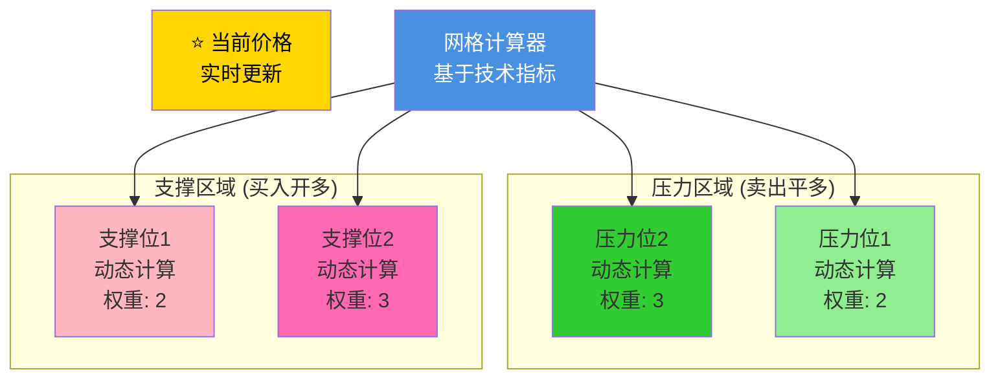
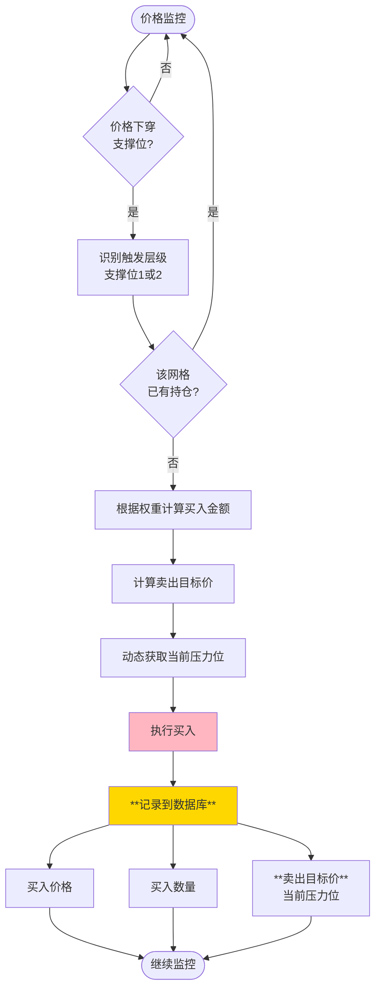
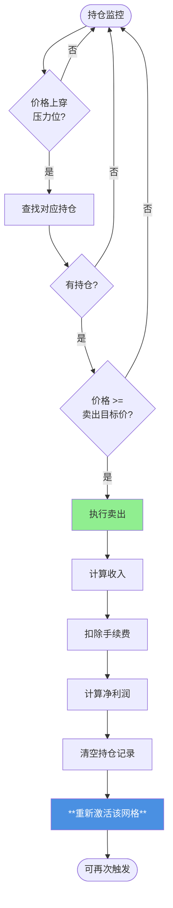
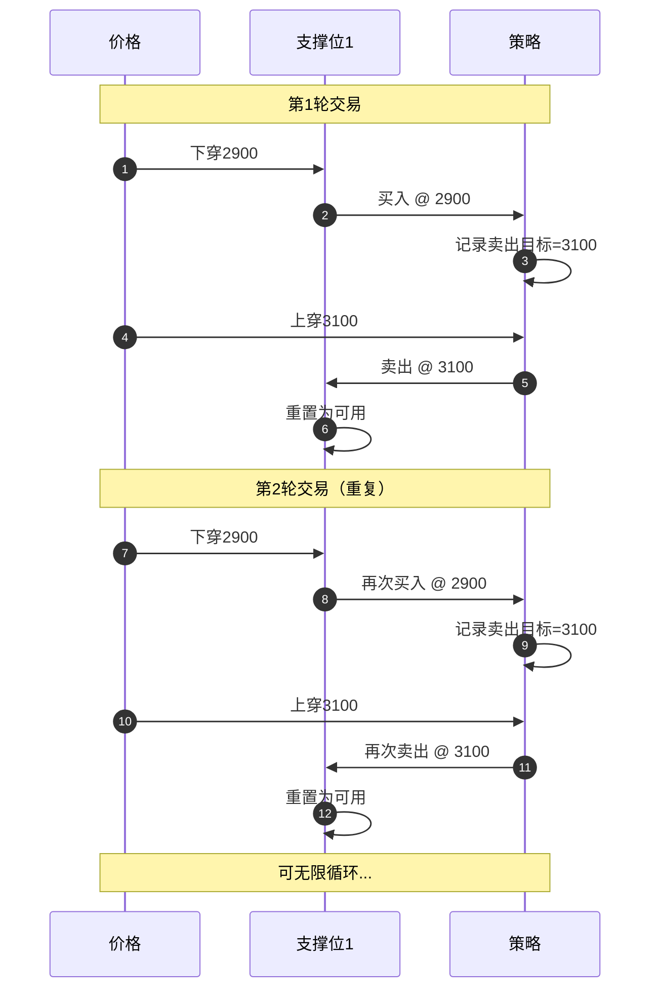
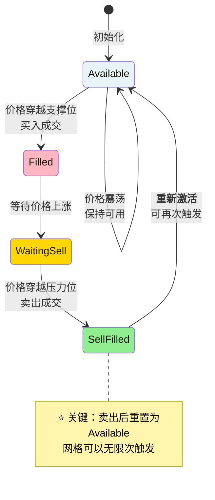
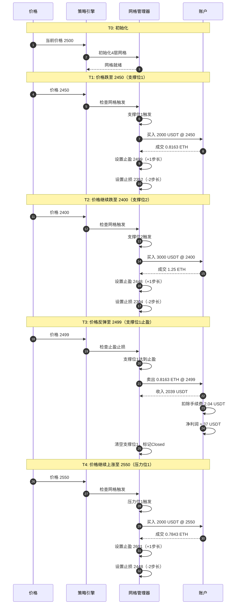

# 网格策略 v2.0 - 动态网格交易策略

**最后更新**: 2025-11-28

根据你的需求，这是一个**动态4层网格策略**。**请仔细检查，如有偏差请立即指出！**

---

## 1. 策略概述

### 1.1 核心特征

这是一个**动态4层网格策略**，特点：
- ✅ 4个网格层级（支撑位2层 + 压力位2层）
- ✅ **动态计算网格价格**（非固定步长）
- ✅ 按层级加权分配资金（3:2:2:3）
- ✅ 每个网格独立管理状态
- ✅ **卖出后重新激活**（可重复触发）
- ✅ **记录每笔成交的卖出目标价**

### 1.2 与传统网格的核心差异

| 特性 | 传统静态网格 | 本策略（动态网格） |
|------|------------|----------------|
| 网格价格 | 固定步长（如2%） | ✅ **动态计算**（基于技术指标） |
| 网格层数 | 10-20层 | 4层（精简高效） |
| 资金分配 | 平均分配 | 按层级加权（3:2:2:3） |
| 网格重置 | 卖出后重新激活 | ✅ **卖出后重新激活** |
| 价格记录 | 不需要 | ✅ **需记录买入价和卖出目标价** |
| 交易方向 | 仅做多 | 到达支撑位开多，到达压力位平多 |

---

## 2. 动态网格结构

### 2.1 网格价格动态计算

**关键特性**：网格价格不是固定步长，而是**根据当前市场状态动态计算**。



### 2.2 具体示例（ETH @ 3000）

**场景**：当前ETH价格 = 3000 USDT

根据市场状态（波动率、技术指标等）动态计算网格：

| 层级 | 类型 | 动态价格 | 与当前价差 | 资金权重 | 分配资金(10000 USDT) | 占比 |
|------|------|---------|----------|---------|------------------|------|
| Level +2 | 压力位2 | **3300** | +300 (+10%) | 3 | 3000 | 30% |
| Level +1 | 压力位1 | **3100** | +100 (+3.3%) | 2 | 2000 | 20% |
| **当前** | **市价** | **3000** | **0** | - | - | - |
| Level -1 | 支撑位1 | **2900** | -100 (-3.3%) | 2 | 2000 | 20% |
| Level -2 | 支撑位2 | **2700** | -300 (-10%) | 3 | 3000 | 30% |

**关键观察**：
- 压力位和支撑位的间距**不对称**（不是固定2%步长）
- 压力位2距离当前价格10%，支撑位2也是10%
- 压力位1距离当前价格3.3%，支撑位1也是3.3%
- 这种动态计算可以基于**ATR、布林带、斐波那契**等技术指标

**资金分配逻辑**（不变）：
```python
总权重 = 3 + 2 + 2 + 3 = 10
支撑位2资金 = 10000 × (3/10) = 3000 USDT
支撑位1资金 = 10000 × (2/10) = 2000 USDT
压力位1资金 = 10000 × (2/10) = 2000 USDT  # 暂不使用
压力位2资金 = 10000 × (3/10) = 3000 USDT  # 暂不使用
```

### 2.3 网格价格计算服务

```python
class DynamicGridCalculator:
    """动态网格价格计算器"""

    def calculate_grid_levels(
        self,
        current_price: float,
        df: pd.DataFrame,  # 历史K线数据
        method: str = "atr"  # 计算方法: atr/volatility/fibonacci
    ) -> Dict[str, float]:
        """
        根据当前价格和市场状态计算4个网格层级

        Returns:
            {
                'resistance_2': 3300,  # 压力位2
                'resistance_1': 3100,  # 压力位1
                'support_1': 2900,     # 支撑位1
                'support_2': 2700      # 支撑位2
            }
        """
        if method == "atr":
            return self._calculate_by_atr(current_price, df)
        elif method == "volatility":
            return self._calculate_by_volatility(current_price, df)
        elif method == "fibonacci":
            return self._calculate_by_fibonacci(current_price, df)

    def _calculate_by_atr(self, price: float, df: pd.DataFrame) -> Dict:
        """基于ATR（平均真实波幅）计算网格"""
        atr = self._get_atr(df, period=14)

        return {
            'resistance_2': price + atr * 3,   # 上方3倍ATR
            'resistance_1': price + atr * 1,   # 上方1倍ATR
            'support_1': price - atr * 1,      # 下方1倍ATR
            'support_2': price - atr * 3       # 下方3倍ATR
        }

    # ... 其他计算方法
```

---

## 3. 交易逻辑

### 3.1 核心交易规则

**简化版**：
- 价格下穿**支撑位** → **开多**（买入）
- 价格上穿**压力位** → **平多**（卖出）
- 卖出后网格**重新激活**，可再次触发


### 3.2 买入逻辑（开多）



**买入示例**（支撑位1触发）：

```python
# T0: 初始化网格
当前价格 = 3000 USDT
计算网格 = {
    'resistance_2': 3300,
    'resistance_1': 3100,
    'support_1': 2900,
    'support_2': 2700
}

# T1: 价格跌至2900（触及支撑位1）
触发网格 = 支撑位1 (2900)
买入金额 = 10000 × 0.2 = 2000 USDT  # 权重2
买入数量 = 2000 / 2900 ≈ 0.6897 ETH

# 关键：记录卖出目标价
卖出目标价 = 当前压力位1 = 3100 USDT  # 动态获取

# 保存到数据库
position_record = {
    'grid_level': 'support_1',
    'buy_price': 2900,
    'amount': 0.6897,
    'cost': 2000,
    'sell_target_price': 3100,  # ← 关键！记录卖出价
    'buy_time': '2025-11-28 10:00:00'
}
```

### 3.3 卖出逻辑（平多）



**卖出示例**（持仓平仓）：

```python
# T2: 价格涨至3100（触及压力位1）
当前价格 = 3100 USDT
触发网格 = 压力位1

# 查找对应持仓
持仓 = 查询数据库(sell_target_price=3100)
# 找到：支撑位1的持仓（卖出目标价=3100）

# 执行卖出
卖出数量 = 0.6897 ETH
卖出所得 = 0.6897 × 3100 = 2138 USDT
手续费 = 2138 × 0.001 = 2.14 USDT
实际收入 = 2138 - 2.14 = 2135.86 USDT

# 计算盈亏
成本 = 2000 USDT
净利润 = 2135.86 - 2000 = 135.86 USDT
收益率 = 135.86 / 2000 = 6.79%

# 关键：重新激活网格
支撑位1.status = 'available'  # 可再次买入
```

### 3.4 网格重置与循环



**关键特性**：
- ✅ 每次卖出后，网格重新激活
- ✅ 同一个网格可以触发**多次**
- ✅ 每次买入时重新计算卖出目标价（动态）

---

## 4. 状态管理与数据持久化

### 4.1 网格状态机（支持重复激活）



### 4.2 数据库模型设计

#### GridPosition 模型（持仓记录表）

**关键**：每次买入创建一条新记录，记录买入价和**卖出目标价**

```python
class GridPosition(models.Model):
    """网格持仓记录"""

    # 基本信息
    id = models.AutoField(primary_key=True)
    created_at = models.DateTimeField(auto_now_add=True)

    # 网格信息
    grid_level = models.CharField(
        max_length=20,
        choices=[
            ('support_1', '支撑位1'),
            ('support_2', '支撑位2'),
        ],
        help_text='触发的网格层级'
    )

    # 买入信息
    buy_price = models.DecimalField(
        max_digits=20,
        decimal_places=8,
        help_text='买入价格'
    )
    buy_time = models.DateTimeField(
        help_text='买入时间'
    )
    amount = models.DecimalField(
        max_digits=20,
        decimal_places=8,
        help_text='买入数量（ETH）'
    )
    cost = models.DecimalField(
        max_digits=20,
        decimal_places=2,
        help_text='总成本（USDT，不含手续费）'
    )

    # ⭐⭐⭐ 关键：卖出目标价（买入时记录）
    sell_target_price = models.DecimalField(
        max_digits=20,
        decimal_places=8,
        help_text='卖出目标价（买入时的压力位价格）'
    )

    # 卖出信息（初始为空）
    sell_price = models.DecimalField(
        max_digits=20,
        decimal_places=8,
        null=True,
        blank=True,
        help_text='实际卖出价格'
    )
    sell_time = models.DateTimeField(
        null=True,
        blank=True,
        help_text='卖出时间'
    )
    revenue = models.DecimalField(
        max_digits=20,
        decimal_places=2,
        null=True,
        blank=True,
        help_text='卖出收入（扣除手续费后）'
    )

    # 盈亏
    pnl = models.DecimalField(
        max_digits=20,
        decimal_places=2,
        null=True,
        blank=True,
        help_text='净利润'
    )
    pnl_pct = models.DecimalField(
        max_digits=10,
        decimal_places=4,
        null=True,
        blank=True,
        help_text='收益率'
    )

    # 状态
    status = models.CharField(
        max_length=20,
        choices=[
            ('open', '持仓中'),
            ('closed', '已平仓'),
        ],
        default='open'
    )

    # 回测关联
    backtest_result = models.ForeignKey(
        'BacktestResult',
        on_delete=models.CASCADE,
        related_name='grid_positions',
        help_text='所属回测'
    )

    class Meta:
        db_table = 'grid_position'
        ordering = ['-created_at']
        indexes = [
            models.Index(fields=['status', 'sell_target_price']),
            models.Index(fields=['backtest_result', 'grid_level']),
        ]
```

#### GridLevel 运行时状态（内存）

```python
class GridLevel:
    """单个网格的运行时状态（不持久化）"""

    level_name: str         # 'support_1', 'support_2'
    trigger_price: float    # 触发价格（动态计算）
    weight: int             # 资金权重
    allocated_amount: float # 分配资金

    # 运行时状态
    status: str             # 'available' | 'filled'
    current_position_id: Optional[int] = None  # 当前持仓ID（指向数据库）

    def is_available(self) -> bool:
        """是否可以买入"""
        return self.status == 'available'

    def activate(self):
        """重新激活（卖出后调用）"""
        self.status = 'available'
        self.current_position_id = None
```

### 4.3 完整数据流示例

```python
# ============= T0: 初始化 =============
grid_support_1 = GridLevel(
    level_name='support_1',
    trigger_price=2900,  # 动态计算
    weight=2,
    allocated_amount=2000,
    status='available',
    current_position_id=None
)

# ============= T1: 价格跌至2900，触发买入 =============
if price <= 2900 and grid_support_1.is_available():
    # 动态获取当前压力位
    current_resistance_1 = calc_resistance_1(price, df)  # 例如：3100

    # 买入并创建数据库记录
    position = GridPosition.objects.create(
        grid_level='support_1',
        buy_price=2900,
        buy_time=now(),
        amount=0.6897,
        cost=2000,
        sell_target_price=current_resistance_1,  # ← 关键！
        status='open',
        backtest_result=current_backtest
    )

    # 更新运行时状态
    grid_support_1.status = 'filled'
    grid_support_1.current_position_id = position.id
    cash -= 2000

# ============= T2: 价格涨至3100，触发卖出 =============
if price >= 3100:
    # 查找所有卖出目标价 <= 3100 的未平仓持仓
    positions_to_close = GridPosition.objects.filter(
        status='open',
        sell_target_price__lte=3100,
        backtest_result=current_backtest
    )

    for pos in positions_to_close:
        # 执行卖出
        revenue_before_fee = pos.amount * 3100
        fee = revenue_before_fee * FEE_RATE
        revenue = revenue_before_fee - fee
        pnl = revenue - pos.cost

        # 更新数据库记录
        pos.sell_price = 3100
        pos.sell_time = now()
        pos.revenue = revenue
        pos.pnl = pnl
        pos.pnl_pct = pnl / pos.cost
        pos.status = 'closed'
        pos.save()

        # ⭐⭐⭐ 关键：重新激活对应网格
        grid = get_grid_by_level(pos.grid_level)
        grid.activate()  # 可以再次买入！
        cash += revenue

# ============= T3: 价格再次跌至2900，再次触发买入 =============
# 因为grid_support_1已经重新激活，所以可以再次买入
if price <= 2900 and grid_support_1.is_available():
    # 重新计算压力位（可能已变化）
    current_resistance_1 = calc_resistance_1(price, df)  # 可能是3150

    # 创建新的持仓记录
    new_position = GridPosition.objects.create(
        grid_level='support_1',
        buy_price=2900,
        buy_time=now(),
        amount=0.6897,
        cost=2000,
        sell_target_price=current_resistance_1,  # 新的目标价
        status='open',
        backtest_result=current_backtest
    )

    # ... 循环往复
```

---

## 5. 完整交易示例

### 5.1 初始状态

```
基准价格：2500 USDT
总资金：10000 USDT
初始持仓：0 ETH

网格初始化：
  支撑位2 (2400): 等待触发，分配3000 USDT
  支撑位1 (2450): 等待触发，分配2000 USDT
  压力位1 (2550): 等待触发，分配2000 USDT
  压力位2 (2600): 等待触发，分配3000 USDT
```

### 5.2 交易序列



### 5.3 账户余额变化

| 时刻 | 事件 | 价格 | 现金 | 持仓(ETH) | 持仓市值 | 总价值 | 盈亏 |
|------|------|------|------|----------|---------|--------|------|
| T0 | 初始化 | 2500 | 10,000 | 0 | 0 | 10,000 | 0 |
| T1 | 支撑位1买入 | 2450 | 8,000 | 0.8163 | 2,000 | 10,000 | 0 |
| T2 | 支撑位2买入 | 2400 | 5,000 | 2.0663 | 4,959 | 9,959 | -41 |
| T3 | 支撑位1止盈 | 2499 | 7,037 | 1.25 | 3,124 | 10,161 | +161 |
| T4 | 压力位1买入 | 2550 | 5,037 | 2.0343 | 5,187 | 10,224 | +224 |

---

## 6. 关键参数配置

### 6.1 策略参数

```yaml
# 网格策略配置
grid_strategy_v2:
  # 基准价格
  base_price_mode: "first_kline"  # 第一根K线价格

  # 网格层级
  levels:
    - level: -2          # 支撑位2
      type: support
      price_multiplier: 0.96
      weight: 3

    - level: -1          # 支撑位1
      type: support
      price_multiplier: 0.98
      weight: 2

    - level: +1          # 压力位1
      type: resistance
      price_multiplier: 1.02
      weight: 2

    - level: +2          # 压力位2
      type: resistance
      price_multiplier: 1.04
      weight: 3

  # 止盈止损
  take_profit:
    default_steps: 1     # 默认+1步长
    configurable: true   # 可配置+1/+2/+3
    step_size: 0.02      # 每步2%

  stop_loss:
    steps: 2             # 固定-2步长
    step_size: 0.02      # 每步2%

  # 网格激活
  reactivate: false      # 不重复激活

  # 手续费
  fee_rate: 0.001        # 0.1%
  fee_from_revenue: true # 从卖出所得扣除
```

### 6.2 资金分配服务

```python
class FundAllocator:
    """资金分配服务（可抽象配置）"""

    def allocate(
        self,
        total_cash: float,
        levels: List[GridLevel]
    ) -> Dict[int, float]:
        """
        分配资金到各个网格层级

        Args:
            total_cash: 总资金
            levels: 网格层级列表

        Returns:
            {level: allocated_amount}
        """
        # 计算总权重
        total_weight = sum(level.weight for level in levels)

        # 按权重分配
        allocation = {}
        for level in levels:
            allocation[level.level] = (
                total_cash * level.weight / total_weight
            )

        return allocation
```

---

## 7. 待确认的疑问

### ❓ 疑问1: 压力位网格的作用

你配置了压力位1和压力位2，但它们的作用是什么？

**可能的理解**：

**理解A**: 压力位也是买入网格
```
如果价格上涨到压力位1 (2550)，也买入
这样可以追涨
```

**理解B**: 压力位只是卖出目标价
```
压力位不买入，只是作为支撑位买入后的止盈参考
例如：在支撑位1买入，目标在压力位1卖出
```

**理解C**: 压力位是做空网格（卖币）
```
在压力位做空（卖出ETH）
在支撑位平空（买回ETH）
但这需要有初始持仓
```

**请明确：压力位的作用是什么？**

---

### ❓ 疑问2: 止盈步数配置

你说"buy-1默认在+1网格卖出，可以配置+1，+2，+3"

**请确认**：

**情况A**: 每个网格独立配置
```python
支撑位1买入：止盈配置为+1步长（默认）
支撑位2买入：止盈配置为+2步长（自定义）
```

**情况B**: 全局统一配置
```python
所有网格使用相同的止盈步数
可以在回测时调整这个参数
```

**你的选择**: A 还是 B？

---

### ❓ 疑问3: 初始按价格挂单

你说"初始按照价格挂单"，这是什么意思？

**理解A**: 只初始化网格，不实际买入
```
T0时刻：
- 价格2500
- 现金10000
- 持仓0
- 等待价格触发买入
```

**理解B**: 根据当前价格立即建仓
```
T0时刻：
- 价格2500（在支撑位1和压力位1之间）
- 不触发任何买入（因为没有穿越网格）
```

**理解C**: 在所有支撑位挂买单（限价单）
```
在支撑位1挂买单2000 USDT @ 2450
在支撑位2挂买单3000 USDT @ 2400
等待价格触及
```

**你的选择**: A、B 还是 C？

---

### ❓ 疑问4: 手续费处理

你说"从卖出所得扣除"，那买入时的手续费呢？

**买入**：
```
投入2000 USDT买入
手续费 = 2000 × 0.1% = 2 USDT
总成本 = 2000 + 2 = 2002 USDT？
还是只用2000 USDT，扣除手续费后实际买1998 USDT的币？
```

**卖出**：
```
卖出获得2500 USDT
手续费 = 2500 × 0.1% = 2.5 USDT
实际收入 = 2500 - 2.5 = 2497.5 USDT ✓
```

**请明确买入手续费的处理方式**

---

## 8. 确认清单

请逐项确认以下理解是否正确：

- [ ] 1. 4层网格：支撑位2、支撑位1、压力位1、压力位2
- [ ] 2. 资金权重：3:2:2:3
- [ ] 3. 每个网格独立管理状态，配对买卖
- [ ] 4. 止盈可配置+1/+2/+3步长，默认+1
- [ ] 5. 止损固定-2步长
- [ ] 6. 网格不重复激活（一次性）
- [ ] 7. 基准价格使用第一根K线价格
- [ ] 8. 初始全部现金，0持仓

**以及回答4个疑问**：
1. 压力位的作用？
2. 止盈步数是独立配置还是全局配置？
3. "初始按价格挂单"的具体含义？
4. 买入手续费如何处理？

---

**请完整回答后，我立即开始实现！**
