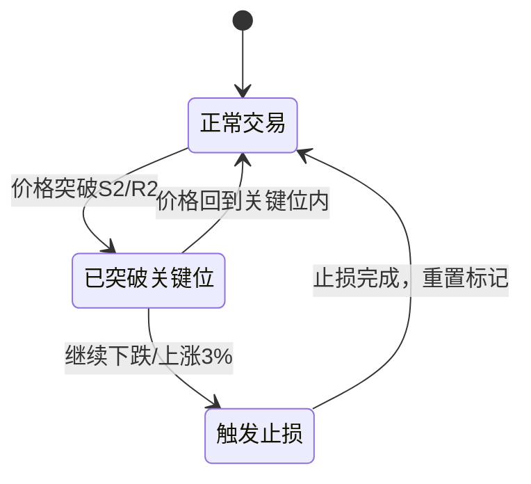

# Grid Strategy V4 实施计划
## 双向交易策略 - 多空同时运作

---

## 📊 策略概述

### 核心特性
- ✨ **双向交易**：同时做多和做空
- ✨ **简单止盈**：到达目标位一次性全平
- ✨ **突破止损**：关键位突破后+3%触发止损
- ✨ **固定仓位**：支撑位1/2 (20%/30%)，压力位1/2 (20%/30%)

### 与V3的核心差异

| 特性 | Grid V3 | Grid V4 |
|-----|---------|---------|
| 交易方向 | 只做多 | 多空双向 |
| 开仓方式 | 挂单系统 | 价格触达直接开仓 |
| 止盈方式 | R1/R2分级渐进 | 一次性全平 |
| 止损方式 | 固定止损价 | 突破关键位+3% |
| 仓位管理 | 动态锁定 | 固定比例 |

---

## 🎯 实施阶段

### 阶段1：数据库扩展 - 支持双向交易

**目标**：扩展GridPosition Model以支持空单记录

**任务清单**：
1. 创建数据库迁移文件 `0007_add_position_direction.py`
2. 在 `GridPosition` Model中添加 `direction` 字段
   - 类型：CharField
   - 选项：'long' (多单) / 'short' (空单)
   - 默认值：'long'（向后兼容）
3. 执行迁移：`python manage.py migrate`

**验收标准**：
- [ ] 迁移文件已创建
- [ ] `python manage.py migrate` 执行成功
- [ ] 现有GridPosition记录的direction字段默认为'long'
- [ ] 可以创建direction='short'的新记录

**测试**：
```python
from backtest.models import GridPosition, BacktestResult

# 测试创建多单
result = BacktestResult.objects.latest('created_at')
long_pos = GridPosition.objects.create(
    backtest_result=result,
    direction='long',
    buy_level='support_1',
    buy_price=3000,
    buy_amount=0.1,
    # ...
)
print(f"多单创建成功: {long_pos.direction}")

# 测试创建空单
short_pos = GridPosition.objects.create(
    backtest_result=result,
    direction='short',
    buy_level='resistance_1',
    buy_price=3200,
    buy_amount=0.1,
    # ...
)
print(f"空单创建成功: {short_pos.direction}")
```

**状态**: 未开始

---

### 阶段2：双向仓位管理器

**目标**：创建 `BidirectionalPositionManager` 类，管理多空两个独立的仓位池

**任务清单**：
1. 创建文件 `backtest/services/bidirectional_position_manager.py`
2. 实现核心方法：
   - `open_long_position(level, price, amount)` - 开多单
   - `open_short_position(level, price, amount)` - 开空单
   - `close_long_position(position_id, price, amount)` - 平多单
   - `close_short_position(position_id, price, amount)` - 平空单
   - `get_long_positions()` - 获取所有多单
   - `get_short_positions()` - 获取所有空单
   - `get_account_value(current_price)` - 计算账户总价值
3. 实现资金管理：
   - 支撑位1：20%资金
   - 支撑位2：30%资金
   - 压力位1：20%资金（开空）
   - 压力位2：30%资金（开空）

**核心逻辑**：

```python
class BidirectionalPositionManager:
    """双向仓位管理器 - 管理多单和空单"""

    def __init__(self, backtest_result_id, initial_cash):
        self.backtest_result_id = backtest_result_id
        self.initial_cash = initial_cash
        self.current_cash = initial_cash

        # 固定仓位比例
        self.support_1_size_pct = 0.20  # 20%
        self.support_2_size_pct = 0.30  # 30%
        self.resistance_1_size_pct = 0.20  # 20%
        self.resistance_2_size_pct = 0.30  # 30%

    def open_long_position(self, level, price, amount):
        """开多单"""
        cost = price * amount * (1 + self.fee_rate)
        if self.current_cash < cost:
            return None  # 资金不足

        position = GridPosition.objects.create(
            backtest_result_id=self.backtest_result_id,
            direction='long',
            buy_level=level,
            buy_price=price,
            buy_amount=amount,
            # ...
        )
        self.current_cash -= cost
        return position

    def open_short_position(self, level, price, amount):
        """开空单（借币卖出）"""
        revenue = price * amount * (1 - self.fee_rate)

        position = GridPosition.objects.create(
            backtest_result_id=self.backtest_result_id,
            direction='short',
            buy_level=level,  # 这里记录开空的压力位
            buy_price=price,   # 开空价格
            buy_amount=amount,
            # ...
        )
        self.current_cash += revenue  # 卖币获得资金
        return position

    def get_account_value(self, current_price):
        """计算账户总价值"""
        # 多单价值
        long_value = sum(
            pos.remaining * current_price
            for pos in self.get_long_positions()
        )

        # 空单价值（负债）
        short_value = sum(
            pos.remaining * (2 * pos.buy_price - current_price)
            for pos in self.get_short_positions()
        )

        return self.current_cash + long_value + short_value
```

**验收标准**：
- [ ] 可以成功创建多单和空单
- [ ] 多单开仓扣除现金，平仓增加现金
- [ ] 空单开仓增加现金，平仓扣除现金
- [ ] `get_account_value()` 正确计算多空混合账户价值
- [ ] 资金不足时拒绝开仓

**测试**：
```python
manager = BidirectionalPositionManager(
    backtest_result_id=1,
    initial_cash=10000
)

# 开多单
long_pos = manager.open_long_position('support_1', 3000, 0.666)
assert long_pos is not None
assert manager.current_cash < 10000

# 开空单
short_pos = manager.open_short_position('resistance_1', 3200, 0.625)
assert short_pos is not None
assert manager.current_cash > 8000  # 卖出后增加现金

# 计算账户价值
value = manager.get_account_value(current_price=3100)
assert value > 0
```

**状态**: 未开始

---

### 阶段3：简单止盈执行器

**目标**：创建 `SimpleTakeProfitExecutor` 类，实现一次性全平逻辑

**任务清单**：
1. 创建文件 `backtest/services/simple_take_profit_executor.py`
2. 实现核心方法：
   - `check_long_take_profit(current_price, grid_levels)` - 检查多单止盈
   - `check_short_take_profit(current_price, grid_levels)` - 检查空单止盈
   - `execute_long_take_profit(position, price)` - 执行多单止盈
   - `execute_short_take_profit(position, price)` - 执行空单止盈

**核心逻辑**：

```python
class SimpleTakeProfitExecutor:
    """简单止盈执行器 - 一次性全平"""

    def __init__(self, position_manager, fee_rate=0.001):
        self.position_manager = position_manager
        self.fee_rate = fee_rate
        self.events = []

    def check_long_take_profit(self, current_price, grid_levels):
        """
        检查多单止盈条件
        所有多单（S1/S2）到达R1全部平仓
        """
        r1_price = grid_levels['resistance_1']['price']

        if current_price >= r1_price:
            long_positions = self.position_manager.get_long_positions()
            for pos in long_positions.filter(status='open'):
                self.execute_long_take_profit(pos, current_price)

    def check_short_take_profit(self, current_price, grid_levels):
        """
        检查空单止盈条件
        所有空单（R1/R2）到达S1全部平仓
        """
        s1_price = grid_levels['support_1']['price']

        if current_price <= s1_price:
            short_positions = self.position_manager.get_short_positions()
            for pos in short_positions.filter(status='open'):
                self.execute_short_take_profit(pos, current_price)

    def execute_long_take_profit(self, position, price):
        """执行多单止盈 - 全部卖出"""
        amount = position.remaining
        revenue = price * amount * (1 - self.fee_rate)

        position.remaining = 0
        position.status = 'closed'
        position.pnl = revenue - position.buy_cost
        position.save()

        self.position_manager.current_cash += revenue

        self.events.append({
            'type': 'sell',
            'direction': 'long',
            'position_id': position.id,
            'price': price,
            'amount': amount,
            'revenue': revenue,
            'pnl': float(position.pnl)
        })

    def execute_short_take_profit(self, position, price):
        """执行空单止盈 - 买币还债"""
        amount = position.remaining
        cost = price * amount * (1 + self.fee_rate)

        position.remaining = 0
        position.status = 'closed'
        # 空单盈亏 = 开仓收入 - 平仓成本
        position.pnl = (position.buy_price * amount) - cost
        position.save()

        self.position_manager.current_cash -= cost

        self.events.append({
            'type': 'buy_to_cover',
            'direction': 'short',
            'position_id': position.id,
            'price': price,
            'amount': amount,
            'cost': cost,
            'pnl': float(position.pnl)
        })
```

**验收标准**：
- [ ] 多单到达R1后全部平仓
- [ ] 空单到达S1后全部平仓
- [ ] 多单盈亏计算正确（卖出收入 - 买入成本）
- [ ] 空单盈亏计算正确（开空收入 - 平空成本）
- [ ] 平仓后现金余额更新正确
- [ ] 事件记录完整

**测试**：
```python
executor = SimpleTakeProfitExecutor(
    position_manager=manager,
    fee_rate=0.001
)

# 模拟多单止盈
grid_levels = {
    'resistance_1': {'price': 3200},
    'support_1': {'price': 2800}
}

# 价格到达R1
executor.check_long_take_profit(
    current_price=3200,
    grid_levels=grid_levels
)

# 验证多单已平仓
long_positions = manager.get_long_positions()
assert all(pos.status == 'closed' for pos in long_positions)
```

**状态**: 未开始

---

### 阶段4：突破止损管理器

**目标**：创建 `BreakoutStopLossManager` 类，实现突破关键位+3%止损

**任务清单**：
1. 创建文件 `backtest/services/breakout_stop_loss_manager.py`
2. 实现核心方法：
   - `check_long_stop_loss(current_price, grid_levels)` - 检查多单止损
   - `check_short_stop_loss(current_price, grid_levels)` - 检查空单止损
   - `execute_stop_loss(positions, price, direction)` - 执行止损

**核心逻辑**：

```python
class BreakoutStopLossManager:
    """突破止损管理器"""

    def __init__(self, position_manager, stop_loss_pct=0.03, fee_rate=0.001):
        self.position_manager = position_manager
        self.stop_loss_pct = stop_loss_pct  # 3%
        self.fee_rate = fee_rate
        self.events = []

        # 追踪是否已突破关键位
        self.support_2_broken = False
        self.resistance_2_broken = False

    def check_long_stop_loss(self, current_price, grid_levels):
        """
        多单止损逻辑：
        1. 价格跌破S2 → 标记support_2_broken=True
        2. 继续下跌3% → 触发止损
        """
        s2_price = grid_levels['support_2']['price']

        # 检测S2突破
        if current_price < s2_price:
            self.support_2_broken = True

        # 如果已突破S2，检查是否触发止损
        if self.support_2_broken:
            stop_loss_price = s2_price * (1 - self.stop_loss_pct)
            if current_price <= stop_loss_price:
                long_positions = self.position_manager.get_long_positions()
                self.execute_stop_loss(
                    long_positions.filter(status='open'),
                    current_price,
                    'long'
                )
                self.support_2_broken = False  # 重置标记

    def check_short_stop_loss(self, current_price, grid_levels):
        """
        空单止损逻辑：
        1. 价格涨破R2 → 标记resistance_2_broken=True
        2. 继续上涨3% → 触发止损
        """
        r2_price = grid_levels['resistance_2']['price']

        # 检测R2突破
        if current_price > r2_price:
            self.resistance_2_broken = True

        # 如果已突破R2，检查是否触发止损
        if self.resistance_2_broken:
            stop_loss_price = r2_price * (1 + self.stop_loss_pct)
            if current_price >= stop_loss_price:
                short_positions = self.position_manager.get_short_positions()
                self.execute_stop_loss(
                    short_positions.filter(status='open'),
                    current_price,
                    'short'
                )
                self.resistance_2_broken = False  # 重置标记

    def execute_stop_loss(self, positions, price, direction):
        """批量止损"""
        if not positions.exists():
            return

        total_revenue = 0
        position_ids = []

        for pos in positions:
            amount = pos.remaining

            if direction == 'long':
                revenue = price * amount * (1 - self.fee_rate)
                pos.pnl = revenue - pos.buy_cost
            else:  # short
                cost = price * amount * (1 + self.fee_rate)
                revenue = -cost
                pos.pnl = (pos.buy_price * amount) - cost

            pos.remaining = 0
            pos.status = 'closed'
            pos.save()

            total_revenue += revenue
            position_ids.append(pos.id)

        self.position_manager.current_cash += total_revenue

        self.events.append({
            'type': 'stop_loss',
            'direction': direction,
            'position_ids': position_ids,
            'price': price,
            'total_revenue': total_revenue
        })
```

**验收标准**：
- [ ] 多单：跌破S2后继续下跌3%触发止损
- [ ] 空单：涨破R2后继续上涨3%触发止损
- [ ] 止损前价格在临界区间不触发
- [ ] 批量止损所有相关仓位
- [ ] 止损后现金余额更新正确

**测试**：
```python
stop_loss_mgr = BreakoutStopLossManager(
    position_manager=manager,
    stop_loss_pct=0.03
)

grid_levels = {
    'support_2': {'price': 2800},
    'resistance_2': {'price': 3200}
}

# 测试多单止损
# 1. 价格跌破S2
stop_loss_mgr.check_long_stop_loss(2790, grid_levels)
assert stop_loss_mgr.support_2_broken == True

# 2. 继续下跌但未达3%
stop_loss_mgr.check_long_stop_loss(2730, grid_levels)  # -2.5%
assert manager.get_long_positions().filter(status='open').exists()

# 3. 下跌超过3%触发止损
stop_loss_mgr.check_long_stop_loss(2715, grid_levels)  # -3.04%
assert not manager.get_long_positions().filter(status='open').exists()
```

**状态**: 未开始

---

### 阶段5：Grid V4主策略类

**目标**：创建 `GridStrategyV4` 主策略类，整合所有组件

**任务清单**：
1. 创建文件 `backtest/services/grid_strategy_v4.py`
2. 实现主循环逻辑：
   - 计算动态网格
   - 检查开仓信号（S1/S2多单，R1/R2空单）
   - 检查平仓信号（R1平多单，S1平空单）
   - 检查止损信号
   - 记录快照
3. 集成MetricsCalculator计算增强指标
4. 添加到 `run_backtest` 命令

**核心逻辑**：

```python
class GridStrategyV4:
    """箱体网格策略 V4.0 - 双向交易"""

    def __init__(
        self,
        symbol: str,
        interval: str,
        start_date: datetime,
        end_date: datetime,
        initial_cash: float = 10000.0,
        stop_loss_pct: float = 0.03,  # 3%
        commission: float = 0.001,
        price_deviation_pct: float = 0.10
    ):
        self.symbol = symbol
        self.interval = interval
        self.start_date = start_date
        self.end_date = end_date
        self.initial_cash = initial_cash
        self.stop_loss_pct = stop_loss_pct
        self.commission = commission
        self.price_deviation_pct = price_deviation_pct

    def run(self) -> BacktestResult:
        """运行回测"""
        # 1. 加载K线数据
        self.klines = self._load_klines()

        # 2. 创建回测结果记录
        self.backtest_result = BacktestResult.objects.create(
            name=f"Grid V4 - {self.symbol} {self.interval}",
            symbol=self.symbol,
            interval=self.interval,
            start_date=self.klines.index[0],
            end_date=self.klines.index[-1],
            strategy_params={
                'strategy_type': 'grid_v4',
                'stop_loss_pct': self.stop_loss_pct,
                'commission': self.commission,
                'price_deviation_pct': self.price_deviation_pct
            },
            initial_cash=Decimal(str(self.initial_cash)),
            final_value=Decimal(str(self.initial_cash)),
            total_return=Decimal('0'),
            max_drawdown=Decimal('0'),
            win_rate=Decimal('0')
        )

        # 3. 初始化组件
        self.grid_calculator = DynamicGridCalculator(
            symbol=self.symbol,
            price_deviation_pct=self.price_deviation_pct
        )

        self.position_manager = BidirectionalPositionManager(
            backtest_result_id=self.backtest_result.id,
            initial_cash=self.initial_cash,
            fee_rate=self.commission
        )

        self.take_profit_executor = SimpleTakeProfitExecutor(
            position_manager=self.position_manager,
            fee_rate=self.commission
        )

        self.stop_loss_manager = BreakoutStopLossManager(
            position_manager=self.position_manager,
            stop_loss_pct=self.stop_loss_pct,
            fee_rate=self.commission
        )

        # 4. 主循环
        for idx, (timestamp, row) in enumerate(self.klines.iterrows()):
            current_price = row['Close']

            # 4.1 计算动态网格
            grid_levels = self.grid_calculator.calculate_grid_levels(timestamp)

            if not grid_levels:
                continue

            # 4.2 检查开仓信号
            self._check_entry_signals(current_price, grid_levels)

            # 4.3 检查止盈信号
            self.take_profit_executor.check_long_take_profit(
                current_price, grid_levels
            )
            self.take_profit_executor.check_short_take_profit(
                current_price, grid_levels
            )

            # 4.4 检查止损信号
            self.stop_loss_manager.check_long_stop_loss(
                current_price, grid_levels
            )
            self.stop_loss_manager.check_short_stop_loss(
                current_price, grid_levels
            )

            # 4.5 记录快照
            self._record_snapshot(idx, timestamp, current_price, grid_levels)

        # 5. 计算最终结果
        self._finalize_result()

        return self.backtest_result

    def _check_entry_signals(self, current_price, grid_levels):
        """检查开仓信号"""
        s1_price = grid_levels['support_1']['price']
        s2_price = grid_levels['support_2']['price']
        r1_price = grid_levels['resistance_1']['price']
        r2_price = grid_levels['resistance_2']['price']

        # 多单开仓
        if current_price <= s1_price:
            self._open_long_at_support_1(current_price)

        if current_price <= s2_price:
            self._open_long_at_support_2(current_price)

        # 空单开仓
        if current_price >= r1_price:
            self._open_short_at_resistance_1(current_price)

        if current_price >= r2_price:
            self._open_short_at_resistance_2(current_price)

    def _open_long_at_support_1(self, price):
        """支撑位1开多单（20%）"""
        size_pct = 0.20
        amount = (self.initial_cash * size_pct) / price

        position = self.position_manager.open_long_position(
            level='support_1',
            price=price,
            amount=amount
        )

        if position:
            self.current_events.append({
                'type': 'buy',
                'direction': 'long',
                'level': 'support_1',
                'position_id': position.id,
                'price': price,
                'amount': amount,
                'cost': price * amount * (1 + self.commission)
            })

    # ... 类似方法for S2, R1, R2 ...
```

**验收标准**：
- [ ] 完整回测流程运行成功
- [ ] 多空单正确开仓和平仓
- [ ] 止损逻辑正确触发
- [ ] 快照记录完整
- [ ] 增强指标计算正确
- [ ] 与V3策略并行运行不冲突

**测试**：
```bash
# 运行7天回测
python manage.py run_backtest \
  --symbol ETHUSDT \
  --interval 4h \
  --strategy grid_v4 \
  --days 7

# 检查结果
python manage.py shell -c "
from backtest.models import BacktestResult, GridPosition

result = BacktestResult.objects.latest('created_at')
print(f'策略: {result.name}')
print(f'收益率: {float(result.total_return)*100:.2f}%')

# 检查多空单分布
long_count = GridPosition.objects.filter(
    backtest_result=result,
    direction='long'
).count()
short_count = GridPosition.objects.filter(
    backtest_result=result,
    direction='short'
).count()

print(f'多单: {long_count}笔')
print(f'空单: {short_count}笔')
"
```

**状态**: 未开始

---

## 📝 总体时间估算

| 阶段 | 预估时间 | 复杂度 |
|-----|---------|--------|
| 阶段1：数据库扩展 | 15分钟 | ⭐ |
| 阶段2：双向仓位管理器 | 45分钟 | ⭐⭐⭐ |
| 阶段3：简单止盈执行器 | 30分钟 | ⭐⭐ |
| 阶段4：突破止损管理器 | 30分钟 | ⭐⭐ |
| 阶段5：Grid V4主策略 | 60分钟 | ⭐⭐⭐⭐ |
| **总计** | **3小时** | |

---

## 🔧 技术要点

### 空单盈亏计算

**开空单**：
```python
开仓：卖出币（借币） → 获得现金
revenue = price * amount * (1 - fee_rate)
cash += revenue
```

**平空单**：
```python
平仓：买入币还债
cost = price * amount * (1 + fee_rate)
cash -= cost

盈亏 = 开仓收入 - 平仓成本
pnl = revenue - cost = (open_price - close_price) * amount - fees
```

### 账户价值计算

```python
总价值 = 现金 + 多单价值 + 空单价值

多单价值 = Σ(持仓量 * 当前价格)
空单价值 = Σ(持仓量 * (2 * 开仓价 - 当前价格))
         = Σ(持仓量 * 开仓价) - Σ(持仓量 * 当前价格)
```

### 突破止损状态机



---

## ⚠️ 注意事项

1. **向后兼容**：direction字段默认值为'long'，不影响现有V3数据
2. **资金隔离**：多空单使用同一现金池，需要合理控制总仓位
3. **止损优先级**：止损检查应在止盈之前，避免先止盈后无法止损
4. **手续费双向**：开仓和平仓都需要扣除手续费
5. **测试覆盖**：每个阶段完成后必须通过单元测试才能进入下一阶段

---

## 📊 成功标准

### 功能完整性
- [ ] 支持多空双向交易
- [ ] 固定仓位比例正确（20%/30%）
- [ ] 一次性止盈正确触发
- [ ] 突破止损正确触发
- [ ] 增强指标计算正确

### 性能指标
- [ ] 7天回测执行时间 < 30秒
- [ ] 内存占用 < 500MB
- [ ] 数据库查询次数合理

### 代码质量
- [ ] 所有类有完整的docstring
- [ ] 核心方法有类型注解
- [ ] 通过所有单元测试
- [ ] 遵循项目编码规范

---

*计划创建时间：2025-12-02*
*预计完成时间：2025-12-02 + 3小时*
